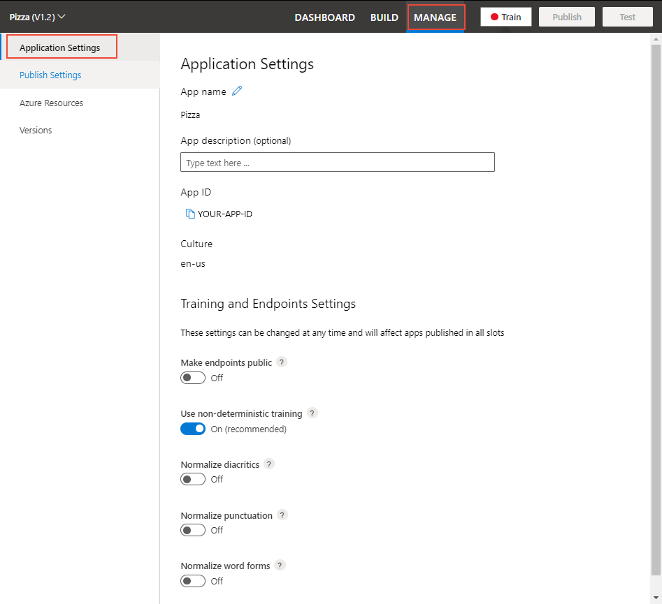

# Application and version settings

Configure your application settings in the LUIS portal such as utterance normalization and app privacy.

## Application name and ID

You can edit your application name, and description. You can copy your App ID. The culture can't be changed.

1. Sign into the [LUIS portal](https://www.luis.ai).
1. Select an app from the **My apps* list.
.
1. Select **Manage** from the top navigation bar, then **Application Settings** from the left navigation bar.

> [!div class="mx-imgBorder"]
> 

## Change training and endpoint settings

The training and endpoints settings apply to your entire app, and all versions.

To change a setting, select the toggle on the page.

|Level|Settings|Information|
|--|--|--|
|App|Make endpoints public|Anyone can access your public app if they have a prediction key and know your app ID. [API](https://westus.dev.cognitive.microsoft.com/docs/services/5890b47c39e2bb17b84a55ff/operations/58aeface39e2bb03dcd5909e)|
|Version|Use non-deterministic training|Training uses a small percentage of negative sampling. If you want to use all data instead of the small negative sampling, use the `UseAllTrainingData` set to true to turn off this feature. [API](https://westus.dev.cognitive.microsoft.com/docs/services/5890b47c39e2bb17b84a55ff/operations/versions-update-application-version-settings)|
|Version|Normalize diacritics|Normalizing diacritics replaces the characters with diacritics in utterances with regular characters.  [concept](luis-concept-utterance.md#utterance-normalization), [reference](luis-reference-application-settings.md), [API](https://westus.dev.cognitive.microsoft.com/docs/services/5890b47c39e2bb17b84a55ff/operations/versions-update-application-version-settings)|
|Version|Normalize punctuation|Normalizing punctuation means that before your models get trained and before your endpoint queries get predicted, punctuation will be removed from the utterances. [concept](luis-concept-utterance.md#utterance-normalization), [reference](luis-reference-application-settings.md), [API](https://westus.dev.cognitive.microsoft.com/docs/services/5890b47c39e2bb17b84a55ff/operations/versions-update-application-version-settings)|
|Version|Normalize word forms|[concept](luis-concept-utterance.md#utterance-normalization), [reference](luis-reference-application-settings.md), [API](https://westus.dev.cognitive.microsoft.com/docs/services/5890b47c39e2bb17b84a55ff/operations/versions-update-application-version-settings)|

## Next steps

* How to [collaborate](luis-how-to-collaborate.md) with other authors