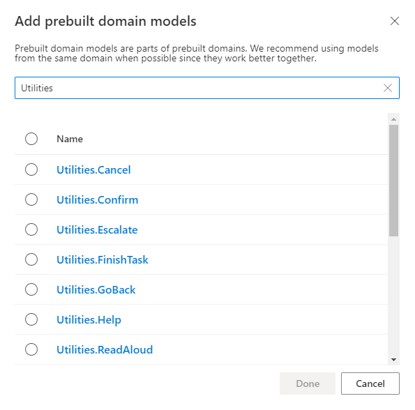
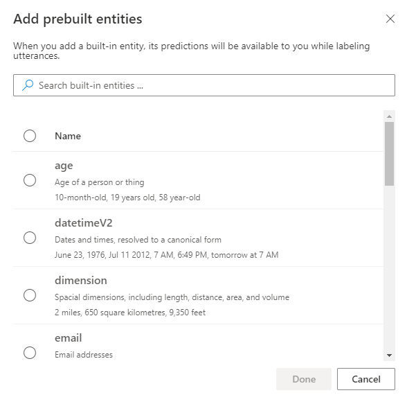

# Add prebuilt models for common usage scenarios 

LUIS includes a set of prebuilt models for quickly adding common, conversational user scenarios. This is a quick and easy way to add abilities to your conversational client application without having to design the models for those abilities. 

[!INCLUDE [Uses preview portal](includes/uses-portal-preview.md)]

## Add a prebuilt domain

1. On the **My Apps** page, select your app. This opens your app to the **Build** section of the app. 

1. Select **Prebuilt domains** from the left toolbar. 

1. Find the domain you want added to the app then select **Add domain** button.

    > [!div class="mx-imgBorder"]
    > 

## Add a prebuilt intent

1. On the **My Apps** page, select your app. This opens your app to the **Build** section of the app. 

1. On the **Intents** page, select **Add prebuilt domain intent** from the toolbar above the intents list. 

1. Select the **Utilities.Cancel** intent from the pop-up dialog. 

    > [!div class="mx-imgBorder"]
    > 

1. Select the **Done** button.

## Add a prebuilt entity

1. Open your app by clicking its name on **My Apps** page, and then click **Entities** in the left side. 

1. On the **Entities** page, click **Add prebuilt entity**.

1. In **Add prebuilt entities** dialog box, select the prebuilt entity. 

    > [!div class="mx-imgBorder"]
    > 

1. Select **Done**. After the entity is added, you do not need to train the app. 

## Publish to view prebuilt model from prediction endpoint

The easiest way to view the value of a prebuilt model is to query from the published endpoint. 

## Entities containing a prebuilt entity token
 
If you have a machine-learned entity that is constrained by a prebuilt entity, add a subcomponent to the machine-learned entity, then add a constraint of a prebuilt entity.

## Next steps
> [!div class="nextstepaction"]
> [Build model from .csv with REST APIs](./luis-tutorial-node-import-utterances-csv.md)
