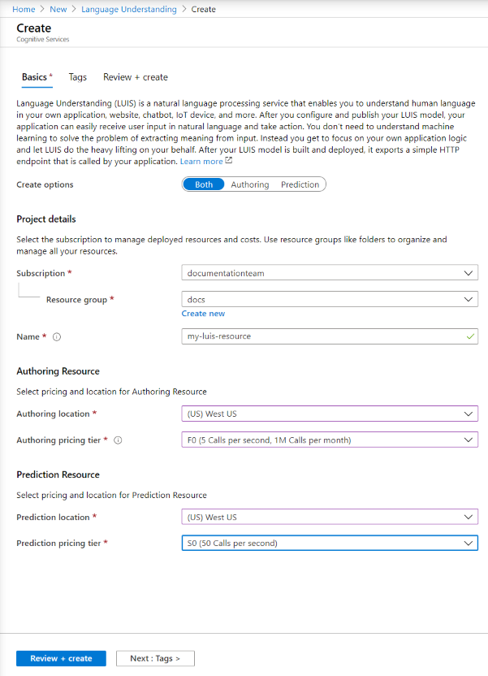

## Create LUIS resources in the Azure portal

1. Use [this link](https://ms.portal.azure.com/#create/Microsoft.CognitiveServicesLUISAllInOne) to begin creating LUIS resources in the Azure portal.

1. Enter all required settings:

    |Name|Purpose|
    |--|--|
    |Subscription | The subscription that will be billed for the resource.|
    |Resource group| A custom resource group name that you choose or create. Resource groups allow you to group Azure resources for access and management.|
    |Name| A custom name that you choose. It's used as your custom subdomain for your authoring and prediction endpoint queries.|
    |Authoring location|The region associated with your model.|
    |Authoring pricing tier|Determines the maximum transactions per second and month.|
    |Prediction location|The region associated with your published prediction endpoint runtime.|
    |Prediction pricing tier|Determines the maximum transactions per second and month.|

    > [!div class="mx-imgBorder"]
    > 

1. Select **Review + create**, and wait for the resource to be created.
1. After both resources are created, still in the Azure portal, select the new authoring resource. Then select **Quickstarts** to get the authoring **endpoint URL** and **key** for authoring programmatically.

> [!TIP]
> To use the resources, in the LUIS portal, [assign the resources](../luis-how-to-azure-subscription.md#assign-an-authoring-resource-in-the-luis-portal-for-all-apps).
