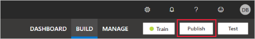
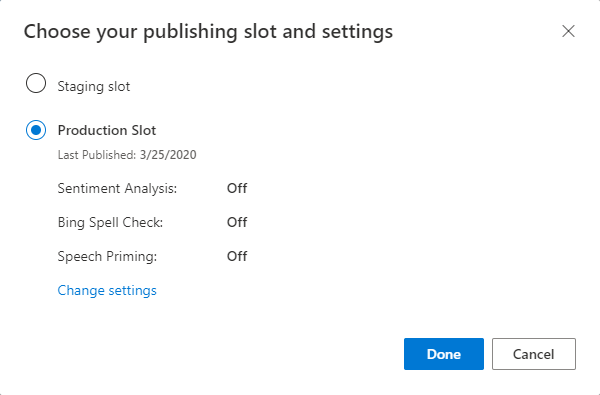

In order to receive a LUIS prediction in a chat bot or other client applications, you need to publish the app to the prediction endpoint.

1. Select **Publish** in the top-right navigation.
    
    > [!div class="mx-imgBorder"]
    > 

1. Select the **Production** slot, then select **Done**.

    > [!div class="mx-imgBorder"]
    > 

1. Select **Access your endpoint URLs** in the notification to go to the **Azure Resources** page. You will only be able to see the URLs if you have a prediction resource associated with the app. You can also find the **Azure Resources** page by clicking **Manage**.

     > [!div class="mx-imgBorder"]
    > 
