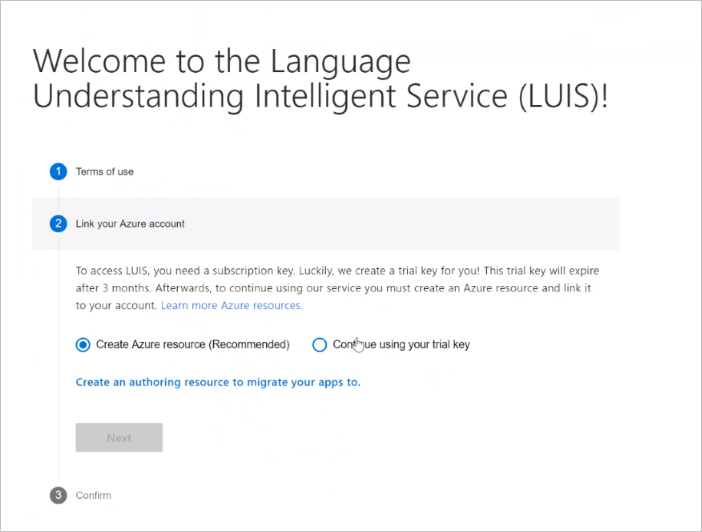
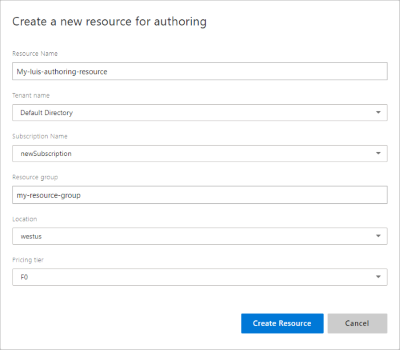
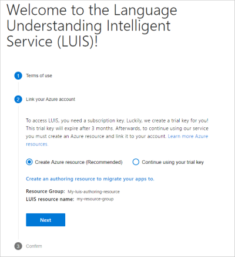
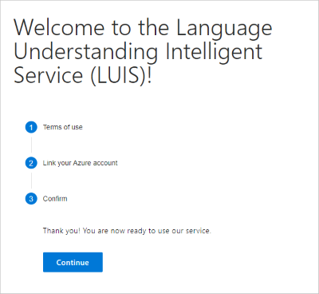

## Sign in to LUIS portal

A new user to LUIS needs to follow this procedure:

1. Sign in to [LUIS portal](https://www.luis.ai), select your country/region and agree to the terms of use. If you see **My Apps** instead, a LUIS resource already exists and you should skip ahead to create an app. For supported regions, visit [authoring and publishing regions and the associated keys](https://docs.microsoft.com/azure/cognitive-services/luis/luis-reference-regions).

1. Select **Create Azure resource** then select **Create an authoring resource to migrate your apps to.**

    

1. Fill in the details for the resource.

    

    When **creating a new authoring resource**, provide the following information:

    * **Resource name** - a custom name you choose, used as part of the URL for your authoring and prediction endpoint queries.
    * **Tenant** - the tenant your Azure subscription is associated with.
    * **Subscription name** - the subscription that will be billed for the resource.
    * **Resource group** - a custom resource group name you choose or create. Resource groups allow you to group Azure resources for access and management.
    * **Location** - the location choice is based on the **resource group** selection.
    * **Pricing tier** - the pricing tier determines the maximum transaction per second and month.

1. A summary of the resource to be created is displayed. Select **Next**.

    

1. Confirm by selecting **Continue**.

    
