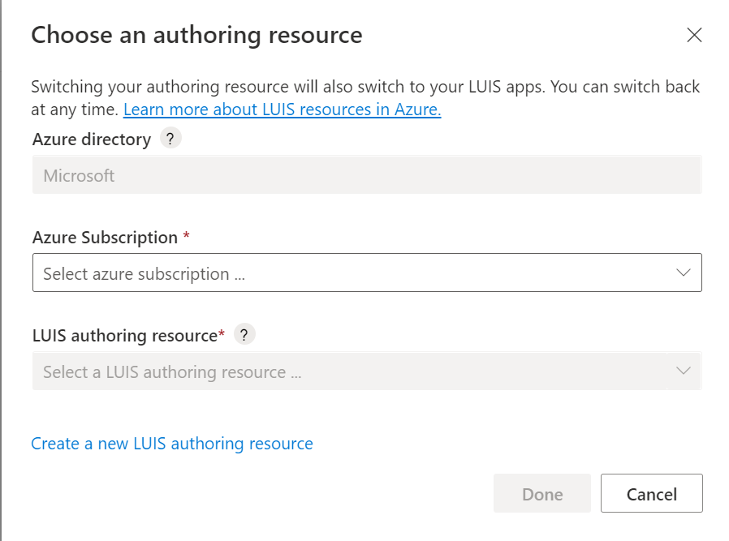

## Sign in to LUIS portal

[!INCLUDE [Note about portal deprecation](luis-portal-note.md)]

A new user to LUIS needs to follow this procedure:

1. Sign in to the [LUIS portal](https://www.luis.ai), select your country/region and agree to the terms of use. If you see **My Apps** instead, a LUIS resource already exists and you should skip ahead to create an app. If not, start by using an Azure resource, this allows you to link your LUIS account with a new or existing Azure Authoring resource. <!---This is equivalent to signing up already migrated. You won't need to go through the [migration process](../luis-migration-authoring.md#what-is-migration) later on.-->
<!---
    * Using a trial key. This allows you to sign in to LUIS with a trial resource that you don't need to set up. If you choose this option, you will eventually be required to [migrate your account](../luis-migration-authoring.md#migration-steps) and link your applications to an authoring resource.
-->

2. In the **Choose an authoring** window that appears, find your Azure subscription, and LUIS authoring resource. If you don't have a resource, you can create a new one.

    <!---:::image type="content" source="../media/luis-how-to-azure-subscription/choose-authoring-resource.png" alt-text="Choose a type of Language Understanding authoring resource.":::
    -->
    
    
    When you create a new authoring resource, provide the following information:
    * **Tenant name** - the tenant your Azure subscription is associated with.
    * **Azure subscription name** - the subscription that will be billed for the resource.
    * **Azure resource group name** - a custom resource group name you choose or create. Resource groups allow you to group Azure resources for access and management.
    * **Azure resource name** - a custom name you choose, used as part of the URL for your authoring and prediction endpoint queries.
    * **Pricing tier** - the pricing tier determines the maximum transaction per second and month.

