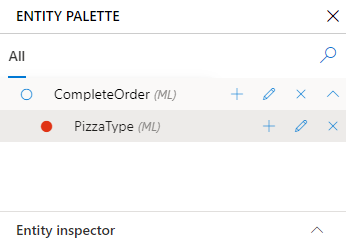
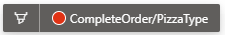
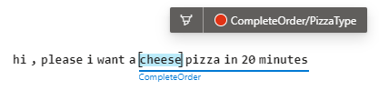

# Label machine-learned entity in an example utterance

Labeling an entity in an example utterance shows LUIS has an example of the entity is and where the entity can appear in the utterance. 

## Labeling machine-learned entity

Consider the phrase, `hi, please I want a cheese pizza in 20 minutes`. 

1. Select the left-most text, then select the right-most text of the entity. The _complete order_ is labeled in the following image.

    > [!div class="mx-imgBorder"]
    > 

1. Select the entity from the pop-up window. The labeled complete pizza order entity includes all words (from left to right in English) that are labeled. 

> [!TIP]
> The entities available in the pop-up window are relative to the context in which the text appears. For example, if you have a 5-level machine-learned entity, and you are selecting text at the 3rd level (indicated by a labeled entity name under the example utterance), the entities available in the pop-up window are limited to the context of subcomponents of the 3rd level (4th level subcomponents). 

## Review labeled text

After labeling, review the example utterance. LUIS applies the current model to the example utterance after labeling. The solid line indicates the text has been labeled. 

> [!div class="mx-imgBorder"]
> 

## When to train

If the current model should support your labeled entity, but the example utterance continues to show the text as predicted but not labeled, train your app.  

## Confirm predicted entity

If the visual indicator is above the utterance, it indicates the text is predicted but _not labeled yet_. To turn the prediction into a label, select the utterance, then select **Confirm entity predictions**.

> [!div class="mx-imgBorder"]
> 

## Label subcomponent entity by painting with entity palette cursor

1. In order to correct predictions (entities, which appear above the example utterance), open the entity palette. 

    > [!div class="mx-imgBorder"]
    > 

1. Select the entity subcomponent. This action is visually indicated with a new cursor. The cursor follows the mouse as you move in the portal. 

    > [!div class="mx-imgBorder"]
    > 

1. In the example utterance, _paint_ the entity with the cursor. 

    > [!div class="mx-imgBorder"]
    > 

## Labeling matching-text entities to a machine-learned entity

Matching-text entities include prebuilt entities, regular expression entities, and list entities. You add these to a machine-learned entity, as constraints to a subcomponent, when you create or edit the machine-learned entity. 

**Once these constraints are added, you do not need to label the matching text in the example utterance.**

## Entity prediction errors

Entity prediction errors show a caution indicator. This indicates the predicted entity doesn't match the labeled entity. 

> [!div class="mx-imgBorder"]
> 

## Next steps

Use the [dashboard](luis-how-to-use-dashboard.md) and [review endpoint utterances](luis-how-to-review-endpoint-utterances.md) to improve the prediction quality of your app.
