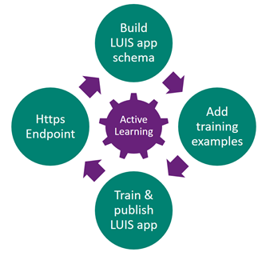

# Authoring cycle for your LUIS app
LUIS learns best in an iterative cycle of model changes, utterance examples, publishing, and gathering data from endpoint queries. 

## Building a LUIS model
The model's purpose is to figure out what the user is asking for (the intention or intent) and what parts of the question provide details (entities) that help determine the answer. 

The model needs to be specific to the app domain in order to determine words and phrases that are relevant as well as typical word ordering. 

The model includes intent, entities. 

## Add training examples
LUIS needs example utterances in the intents. The examples need enough variation of word choice and word order to be able to determine which intent the utterance is meant for. Each example utterance needs to have any required data labeled as entities. 

You instruct LUIS to ignore utterances that are not relevant to your app's domain by assigning the utterance to the **None** intent. Any words or phrases you do not need pulled out of an utterance do not need to be labeled. There is no label for words or phrases to ignore. 

## Train and publish the app
Once you have 10 to 15 different utterances in each intent, with the required entities labeled, train and publish. From the publish success notification, use the link to get your endpoints. Make sure to create your app and publish your app so that it is available in the [endpoint regions](luis-reference-regions.md) you need. 

## HTTPS endpoint testing
You can test your LUIS app from the HTTPS endpoint. Testing from the endpoint allows LUIS to choose any utterances with low-confidence for review.  

## Recycle
When you are done with a cycle of authoring, you can begin again. Start with reviewing endpoint utterances LUIS marked with low-confidence. Check these utterances for both intent and entity. Once you review utterances, the review list should be empty.  

## Batch testing
Batch testing is a way to see how many example utterances are scored by LUIS. The examples should be new to LUIS and should be correctly labeled with intent and entities you want LUIS to find. The test results indicate how well LUIS would perform on that set of utterances. 

## Next steps

Learn concepts about [collaboration](luis-concept-collaborator.md).
