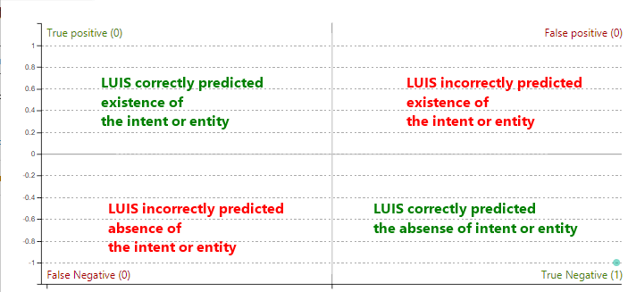
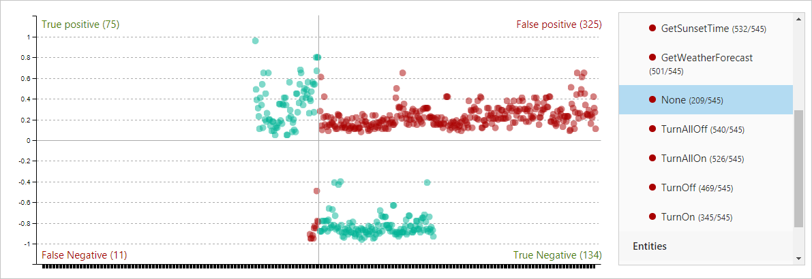

# Batch testing with 1000 utterances in LUIS portal

Batch testing validates your active trained version to measure its prediction accuracy. A batch test helps you view the accuracy of each intent and entity in your active version, displaying results with a chart. Review the batch test results to take appropriate action to improve accuracy, such as adding more example utterances to an intent if your app frequently fails to identify the correct intent or labeling entities within the utterance.

## Group data for batch test

It is important that utterances used for batch testing are new to LUIS. If you have a data set of utterances, divide the utterances into three sets: example utterances added to an intent, utterances received from the published endpoint, and utterances used to batch test LUIS after it is trained.

## A data set of utterances

Submit a batch file of utterances, known as a *data set*, for batch testing. The data set is a JSON-formatted file containing a maximum of 1,000 labeled **non-duplicate** utterances. You can test up to 10 data sets in an app. If you need to test more, delete a data set and then add a new one.

|**Rules**|
|--|
|*No duplicate utterances|
|1000 utterances or less|

*Duplicates are considered exact string matches, not matches that are tokenized first.

## Entities allowed in batch tests

All custom entities in the model appear in the batch test entities filter even if there are no corresponding entities in the batch file data.

<a name="json-file-with-no-duplicates"></a>
<a name="example-batch-file"></a>

## Batch file format

The batch file consists of utterances. Each utterance must have an expected intent prediction along with any [machine-learning entities](luis-concept-entity-types.md#types-of-entities) you expect to be detected.

## Batch syntax template for intents with entities

Use the following template to start your batch file:

```JSON
[
  {
    "text": "example utterance goes here",
    "intent": "intent name goes here",
    "entities":
    [
        {
            "entity": "entity name 1 goes here",
            "startPos": 14,
            "endPos": 23
        },
        {
            "entity": "entity name 2 goes here",
            "startPos": 14,
            "endPos": 23
        }
    ]
  }
]
```

The batch file uses the **startPos** and **endPos** properties to note the beginning and end of an entity. The values are zero-based and should not begin or end on a space. This is different from the query logs, which use startIndex and endIndex properties.

[!INCLUDE [Entity roles in batch testing - currently not supported](../../../includes/cognitive-services-luis-roles-not-supported-in-batch-testing.md)]

## Batch syntax template for intents without entities

Use the following template to start your batch file without entities:

```JSON
[
  {
    "text": "example utterance goes here",
    "intent": "intent name goes here",
    "entities": []
  }
]
```

If you do not want to test entities, include the `entities` property and set the value as an empty array, `[]`.


## Common errors importing a batch

Common errors include:

> * More than 1,000 utterances
> * An utterance JSON object that doesn't have an entities property. The property can be an empty array.
> * Word(s) labeled in multiple entities
> * Entity label starting or ending on a space.

## Batch test state

LUIS tracks the state of each data set's last test. This includes the size (number of utterances in the batch), last run date, and last result (number of successfully predicted utterances).

<a name="sections-of-the-results-chart"></a>

## Batch test results

The batch test result is a scatter graph, known as an error matrix. This graph is a 4-way comparison of the utterances in the batch file and the current model's predicted intent and entities.

Data points on the **False Positive** and **False Negative** sections indicate errors, which should be investigated. If all data points are on the **True Positive** and **True Negative** sections, then your app's accuracy is perfect on this data set.



This chart helps you find utterances that LUIS predicts incorrectly based on its current training. The results are displayed per region of the chart. Select individual points on the graph to review the utterance information or select region name to review utterance results in that region.



## Errors in the results

Errors in the batch test indicate intents that are not predicted as noted in the batch file. Errors are indicated in the two red sections of the chart.

The false positive section indicates that an utterance matched an intent or entity when it shouldn't have. The false negative indicates an utterance did not match an intent or entity when it should have.

## Fixing batch errors

If there are errors in the batch testing, you can either add more utterances to an intent, and/or label more utterances with the entity to help LUIS make the discrimination between intents. If you have added utterances, and labeled them, and still get prediction errors in batch testing, consider adding a [phrase list](luis-concept-feature.md) feature with domain-specific vocabulary to help LUIS learn faster.

## Next steps

* Learn how to [test a batch](luis-how-to-batch-test.md)
