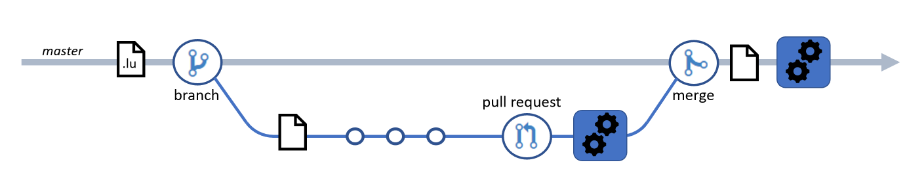

# Continuous Integration and Continuous Delivery workflows for LUIS DevOps

Software engineers who are developing a Language Understanding (LUIS) app can apply DevOps practices around [source control](luis-concept-devops-sourcecontrol.md), [automated builds](luis-concept-devops-automation.md), [testing](luis-concept-devops-testing.md), and [release management](luis-concept-devops-automation.md#release-management). This article describes concepts for implementing automated builds for LUIS.

## Build automation workflows for LUIS

In your source code management (SCM) system, configure automated build pipelines to run at the following events:

1. **PR workflow** triggered when a [pull request](https://help.github.com/github/collaborating-with-issues-and-pull-requests/about-pull-requests) (PR) is raised. This workflow validates the contents of the PR *before* the updates get merged into the master branch.
1. **CI/CD workflow** triggered when updates are pushed to the master branch, for example upon merging the changes from a PR. This workflow ensures the quality of all updates to the master branch.

The **CI/CD workflow** combines two complementary development processes:

* [Continuous Integration](https://docs.microsoft.com/azure/devops/learn/what-is-continuous-integration) (CI) is the engineering practice of frequently committing code in a shared repository, and performing an automated build on it. Paired with an automated [testing](luis-concept-devops-testing.md) approach, continuous integration allows us to verify that for each update, the LUDown source is still valid and can be imported into a LUIS app, but also that it passes a group of tests that verify the trained app can recognize the intents and entities required for your solution.

* [Continuous Delivery](https://docs.microsoft.com/azure/devops/learn/what-is-continuous-delivery) (CD) takes the Continuous Integration concept further to automatically deploy the application to an environment where you can do more in-depth testing. CD enables us to learn early about any unforeseen issues that arise from our changes as quickly as possible, and also to learn about gaps in our test coverage.

The goal of continuous integration and continuous delivery is to ensure that "master is always shippable,". For a LUIS app, this means that we could, if we needed to, take any version from the master branch LUIS app and ship it on production.

### Tools for building automation workflows for LUIS

There are different build automation technologies available to create build automation workflows. All of them require that you can script steps using a command-line interface (CLI) or REST calls so that they can execute on a build server.

Use the following tools for building automation workflows for LUIS:

* [Bot Framework Tools LUIS CLI](https://github.com/microsoft/botbuilder-tools/tree/master/packages/LUIS) to work with LUIS apps and versions, train, test, and publish them within the LUIS service.

* [Azure CLI](https://docs.microsoft.com/cli/azure/?view=azure-cli-latest) to query Azure subscriptions, fetch LUIS authoring and prediction keys, and to create an Azure [service principal](https://docs.microsoft.com/cli/azure/ad/sp?view=azure-cli-latest) used for automation authentication.

* [NLU.DevOps](https://github.com/microsoft/NLU.DevOps) tool for [testing a LUIS app](luis-concept-devops-testing.md) and to analyze test results.

### The PR workflow

As mentioned, you configure this workflow to run when a developer raises a PR to propose changes to be merged from a feature branch into the master branch. Its purpose is to verify the quality of the changes in the PR before they're merged to the master branch.

This workflow should:

* Create a temporary LUIS app by importing the `.lu` source in the PR.
* Train and publish the LUIS app version.
* Run all the [unit tests](luis-concept-devops-testing.md) against it.
* Pass the workflow if all the tests pass, otherwise fail it.
* Clean up and delete the temporary app.

If supported by your SCM, configure branch protection rules so that this workflow must complete successfully before the PR can be completed.

### The master branch CI/CD workflow

Configure this workflow to run after the updates in the PR have been merged into the master branch. Its purpose is to keep the quality bar for your master branch high by testing the updates. If the updates meet the quality bar, this workflow deploys the new LUIS app version to an environment where you can do more in-depth testing.

This workflow should:

* Build a new version in your primary LUIS app (the app you maintain for the master branch) using the updated source code.

* Train and publish the LUIS app version.

  > [!NOTE]
  > As explained in [Running tests in an automated build workflow](luis-concept-devops-testing.md#running-tests-in-an-automated-build-workflow) you must publish the LUIS app version under test so that tools such as NLU.DevOps can access it. LUIS only supports two named publication slots, *staging* and *production* for a LUIS app, but you can also [publish a version directly](https://github.com/microsoft/botframework-cli/blob/master/packages/luis/README.md#bf-luisapplicationpublish) and [query by version](https://docs.microsoft.com/azure/cognitive-services/luis/luis-migration-api-v3#changes-by-slot-name-and-version-name). Use direct version publishing in your automation workflows to avoid being limited to using the named publishing slots.

* Run all the [unit tests](luis-concept-devops-testing.md).

* Optionally run [batch tests](luis-concept-devops-testing.md#how-to-do-unit-testing-and-batch-testing) to measure the quality and accuracy of the LUIS app version and compare it to some baseline.

* If the tests complete successfully:
  * Tag the source in the repo.
  * Run the Continuous Delivery (CD) job to deploy the LUIS app version to environments for further testing.

### Continuous delivery (CD)

The CD job in a CI/CD workflow runs conditionally on success of the build and automated unit tests. Its job is to automatically deploy the LUIS application to an environment where you can do more testing.

There's no one recommended solution on how best to deploy your LUIS app, and you must implement the process that is appropriate for your project. The [LUIS DevOps template](https://github.com/Azure-Samples/LUIS-DevOps-Template) repo implements a simple solution for this which is to [publish the new LUIS app version](https://docs.microsoft.com/azure/cognitive-services/luis/luis-how-to-publish-app) to the *production* publishing slot. This is fine for a simple setup. However, if you need to support a number of different production environments at the same time, such as *development*, *staging* and *UAT*, then the limit of two named publishing slots per app will prove insufficient.

Other options for deploying an app version include:

* Leave the app version published to the direct version endpoint and implement a process to configure downstream production environments with the direct version endpoint as required.
* Maintain different LUIS apps for each production environments and write automation steps to import the `.lu` into a new version in the LUIS app for the target production environment, to train, and publish it.
* Export the tested LUIS app version into a [LUIS docker container](https://docs.microsoft.com/azure/cognitive-services/luis/luis-container-howto?tabs=v3) and deploy the LUIS container to Azure [Container instances](https://docs.microsoft.com/azure/container-instances/).

## Release management

Generally we recommend that you do continuous delivery only to your non-production environments, such as to development and staging. Most teams require a manual review and approval process for deployment to a production environment. For a production deployment, you might want to make sure it happens when key people on the development team are available for support, or during low-traffic periods.

## Next steps

* Learn how to [implement DevOps for LUIS with GitHub](luis-how-to-devops-with-github.md)
* Learn how to write a [GitHub Actions workflow with NLU.DevOps](https://github.com/Azure-Samples/LUIS-DevOps-Template/blob/master/docs/4-pipeline.md)
