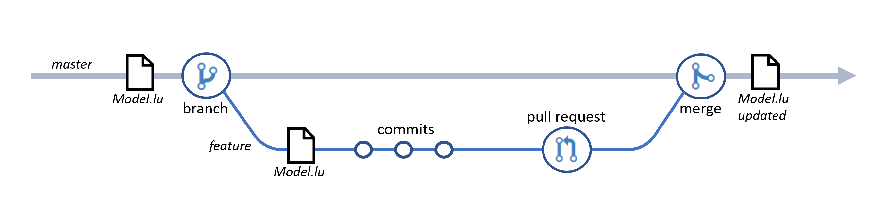

# Source control and branch strategies for LUIS

Develop a LUIS app whilst observing these software engineering fundamentals and best practices:

- **Source Code Management** - Source code for your LUIS app is in the human-readable [LUDown format](https://github.com/microsoft/botframework-cli/blob/master/packages/luis/docs/lu-file-format.md), the model can be built from the source code in a repeatable fashion, and the source code can be managed by a source code repository. Credentials and secrets such as authoring and subscription keys are prevented from check-in.

- **Branching and Merging** - Developers can work from independent branches, in multiple branches concurrently, can rebase and merge from the parent branch, and merge [pull requests](https://help.github.com/github/collaborating-with-issues-and-pull-requests/about-pull-requests) (PRs) to the parent branch.

- **Code Reviews** - The changes in the PR are presented as human readable source code that can be reviewed before accepting the PR.

## Source Control

*Source code is in human-readable text, the model can be built from the source code in a repeatable fashion, and the source code can be managed by a source code repo. Credentials and secrets such as subscription keys prevented from check-in.*

### LUIS app source code management

To maintain the [App schema definition](https://docs.microsoft.com/azure/cognitive-services/luis/app-schema-definition) of a LUIS app in a source code management system, use the `.lu` representation of the app. `.lu` format is preferred to `.json` format because it is human readable which makes it easier to review changes in PRs.

#### Using the LUDown format

To create a new LUIS app in `.lu` format and place it under source control:

- EITHER: Use a text editor to create a `.lu` file for a LUIS app and add it to your source control repository

- OR: Export an app from the [LUIS portal](https://www.luis.ai/) in `.lu` format and add it to your source control repository

#### Building the LUIS app from source

To build the LUIS app from the `.lu` source, you can:

- Use the LUIS portal to [import the `.lu` version](https://docs.microsoft.com/azure/cognitive-services/luis/luis-how-to-manage-versions#import-version) of the app from source control, and [train](https://docs.microsoft.com/azure/cognitive-services/luis/luis-how-to-train) and [publish](https://docs.microsoft.com/azure/cognitive-services/luis/luis-how-to-publish-app) the app.

- Use the [Bot Framework Command Line Interface for LUIS](https://github.com/microsoft/botbuilder-tools/tree/master/packages/LUIS) at the command line or in a CI/CD workflow to [import](https://github.com/microsoft/botframework-cli/blob/master/packages/luis/README.md#bf-luisversionimport) the `.lu` version of the app from source control into a LUIS application, and [train](https://github.com/microsoft/botframework-cli/blob/master/packages/luis/README.md#bf-luistrainrun) and [publish](https://github.com/microsoft/botframework-cli/blob/master/packages/luis/README.md#bf-luisapplicationpublish) the app.

#### Files to maintain under source control

The following types of files for your LUIS application should be maintained under source control:

- `.lu` file for the LUIS application

- [Unit Test definition files](link tbd) (utterances and expected results)

- [Batch test files](https://docs.microsoft.com/azure/cognitive-services/luis/luis-concept-batch-test#batch-file-format) (utterances and expected results) used for F-measure testing

### Credentials and keys should not be checked in

You should ensure that LUIS account keys and any similar confidential values are not checked into your source code control system where they might be visible to unauthorized personnel. The keys and other values that you should ensure are not included in files that you check into your source code repository includes:

- LUIS Authoring and Prediction keys
- LUIS Authoring and Prediction endpoints
- Azure subscription keys
- Access tokens, such as the token for an Azure [service principal](https://docs.microsoft.com/cli/azure/ad/sp?view=azure-cli-latest) used for automation authentication

#### Strategies for securely managing secrets

Strategies for securely managing secrets includes:

- If you are using a Git based version control system such as [GitHub](https://github.com/), you can store runtime secrets in a local file and prevent check in of the file by adding a pattern to match the filename to a [`.gitignore`](https://git-scm.com/docs/gitignore) file
- In an automation workflow, you can store secrets securely in the parameters configuration offered by that automation technology. For example, if you are using [GitHub Actions](https://github.com/features/actions), you can store secrets securely in [GitHub secrets](https://help.github.com/en/actions/configuring-and-managing-workflows/creating-and-storing-encrypted-secrets).

## Branching and merging

*Developers can work from independent branches, in multiple branches concurrently, and rebase and merge from master, and to merge to master via PRs.*

Distributed version control systems like Git give you flexibility in how you use version control to share and manage code. Team members publish, share, review, and iterate on code changes through Git branches shared with others. You should adopt a branching strategy that is appropriate for your team. For more information, see [Adopt a Git branching strategy](https://docs.microsoft.com/azure/devops/repos/git/git-branching-guidance).

Whichever branching strategy you adopt, a key principle of all of them is that development team members can work on changes to the solution within a *feature branch* and that work can happen independently from the work that other team members are doing in other branches. In order to support this when working on changes to a LUIS app, this means that:

- Each feature branch must use its own instance of a LUIS app
- The master branch also has its own LUIS app which is the app that receives the updates when work is merged into master from a feature branch.

### Developers can work from independent branches

Developers can work on updates on a LUIS app independently from other branches by:

- Creating a feature branch from the main branch (usually called master or develop)

- If this is a new project and the LUIS app for the solution has not yet been created, [create a new app in the LUIS portal](https://docs.microsoft.com/azure/cognitive-services/luis/luis-how-to-start-new-app). Note that this LUIS application is created solely to support the work in the feature branch.

- If this is an existing project and the `.lu` source for the solution app already exists in the repo, import the .lu file into a new LUIS application created solely to support the work in the feature branch.

- Work on the LUIS app to implement the required changes.

- Test the updated application - see [Testing the LUIS application](link tbd) for details on testing your application within a development branch.

- Export the active version of your development LUIS app as `.lu` from the [versions list](https://docs.microsoft.com/azure/cognitive-services/luis/luis-how-to-manage-versions).

- Check in your updates and initiate peer review of your updates. If you are using GitHub, you will raise a [pull request](https://help.github.com/en/github/collaborating-with-issues-and-pull-requests/about-pull-requests).

- When the changes are approved, merge the updates into the parent branch. At this point, a new version of the LUIS app for the *master* branch should be created using the updated `.lu` representation of the app that is now in the master branch. This new version can be created manually, or preferably, [built by an automation workflow](link tbd).

- It is best practice to delete the LUIS app you created for the feature branch work when the feature branch is deleted.

### Developers can work in multiple branches concurrently

If you follow the pattern described above in [Developers can work from independent branches](#developers-can-work-from-independent-branches) then each branch will use a unique LUIS application to support development, enabling a single developer to work on multiple branches concurrently, should this be necessary.

### Multiple Developers can work on the same branch concurrently

You can support multiple developers working on the same feature branch at the same time:

- Developers should check out the same feature branch and use standard source control management features to push and pull changes submitted by themselves and other developers while work proceeds.

- If you follow the pattern described above in [Developers can work from independent branches](#developers-can-work-from-independent-branches) then each branch will use a unique LUIS application to support development that will be created initially by the first member of the development team who commences work in the feature branch.

- The developer that creates the LUIS app used to support the work in the feature branch can share that app with other developers using the procedures described in [Add contributors to your app](https://docs.microsoft.com/azure/cognitive-services/luis/luis-how-to-collaborate).

- When the feature branch work is complete, one member of the team must export the active version of the development LUIS app as `.lu` from the [versions list](https://docs.microsoft.com/azure/cognitive-services/luis/luis-how-to-manage-versions), save the updated `.lu` file in the repo and check in and PR the changes.

##############################################################  Complete to here  #########

### Rebase and Merge from master

- LUIS app in ludown format is human readable, supports merging using standard Merge tools

- Guidance:

  - Ensure that LUIS app is re-exported from portal before Rebase and Merge to ensure any changes made in portal and not yet exported are not lost.

  - Essential to reimport the app and retrain after rebase and merge
          using [BotBuilder-Tools LUIS CLI](https://github.com/microsoft/botbuilder-tools/tree/master/packages/LUIS) or the LUIS Preview portal

### Merge to master from PRs

- LUIS app in ludown format is human readable, supports merging using standard Merge tools

- Guidance:

  - Ensure that LUIS app is re-exported from portal before PR raised and changes checked in to ensure any changes made in portal and not yet exported are not lost.

  - When a PR is raised that targets master, a GitHub Actions pipeline should execute to run unit tests. Tests must pass before the PR can be merged.

  - After PR merge:

    - Delete branch (recommended)

    - Delete LUIS app for branch (recommended)

## Code Reviews

*The changes in the PR are presented as human readable source code that can be reviewed before accepting the PR.*

### Human readable source that can be reviewed

- LUIS app in LUDown format is human readable, supports communication of changes in a PR suitable for review

- Guidance will be to export to JSON and then use the [BotBuilder-Tools LUIS CLI](https://github.com/microsoft/botbuilder-tools/tree/master/packages/LUIS) to convert to LUDown using the --sort option to ensure that intents and utterances are sorted alphabetically.

- Unit test files are JSON or LUDown, also easily reviewable in a PR.

## Next steps

> [!div class="nextstepaction"]
> [*************DevOps practices for testing a LUIS app*************](luis-concept-app-iteration.md)
