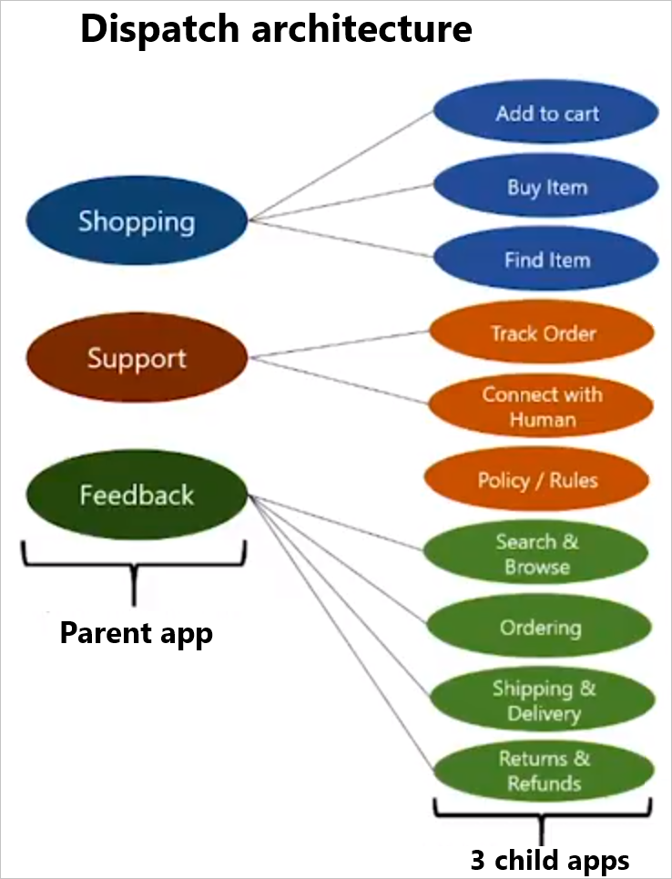

# Enterprise strategies for a LUIS app
Review these design strategies for your enterprise app.

## When you expect LUIS requests beyond the quota
If your LUIS app request rate exceeds the allowed [quota rate](https://azure.microsoft.com/pricing/details/cognitive-services/language-understanding-intelligent-services/), spread the load to more LUIS apps with the [same app definition](#use-multiple-apps-with-same-app-definition) or create and [assign multiple keys](#assign-multiple-luis-keys-to-same-app) to the app. 

### Use multiple apps with same app definition
Export the original LUIS app, then import the app back into separate apps. Each app has its own app ID. When you publish, instead of using the same key across all apps, create a separate key for each app. Balance the load across all apps so that no single app is overwhelmed. Add [Application Insights](luis-tutorial-bot-csharp-appinsights.md) to monitor usage. 

In order to get the same top intent between all the apps, make sure the intent prediction between the first and second intent is wide enough that LUIS is not confused, giving different results between apps for minor variations in utterances. 

Designate a single app as the master. Any utterances that are suggested for review should be added to the master app then moved back to all the other apps. This is either a full export of the app, or loading the labeled utterances from the master to the children. Loading can be done from either the [LUIS](luis-reference-regions.md) website or the authoring API for a [single utterance](https://westus.dev.cognitive.microsoft.com/docs/services/5890b47c39e2bb17b84a55ff/operations/5890b47c39e2bb052c5b9c08) or for a [batch](https://westus.dev.cognitive.microsoft.com/docs/services/5890b47c39e2bb17b84a55ff/operations/5890b47c39e2bb052c5b9c09). 

Schedule a periodic [review of endpoint utterances](luis-how-to-review-endoint-utt.md) for active learning, such as every two weeks, then retrain and republish. 

### Assign multiple LUIS keys to same app
If your LUIS app receives more endpoint hits than your single key's quota allows, create and assign more keys to the LUIS app. Create a traffic manager or load balancer to manage the endpoint queries across the endpoint keys. 

## When your monolithic app returns wrong intent
If your app is meant to predict a wide variety of user utterances, consider implementing the [dispatch model](#dispatch-tool-and-model). Breaking up a monolithic app allows LUIS to focus detection between intents successfully instead of getting confused between intents across the parent app and child apps. 

Schedule a periodic [review of endpoint utterances](luis-how-to-review-endoint-utt.md) for active learning, such as every two weeks, then retrain and republish. 

## When you need to have more than 500 intents
For example, let's say you're developing an office assistant that has over 500 intents. If 200 intents relate to scheduling meetings, 200 are about reminders, 200 are about getting information about colleagues, and 200 are for sending email, group intents so that each group is in a single app, then create a top-level app containing each intent. Use the [dispatch tool and architecture](#dispatch-tool-and-model) to build the top-level app. Then change your bot to use the cascading call as show in the [dispatch tutorial][dispatcher-application-tutorial]. 

## When you need to combine several LUIS and QnA maker apps
If you have several LUIS and QnA maker apps that need to respond to a bot, use the [dispatch tool](#dispatch-tool-and-model) to build the top-level app. Then change your bot to use the cascading call as show in the [dispatch tutorial][dispatcher-application-tutorial]. 

## Dispatch tool and model
Use the [Dispatch][dispatch-tool] command-line tool, found in [BotBuilder-tools](https://github.com/Microsoft/botbuilder-tools) to combine multiple LUIS and/or QnA Maker apps into a parent LUIS app. This approach allows you to have a parent domain including all subjects and different child subject domains in separate apps. 

The parent domain is noted in LUIS with a version named `Dispatch` in the apps list. 

The chatbot receives the utterance, then sends to the parent LUIS app for prediction. The top predicted intent from the parent app determines which child LUIS app is called next. The chatbot sends the utterance to the child app for a more specific prediction.

Understand how this hierarchy of calls is made from the Bot Builder v4 [dispatcher-application-tutorial][dispatcher-application-tutorial].  

### Intent limits in dispatch model
A dispatch application has 500 dispatch sources, equivalent to 500 intents, as the maximum. 

## Next steps

* Learn how to [test a batch](luis-how-to-batch-test.md)

[dispatcher-application-tutorial]: https://aka.ms/bot-dispatch
[dispatch-tool]: https://aka.ms/dispatch-tool