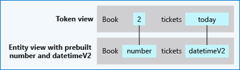
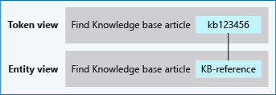
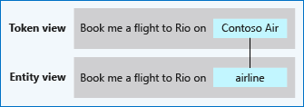

# Entity types and their purposes in LUIS

Entities extract data from the utterance. Entity types give you predictable extraction of data. There are two types of entities: machine-learned and non-machine-learned. It is important to know which type of entity you are working with in utterances. 

## Entity compared to intent

The entity represents a word or phrase inside the utterance that you want extracted. An utterance can include many entities or none at all. A client application may need the entity to perform its task or use it as a guide of several choices to present to the user. 

An entity:

* Represents a class including a collection of similar objects (places, things, people, events or concepts). 
* Describes information relevant to the intent


For example, a News Search app may include entities such as “topic”, “source”, “keyword” and “publishing date”, which are key data to search for news. In a travel booking app, the “location”, “date”, "airline", "travel class" and "tickets" are key information for flight booking (relevant to the "Book flight" intent).

By comparison, the intent represents the prediction of the entire utterance. 

## Entities help with data extraction only

You label or mark entities for the purpose of entity extraction only, it does not help with intent prediction.

## Entities represent data

Entities are data you want to pull from the utterance. This can be a name, date, product name, or any group of words. 

|Utterance|Entity|Data|
|--|--|--|
|Buy 3 tickets to New York|Prebuilt number<br>Location.Destination|3<br>New York|
|Buy a ticket from New York to London on March 5|Location.Origin<br>Location.Destination<br>Prebuilt datetimeV2|New York<br>London<br>March 5, 2018|

## Entities are optional but highly recommended

While intents are required, entities are optional. You do not need to create entities for every concept in your app, but only for those required for the client application to take action. 

If your utterances do not have details your bot needs to continue, you do not need to add them. As your app matures, you can add them later. 

If you're not sure how you would use the information, add a few common prebuilt entities such as [datetimeV2](luis-reference-prebuilt-datetimev2.md), [ordinal](luis-reference-prebuilt-ordinal.md), [email](luis-reference-prebuilt-email.md), and [phone number](luis-reference-prebuilt-phonenumber.md).

## Label for word meaning

If the word choice or word arrangement is the same, but doesn't mean the same thing, do not label it with the entity. 

The following utterances, the word `fair` is a homograph. It is spelled the same but has a different meaning:

|Utterance|
|--|
|What kind of county fairs are happening in the Seattle area this summer?|
|Is the current rating for the Seattle review fair?|

If you wanted an event entity to find all event data, label the word `fair` in the first utterance, but not in the second.

## Entities are shared across intents

Entities are shared among intents. They don't belong to any single intent. Intents and entities can be semantically associated but it isn't an exclusive relationship.

In the utterance "Book me a ticket to Paris", "Paris" is an entity referring to location. By recognizing the entities that are mentioned in the user’s utterance, LUIS helps your client application choose the specific actions to take to fulfill the user's request.

## Mark entities in None intent

All intents, including the **None** intent, should have marked entities, when possible. This helps LUIS learn more about where the entities are in the utterances and what words are around the entities. 

## Entity status for predictions

The LUIS portal tells you when the entity in an example utterance is either different from the marked entity or is too close to another entity and therefore unclear. This is indicated by a red underline in the example utterance. 

For more information, see [Entity Status predictions](luis-how-to-add-example-utterances.md#entity-status-predictions). 

## Types of entities

LUIS offers many types of entities. Choose the entity based on how the data should be extracted and how it should be represented after it is extracted.

Entities can be extracted with machine-learning, which allows LUIS to continue learning about how the entity appears in the utterance. Entities can be extracted without machine-learning, matching either exact text or a regular expression. Entities in patterns can be extracted with a mixed implementation. 

Once the entity is extracted, the entity data can be represented as a single unit of information or combined with other entities to form a unit of information the client-application can use.

|Machine-learned|Can Mark|Tutorial|Example<br>Response|Entity type|Purpose|
|--|--|--|--|--|--|
|✔|✔|[✔](luis-tutorial-composite-entity.md)|[✔](luis-concept-data-extraction.md#composite-entity-data)|[**Composite**](#composite-entity)|Grouping of entities, regardless of entity type.|
|||[✔](luis-quickstart-intent-and-list-entity.md)|[✔](luis-concept-data-extraction.md#list-entity-data)|[**List**](#list-entity)|List of items and their synonyms extracted with exact text match.|
|Mixed||[✔](luis-tutorial-pattern.md)|[✔](luis-concept-data-extraction.md#patternany-entity-data)|[**Pattern.any**](#patternany-entity)|Entity where end of entity is difficult to determine.|
|||[✔](luis-tutorial-prebuilt-intents-entities.md)|[✔](luis-concept-data-extraction.md#prebuilt-entity-data)|[**Prebuilt**](#prebuilt-entity)|Already trained to extract various kinds of data.|
|||[✔](luis-quickstart-intents-regex-entity.md)|[✔](luis-concept-data-extraction.md#regular-expression-entity-data)|[**Regular Expression**](#regular-expression-entity)|Uses regular expression to match text.|
|✔|✔|[✔](luis-quickstart-primary-and-secondary-data.md)|[✔](luis-concept-data-extraction.md#simple-entity-data)|[**Simple**](#simple-entity)|Contains a single concept in word or phrase.|

Only Machine-learned entities need to be marked in the example utterances. Machine-learned entities work best when tested via [endpoint queries](luis-concept-test.md#endpoint-testing) and [reviewing endpoint utterances](luis-how-to-review-endoint-utt.md). 

Pattern.any entities need to be marked in the [Pattern](luis-how-to-model-intent-pattern.md) template examples, not the intent user examples. 

Mixed entities use a combination of entity detection methods.

## Machine-learned entities use context

Machine-learned entities learn from context in the utterance. This makes variation of placement in example utterances significant. 

## Non-machine-learned entities don't use context

The following non-machine learned entities do not take utterance context into account when matching entities: 

* [Prebuilt entities](#prebuilt-entity)
* [Regex entities](#regular-expression-entity)
* [List entities](#list-entity) 

These entities do not require labeling or training the model. Once you add or configure the entity, the entities are extracted. The tradeoff is that these entities can be overmatched, where if context was taken into account, the match would not have been made. 

This happens with list entities on new models frequently. You build and test your model with a list entity but when you publish your model and receive queries from the endpoint, you realize your model is overmatching due to lack of context. 

If you want to match words or phrases and take context into account, you have two options. The first is to use a simple entity paired with a phrase list. The phrase list will not be used for matching but instead will help signal relatively similar words (interchangeable list). If you must have an exact match instead of a phrase list's variations, use a list entity with a role, described below.

### Context with non-machine-learned entities

If you want context of the utterance to matter for non-machine learned entities, you should use [roles](luis-concept-roles.md).

If you have a non-machine-learned entity, such as [prebuilt entities](#prebuilt-entity), [regex](#regular-expression-entity) entities or [list](#list-entity) entities, which is matching beyond the instance you want, consider creating one entity with two roles. One role will capture what you are looking for, and one role will capture what you are not looking for. Both versions will need to be labeled in example utterances.  

## Composite entity

A composite entity is made up of other entities, such as prebuilt entities, simple, regular expression, and list entities. The separate entities form a whole entity. 

This entity is a good fit when the data:

* Are related to each other. 
* Are related to each other in the context of the utterance.
* Use a variety of entity types.
* Need to be grouped and processed by the client application as a unit of information.
* Have a variety of user utterances that require machine-learning.


[Tutorial](luis-tutorial-composite-entity.md)<br>
[Example JSON response for entity](luis-concept-data-extraction.md#composite-entity-data)<br>

## List entity

List entities represent a fixed, closed set of related words along with their synonyms. LUIS does not discover additional values for list entities. Use the **Recommend** feature to see suggestions for new words based on the current list. If there is more than one list entity with the same value, each entity is returned in the endpoint query. 

The entity is a good fit when the text data:

* Are a known set.
* Doesn't change often. If you need to change the list often or want the list to self-expand, a simple entity boosted with a phrase list is a better choice. 
* The set doesn't exceed the maximum LUIS [boundaries](luis-boundaries.md) for this entity type.
* The text in the utterance is an exact match with a synonym or the canonical name. LUIS doesn't use the list beyond exact text matches. Fuzzy matching, case-insensitivity, stemming, plurals, and other variations are not resolved with a list entity. To manage variations, consider using a [pattern](luis-concept-patterns.md#syntax-to-mark-optional-text-in-a-template-utterance) with the optional text syntax.


[Tutorial](luis-quickstart-intent-and-list-entity.md)<br>
[Example JSON response for entity](luis-concept-data-extraction.md#list-entity-data)

## Pattern.any entity

Pattern.any is a variable-length placeholder used only in a pattern's template utterance to mark where the entity begins and ends.  

The entity is a good fit when:

* The ending of the entity can be confused with the remaining text of the utterance. 
[Tutorial](luis-tutorial-pattern.md)<br>
[Example JSON response for entity](luis-concept-data-extraction.md#patternany-entity-data)

**Example**  
Given a client application that searches for books based on title, the pattern.any extracts the complete title. A template utterance using pattern.any for this book search is `Was {BookTitle} written by an American this year[?]`. 

In the following table, each row has two versions of the utterance. The top utterance is how LUIS will initially see the utterance, where it is unclear with the book title begins and ends. The bottom utterance is how LUIS will know the book title when a pattern is in place for extraction. 

|Utterance|
|--|
|Was The Man Who Mistook His Wife for a Hat and Other Clinical Tales written by an American this year?<br><br>Was **The Man Who Mistook His Wife for a Hat and Other Clinical Tales** written by an American this year?|
|Was Half Asleep in Frog Pajamas written by an American this year?<br><br>Was **Half Asleep in Frog Pajamas** written by an American this year?|
|Was The Particular Sadness of Lemon Cake: A Novel written by an American this year?<br><br>Was **The Particular Sadness of Lemon Cake: A Novel** written by an American this year?|
|Was There's A Wocket In My Pocket! written by an American this year?<br><br>Was **There's A Wocket In My Pocket!** written by an American this year?|
||

## Prebuilt entity

Prebuilt entities are built-in types that represent common concepts such as email, URL, and phone number. Prebuilt entity names are reserved. [All prebuilt entities](luis-prebuilt-entities.md) that are added to the application are returned in the endpoint prediction query if they are found in the utterance. 

The entity is a good fit when:

* The data matches a common use case supported by prebuilt entities for your language culture. 

Prebuilt entities can be added and removed at any time.



[Tutorial](luis-tutorial-prebuilt-intents-entities.md)<br>
[Example JSON response for entity](luis-concept-data-extraction.md#prebuilt-entity-data)

Some of these prebuilt entities are defined in the open-source [Recognizers-Text](https://github.com/Microsoft/Recognizers-Text) project. If your specific culture or entity isn't currently supported, contribute to the project. 

### Troubleshooting prebuilt entities

In the LUIS portal, if a prebuilt entity is tagged instead of your custom entity, you have a few choices of how to fix this.

The prebuilt entities added to the app will _always_ be returned, even if the utterance should extract custom entities for the same text. 

#### Change tagged entity in example utterance

If the prebuilt entity is the same text or tokens as the custom entity, select the text in the example utterance and change the tagged utterance. 

If the prebuilt entity is tagged with more text or tokens than your custom entity, you have a couple of choices of how to fix this:

* [Remove example utterance](#remove-example-utterance-to-fix-tagging) method
* [Remove prebuilt entity](#remove-prebuilt-entity-to-fix-tagging) method

#### Remove example utterance to fix tagging 

Your first choice is to remove the example utterance. 

1. Delete the example utterance.
1. Retrain the app. 
1. Add back just the word or phrase that is the entity, which is marked as a prebuilt entity, as a complete example utterance. The word or phrase will still have the prebuilt entity marked. 
1. Select the entity in the example utterance on the **Intent** page, and change to your custom entity and train again. This should prevent LUIS from marking this exact text as the prebuilt entity in any example utterances that use that text. 
1. Add the entire original example utterance back to the Intent. The custom entity should continue to be marked instead of the prebuilt entity. If the custom entity is not marked, you need to add more examples of that text in utterances.

#### Remove prebuilt entity to fix tagging

1. Remove the prebuilt entity from the app. 
1. On the **Intent** page, mark the custom entity in the example utterance.
1. Train the app.
1. Add the prebuilt entity back to the app and train the app. This fix assumes the prebuilt entity isn't part of a composite entity.

## Regular expression entity 

A regular expression is best for raw utterance text. It ignores case and ignores cultural variant.  Regular expression matching is applied after spell-check alterations at the character level, not the token level. If the regular expression is too complex, such as using many brackets, you're not able to add the expression to the model. Uses part but not all of the [.NET Regex](https://docs.microsoft.com/dotnet/standard/base-types/regular-expressions) library. 

The entity is a good fit when:

* The data are consistently formatted with any variation that is also consistent.
* The regular expression does not need more than 2 levels of nesting. 



[Tutorial](luis-quickstart-intents-regex-entity.md)<br>
[Example JSON response for entity](luis-concept-data-extraction.md#regular-expression-entity-data)<br>

Regular expressions may match more than you expect to match. An example of this is numeric word matching such as `one` and `two`. An example is the following regex, which matches the number `one` along with other numbers:

```javascript
(plus )?(zero|one|two|three|four|five|six|seven|eight|nine)(\s+(zero|one|two|three|four|five|six|seven|eight|nine))*
``` 

This regex expression also matches any words that end with these numbers, such as `phone`. In order to fix issues like this, make sure the regex matches takes into account word boundaries. The regex to use word boundaries for this example is used in the following regex:

```javascript
\b(plus )?(zero|one|two|three|four|five|six|seven|eight|nine)(\s+(zero|one|two|three|four|five|six|seven|eight|nine))*\b
```

## Simple entity 

A simple entity is a generic entity that describes a single concept and is learned from the machine-learned context. Because simple entities are generally names such as company names, product names, or other categories of names, add a [phrase list](luis-concept-feature.md) when using a simple entity to boost the signal of the names used. 

The entity is a good fit when:

* The data aren't consistently formatted but indicate the same thing. 



[Tutorial](luis-quickstart-primary-and-secondary-data.md)<br/>
[Example response for entity](luis-concept-data-extraction.md#simple-entity-data)<br/>

## Entity limits

Review [limits](luis-boundaries.md#model-boundaries) to understand how many of each type of entity you can add to a model.

## If you need more than the maximum number of entities 

You might need to use composite entities in combination with entity roles.

Composite entities represent parts of a whole. For example, a composite entity named PlaneTicketOrder might have child entities Airline, Destination, DepartureCity, DepartureDate, and PlaneTicketClass.

LUIS also provides the list entity type that isn't machine-learned but allows your LUIS app to specify a fixed list of values. See [LUIS Boundaries](luis-boundaries.md) reference to review limits of the List entity type. 

If you've considered these entities and still need more than the limit, contact support. To do so, gather detailed information about your system, go to the [LUIS](luis-reference-regions.md#luis-website) website, and then select **Support**. If your Azure subscription includes support services, contact [Azure technical support](https://azure.microsoft.com/support/options/). 

## Next steps

Learn concepts about good [utterances](luis-concept-utterance.md). 

See [Add entities](luis-how-to-add-entities.md) to learn more about how to add entities to your LUIS app.
