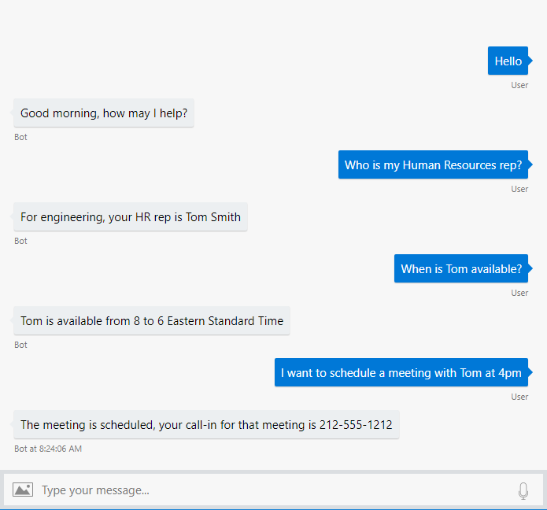

# Developing a LUIS app
LUIS is a REST-based API that predicts user intention of text (500 characters max). The typical consumer of a LUIS app is a conversation-style application such as chat bot or virtual reality game.

In the following example, the chat bot passes each textual interaction of the user to LUIS, one interaction at a time. 



LUIS uses the text and the LUIS app's trained model to predict the user's overall intention and any specific data. The prediction is returned as a JSON response. 

Creating a LUIS app is called _authoring the model_. Using the LUIS app is known as _querying the endpoint_. 

## Model development
A model is the configuration of LUIS used to predict text for your specific domain. The domain is the _subject area_ of the app. In the previous bot conversation, the domain is Human resources. 

### Models begin with intentions
A model begins with user intentions. An intention is what the user is trying to ask for or do, within the conversational, natural language text. 

Different examples of a user's request that can be grouped into the same intention are called **Intents**.

|Examples of the HRContact intent in the Company app|
|--|
|Who is my Human Resources rep?|
|Is anyone in HR available now?|
|I want to schedule a meeting with Tom Smith in HR.|

You can begin the model with just a single domain-specific intent such as HRContact. 

### None intent
The only intent outside the domain of your app is the None intent, provided in all LUIS apps. Since a domain is specific, such as a company's Human Resources (HR) department, LUIS doesn't guess what those non-domain utterances are. You need to provide a few examples. 

### Prebuilt domain
If you want to quickly try LUIS without developing a model of your own, add a [prebuilt domain model](luis-reference-prebuilt-domains.md) to a new app. This allows you to see what the model looks like as well as test it. 

## An intent(ion) needs example utterances
Once the different user intents are identified, provide examples of text (called utterances) a user might submit to LUIS for each intent. 

This teaches LUIS how utterances are constructed, specifically what words, word order, and utterance length. This isn't meant to be a hard limit of all examples but rather a short list of utterances, as a guideline. LUIS learns from the examples. Giving too many examples may incorrectly teach LUIS by reinforcing information derived from the example utterances that you didn't want LUIS to learn. 

> ![NOTE]
> * The LUIS authoring API documentation uses the word label when meaning utterance. 

An utterance is made up of words, spaces, and punctuation. Depending on the culture (spoken language) of the app, there can be a smaller unit (called a token) than a word. For more information, see [tokenization](luis-supported-languages.md#tokenization) .

## An entity is a piece of data inside an utterance
After the intents with example utterances are created, the next step of building the model is to define the data you want pulled out of the utterance. Data is categorized by an **Entity**. 

[Prebuilt entities](luis-reference-prebuilt-entities.md) such as number, email, URL, and datetimeV2 are provided by LUIS. 

There are several types of custom, domain-specific data. If the data can change form but has the same meaning, you need to mark the data in the example utterances. Examples of form changes can include word choice, pluralization, and word quantity.

The following table shows example utterances with the **Contact type** entity marked:

|Contact type entity marked with bold characters|
|--|
|I would like an HR rep or a manager to **call** me.| 
|I want to be **called** by my HR rep.|
|What HR rep **calls** me?|
|**Text** me the email address of my HR rep.|
|Send me an **email** with the list of HR reps for the local engineers' group.|

## Train the model
The model of intents, entities, and marked example utterances is not ready to be published (deployed) yet. It needs to be trained and tested first. Training applies the current model, including any changes, to the example utterances. 

Generally, as long as each intent has at least one example utterance, training succeeds.

## Publish the model
Once the model is successfully trained, it can be [published](publishapp.md). Publishing is the process of making the model available from an HTTPS endpoint. 

A LUIS app can have more than one [version](luis-concept-version.md) but publishes only the active version to the staging or production endpoint. 

## Test the model
There are three types of model testing: [interactive](train-test.md), [batch](luis-how-to-batch-test.md), and endpoint testing. It is important that the utterances used for testing are not the same utterances used as examples. 

The most important test is submitting utterances to the endpoint. This may not seem like testing to the conventional developer. After an utterance's prediction, if the prediction had a low score or a high score but too close to another intent's score, the utterance is moved to the [Review endpoint utterances](label-suggested-utterances.md) list. By using the published endpoint for testing, LUIS can help you find utterances with low confidence. 

Interactive and batch testing utterances are not put on the list of utterances to review.

Interactive testing is only found in the [LUIS][LUIS] website and is meant for testing utterances one at a time. The test includes intent and entity information. You can also compare it to the same query sent to the endpoint.

Batch testing is only found in the [LUIS][LUIS] website and sends thousands of utterances to LUIS for prediction. 

## Improve app performance
Improving app performance is the process of increasing the prediction score of an intent. The first, and most powerful way, to increase the prediction score is to review endpoint utterances (mentioned in the preceding section).

A second method is to create a [Phrase list](add-features.md). A phrase list is a list of words that you want to emphasis. These can be words that are important in the domain or in the word choice of your users. 

## Patterns
If intents are still not getting a high prediction score, consider added [patterns](luis-how-to-model-intent-pattern.md) to your app. This allows you to define common utterance word choice and phrase composition that follows a pattern. Entities and ignorable text are configured using regular expressions.

## Querying at the endpoint
Once the model is published, it is available from an endpoint URL. You can send an utterance to the endpoint URL and receive a prediction. The endpoint URL is shown at the bottom of the Publish page in the [LUIS][LUIS] website. The API documentation also has a test console on each page for each region. 

The following JSON object is a LUIS response: 

```JSON
{
  "query": "I want to be called by my HR rep.",
  "topScoringIntent": {
    "intent": "HRContact",
    "score": 0.921233
  },
  "entities": [
    {
      "entity": "called",
      "type": "Contact Type",
      "startIndex": 13,
      "endIndex": 18,
      "score": 0.7615982
    }
  ]
}
```

## Chat bot using LUIS results
Once LUIS responds with the top intent(ion) and all entities inside an utterance, the chat bot uses this information to fulfill the request. 

For example, the chat bot (not LUIS) could call an external messaging system: 

```javascript

// conversation and endpoint query happens here
// ...

// then LUIS information and chat bot session data 
// are used to fulfill request

// chat bot information found in session
var requestor = session.data.user.email;
var originalRequest = session.data.message;

// luis information returned from querying endpoint
var typeOfContact = luis.entities["Contact Type"];
var receiver = luis.topScoringIntent;

var responseFromMessageServer = sendMessage(requestor, receiver, typeOfContact, originalRequest);
```

## Using the APIs
The APIs are divided between the authoring APIs and the endpoint APIs. 

The [authoring](https://aka.ms/luis-authoring-apis) APIs do not have a limit for usage but you must use the correct key, found on your [User account](luis-how-to-account-settings.md) page in the [LUIS][LUIS] website. This one authoring key is used for all apps you need to author from the APIs.

The authoring API URL looks like: 

```JSON
https://<region>.api.cognitive.microsoft.com/luis/api/v2.0/apps/<appId>/versions/<versionId>/
```

The [endpoint](https://aka.ms/luis-endpoint-apis) APIs have a limit for usage per second and per month. 

While you are beginning with LUIS, use your authoring key for endpoint queries, up to 1000 queries. After that, you will either get a 403 - out of quota for the month or you can create a [subscription key](azureibizasubscription.md) and associate it with your LUIS app on the Publish page of the [LUIS][LUIS] website. A single subscription key can be used across LUIS apps but may affect the endpoint per minute or monthly quota. 

The endpoint API URL looks like (where q is the key for the utterance text: 

```JSON
https://<region>.api.cognitive.microsoft.com/luis/v2.0/apps/<appID>?subscription-key=<authoringKey>&verbose=true&timezoneOffset=0&q=I want to be called by my HR rep.
```

The authoring and endpoint URLs look the same but the authoring API has an additional route of **api** after "/luis/". Both sets of APIs call the LUIS key the same thing, **Ocp-Apim-Subscription-Key**. It is important to understand that the value of the key needs to change based on whether you are accessing the authoring or endpoint API. 

## Next steps

* Learn [concepts](luis-concept-keys.md) about authoring and endpoint keys.
* Learn concepts about [intents](luis-concept-intent.md), [entities](luis-concept-entity-types.md), [utterances](luis-concept-utterance.md), and [roles](luis-concept-roles.md).
* Learn [best practices](luis-concept-best-practices.md). 
* Learn about key [usage](luis-boundaries.md#key-limits) tiers.

[LUIS]: luis-reference-regions.md#luis-website