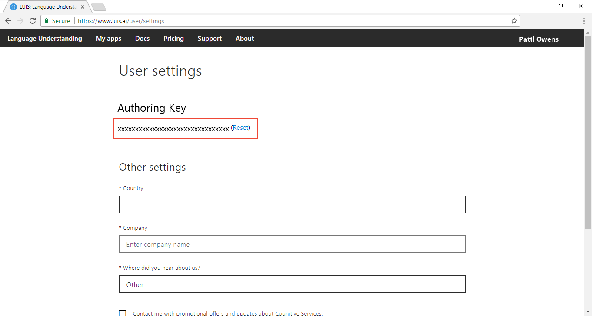

# Keys in LUIS
LUIS uses two keys: [authoring](#programmatic-key) and [endpoint](#endpoint-key). The authoring key is created for you automatically when you create your LUIS account. When you are ready to publish your LUIS app, you need to [create the endpoint key](luis-how-to-azure-subscription.md#create-luis-endpoint-key), [assign it](luis-how-to-manage-keys.md#assign-endpoint-key) to your LUIS app, and [use it with the endpoint query](#use-endpoint-key-in-query). 

|Key|Purpose|
|--|--|
|[Authoring key](#programmatic-key)|Authoring, publishing, managing collaborators, versioning|
|[Endpoint key](#endpoint-key)| Querying|

It is important to author LUIS apps in [regions](luis-reference-regions.md#publishing-regions) where you also want to publish and query.

## Authoring key

An authoring key, also known as a starter key, is created automatically when you create a LUIS account and it is free. You have one authoring key across all your LUIS apps for each authoring [region](luis-reference-regions.md). The authoring key is provided to author your LUIS app or to test endpoint queries. 

To find the authoring Key, log in to [LUIS](luis-reference-regions.md#luis-website) and click on the account name in the upper-right navigation bar to open **Account Settings**.

When you want to make **production endpoint queries**, create the Azure [LUIS subscription](https://azure.microsoft.com/pricing/details/cognitive-services/language-understanding-intelligent-services/). 

> [!CAUTION]
> For convenience, many of the samples use the Authoring key since it provides a few endpoint calls in its [quota](luis-boundaries.md#key-limits).  

## Endpoint key
 When you need **production endpoint queries**, create a [LUIS key](https://azure.microsoft.com/pricing/details/cognitive-services/language-understanding-intelligent-services/) in the Azure portal. Remember the name used to create the key, you need it when you add the key to the app.

When the LUIS subscription process is finished, [assign the key](luis-how-to-manage-keys.md#assign-endpoint-key) to the app. 

The endpoint key allows a quota of endpoint hits based on the usage plan you specified when creating the key. See [Cognitive Services Pricing](https://azure.microsoft.com/pricing/details/cognitive-services/language-understanding-intelligent-services/?v=17.23h) for pricing information.

The endpoint key can be used for all your LUIS apps or for specific LUIS apps. 

Do not use the endpoint key for authoring LUIS apps. 

## Use endpoint key in query
The LUIS endpoint accepts two styles of query, both use the endpoint key, but in different places:

|Verb|Example url and key location|
|--|--|
|[GET](https://westus.dev.cognitive.microsoft.com/docs/services/5819c76f40a6350ce09de1ac/operations/5819c77140a63516d81aee78)|`https://westus.api.cognitive.microsoft.com/luis/v2.0/apps/df67dcdb-c37d-46af-88e1-8b97951ca1c2?subscription-key=your-endpoint-key-here&verbose=true&timezoneOffset=0&q=turn%20on%20the%20lights`  query string value for `subscription-key`  Change your endpoint query value for the `subscription-key` from the authoring (starter) key, to the new endpoint key in order to use the LUIS endpoint key quota rate. If you create the key, and assign the key but do not change the endpoint query value for subscription-key`, you are not using your endpoint key quota.|
|[POST](https://westus.dev.cognitive.microsoft.com/docs/services/5819c76f40a6350ce09de1ac/operations/5819c77140a63516d81aee79)| `https://westus.api.cognitive.microsoft.com/luis/v2.0/apps/df67dcdb-c37d-46af-88e1-8b97951ca1c2`   header value for `Ocp-Apim-Subscription-Key`  Change your endpoint query value for the `Ocp-Apim-Subscription-Key` from the authoring (starter) key, to the new endpoint key in order to use the LUIS endpoint key quota rate. If you create the key, and assign the key but do not change the endpoint query value for `Ocp-Apim-Subscription-Key`, you are not using your endpoint key quota.|

The app ID used in the previous URLs, `df67dcdb-c37d-46af-88e1-8b97951ca1c2`, is the public IoT app used for the [interactive demonstration](https://azure.microsoft.com/services/cognitive-services/language-understanding-intelligent-service/). 

## API usage of Ocp-Apim-Subscription-Key
The LUIS APIs use the header, `Ocp-Apim-Subscription-Key`. The header name does not change based on which key and set of APIs you are using. Set the header to the authoring key for authoring APIs. If you are using the endpoint, set the header to the endpoint key. 

You can't pass the endpoint key for authoring APIs. If you do, you get a 401 error - access denied due to invalid endpoint key. 

## Key limits
See [Key Limits](luis-boundaries.md#key-limits) and [Azure Regions](luis-reference-regions.md). The authoring key is free and used for authoring. The LUIS endpoint key has a free tier but must be created by you and associated with your LUIS app on the **Publish** page. It can't be used for authoring, but only endpoint queries.

Publishing regions are different from authoring regions. Make sure you create an app in the authoring region corresponding to the publishing region you want.

## Key limit errors
If you exceed your per second quota, you receive an HTTP 429 error. If you exceed your per month quota, you receive an HTTP 403 error. Fix these errors by getting a LUIS [endpoint](#endpoint-key) key, [assigning](luis-how-to-manage-keys.md#assign-endpoint-key) the key to the app on the **Publish** page of the [LUIS](luis-reference-regions.md#luis-website) website.

## Automating assignment of the endpoint key

In order to assign the endpoint key to a LUIS app, you must use the LUIS website for the correct authoring and publishing [regions](luis-reference-regions.md). There is **no** automated method of doing this, regardless of mechanism such as with an Azure resource manager script, Azure CLI, programmatic SDK, or with the APIs.

## Next steps

* Learn [concepts](luis-how-to-manage-keys.md#assign-endpoint-key) about authoring and endpoint keys.