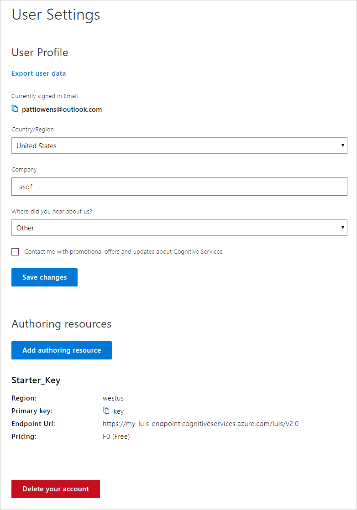

# Authoring and runtime keys

>[!NOTE]
>Please [migrate](luis-migration-authoring.md) any apps, which don't use the Azure authoring resource, before continuing.

LUIS uses two types of Azure resources, each type has keys: 
 
* [Authoring](#programmatic-key) to create intents, entities, and label utterances, train, and publish. When you are ready to publish your LUIS app, you need a [prediction endpoint key for the runtime](luis-how-to-azure-subscription.md) assigned to the app.
* [Prediction endpoint key for the runtime](#prediction-endpoint-runtime-key). Client-applications, such as a chat bot, need access to the runtime's **query prediction endpoint** through this key. 

|Key|Purpose|Cognitive service `kind`|Cognitive service `type`|
|--|--|--|--|
|[Authoring key](#programmatic-key)|Authoring, training, publishing, testing.|`LUIS.Authoring`|`Cognitive Services`|
|[Prediction endpoint runtime key](#prediction-endpoint-runtime-key)| Query prediction endpoint runtime with a user utterance to determine intents and entities.|`LUIS`|`Cognitive Services`|

LUIS also provides a [starter key](luis-how-to-azure-subscription.md#starter-key) with a 1000 transactions per month prediction endpoint quota. 

While you don't need to create both keys at the same time, it is much easier if you do.

It is important to author LUIS apps in [regions](luis-reference-regions.md#publishing-regions) where you want to publish and query.

## Authoring key

An authoring key is created automatically when you create a LUIS account and it is free. When you begin with LUIS, you have one starter key across all your LUIS apps for each authoring [region](luis-reference-regions.md). The purpose of the authoring key is to provide authentication to manage your LUIS app or to test prediction endpoint queries. 

Creating authoring keys in the Azure portal allows you to control permissions to the authoring resource by assigning people to [the contributor role](#contributions-from-other-authors). You need permission at the Azure subscription level to add contributors.. 

To find the authoring Key, sign in to [LUIS](luis-reference-regions.md#luis-website) and click on the account name in the upper-right navigation bar to open **Account Settings**.

When you want to make **runtime queries**, create the Azure [LUIS resource](https://azure.microsoft.com/pricing/details/cognitive-services/language-understanding-intelligent-services/). 

> [!CAUTION]
> For convenience, many of the samples use the [Starter key](#starter-prediction-endpoint-runtime-key) because it provides a few free prediction endpoint calls in its [quota](luis-boundaries.md#key-limits).  

## Prediction endpoint runtime key 

When you need **runtime endpoint queries**, create a Language Understanding (LUIS) resource, then assign it to the LUIS app. 

[!INCLUDE [Azure runtime resource creation for Language Understanding and Cognitive Service resources](../../../includes/cognitive-services-luis-azure-resource-instructions.md)]

When the resource creation process is finished, [assign the key](luis-how-to-azure-subscription.md) to the app. 

* The runtime (query prediction endpoint) key allows a quota of endpoint hits based on the usage plan you specified when creating the runtime key. See [Cognitive Services Pricing](https://azure.microsoft.com/pricing/details/cognitive-services/language-understanding-intelligent-services/?v=17.23h) for pricing information.

* The runtime key can be used for all your LUIS apps or for specific LUIS apps. 
* Do not use the runtime key for authoring LUIS apps. 

### Starter prediction endpoint runtime key

The **Starter** prediction endpoint key is provides for free and includes 1000 prediction endpoint queries. After these queries are used, you should create your own prediction endpoint resource for Language Understanding.  

This is a special resource created for you. It does not appear in your list of Azure resources because it is meant as a temporary beginning key. 

### Use runtime key in query
The LUIS runtime endpoint accepts two styles of query, both use the prediction endpoint runtime key, but in different places.

The endpoint used to access the runtime uses a subdomain that is unique to your resource's region, denoted with `{region}` in the following table. 

|Verb|Example url and key location|
|--|--|
|[GET](https://{region}.dev.cognitive.microsoft.com/docs/services/5819c76f40a6350ce09de1ac/operations/5819c77140a63516d81aee78)|`https://{region}.api.cognitive.microsoft.com/luis/v2.0/apps/df67dcdb-c37d-46af-88e1-8b97951ca1c2?runtime-key=your-endpoint-key-here&verbose=true&timezoneOffset=0&q=turn%20on%20the%20lights`  query string value for `runtime-key`  Change your endpoint query value for the `runtime-key` from the authoring (starter) key, to the new endpoint key in order to use the LUIS endpoint key quota rate. If you create the key, and assign the key but do not change the endpoint query value for `runtime-key`, you are not using your endpoint key quota.|
|[POST](https://{region}.dev.cognitive.microsoft.com/docs/services/5819c76f40a6350ce09de1ac/operations/5819c77140a63516d81aee79)| `https://{region}.api.cognitive.microsoft.com/luis/v2.0/apps/df67dcdb-c37d-46af-88e1-8b97951ca1c2`   header value for `Ocp-Apim-Subscription-Key` If you create the runtime key, and assign the runtime key but do not change the endpoint query value for `Ocp-Apim-Subscription-Key`, you are not using your runtime key.|

The app ID used in the previous URLs, `df67dcdb-c37d-46af-88e1-8b97951ca1c2`, is the public IoT app used for the [interactive demonstration](https://azure.microsoft.com/services/cognitive-services/language-understanding-intelligent-service/). 

## Assignment of the runtime key

You can [assign](luis-how-to-azure-subscription.md) the runtime key in the [LUIS portal](https://www.luis.ai) or via the corresponding APIs. 

## Key limits

You can create up to 10 authoring keys per region per subscription. 

See [Key Limits](luis-boundaries.md#key-limits) and [Azure regions](luis-reference-regions.md). 

Publishing regions are different from authoring regions. Make sure you create an app in the authoring region corresponding to the publishing region you want your client application to be located.

## Key limit errors
If you exceed your transactions-per-second (TPS) quota, you receive an HTTP 429 error. If you exceed your transaction-per-month (TPS) quota, you receive an HTTP 403 error. 

## Contributions from other authors

Management of contributions from collaborators depends on the current status of the app.

**For [authoring resource migrated](luis-migration-authoring.md) apps**: _contributors_ are managed in the Azure portal for the authoring resource, using the **Access control (IAM)** page. Learn [how to add a user](luis-how-to-collaborate.md), using the collaborator's email address and the _contributor_ role. 

**For apps that have not migrated yet**: all _collaborators_ are managed in the LUIS portal from the **Manage -> Collaborators** page.

### Contributor roles vs entity roles

[Entity roles](luis-concept-roles.md) apply to the data model of the LUIS app. The collaborator/contributor roles apply to levels of authoring access. 

## Moving or changing ownership

An app is defined by its Azure resources, which is determined by the owner's subscription. 

You can move your LUIS app. Use the following documentation resources in the Azure portal or Azure CLI:

* [Move app between LUIS authoring resources](https://westus.dev.cognitive.microsoft.com/docs/services/5890b47c39e2bb17b84a55ff/operations/apps-move-app-to-another-luis-authoring-azure-resource)
* [Move resource to new resource group or subscription](../../azure-resource-manager/resource-group-move-resources.md)
* [Move resource within same subscription or across subscriptions](../../azure-resource-manager/move-limitations/app-service-move-limitations.md)
* [Transfer ownership](../../billing/billing-subscription-transfer.md) of your subscription 

## Access for private and public apps

For a **private** app, runtime access is available for owners and contributors. For a **public** app, runtime access is available to everyone that has their own Azure [Cognitive Service](../cognitive-services-apis-create-account.md) or [LUIS](luis-how-to-azure-subscription.md#create-resources-in-the-azure-portal) runtime resource, and has the public app's ID. 

Currently, there isn't a catalog of public apps.

### Authoring access
Access to the app from the [LUIS](luis-reference-regions.md#luis-website) portal or the [authoring APIs](https://go.microsoft.com/fwlink/?linkid=2092087) is controlled by the Azure authoring resource. 

The owner and all contributors have access to author the app. 

|Authoring access includes|Notes|
|--|--|
|Add or remove endpoint keys||
|Exporting version||
|Export endpoint logs||
|Importing version||
|Make app public|When an app is public, anyone with an authoring or endpoint key can query the app.|
|Modify model|
|Publish|
|Review endpoint utterances for [active learning](luis-how-to-review-endpoint-utterances.md)|
|Train|

### Prediction endpoint runtime access

Access to query the prediction endpoint is controlled by a setting on the **Application Information** page in the **Manage** section. 

|[Private endpoint](#runtime-security-for-private-apps)|[Public endpoint](#runtime-security-for-public-apps)|
|:--|:--|
|Available to owner and contributors|Available to owner, contributors, and anyone else that knows app ID|

You can control who sees your LUIS runtime key by calling it in a server-to-server environment. If you are using LUIS from a bot, the connection between the bot and LUIS is already secure. If you are calling the LUIS endpoint directly, you should create a server-side API (such as an Azure [function](https://azure.microsoft.com/services/functions/)) with controlled access (such as [AAD](https://azure.microsoft.com/services/active-directory/)). When the server-side API is called and authenticated and authorization is verified, pass the call on to LUIS. While this strategy doesn’t prevent man-in-the-middle attacks, it obfuscates your key and endpoint URL from your users, allows you to track access, and allows you to add endpoint response logging (such as [Application Insights](https://azure.microsoft.com/services/application-insights/)).

#### Runtime security for private apps

A private app's runtime is only available to the following:

|Key and user|Explanation|
|--|--|
|Owner's authoring key| Up to 1000 endpoint hits|
|Collaborator/contributor authoring keys| Up to 1000 endpoint hits|
|Any key assigned to LUIS by an author or collaborator/contributor|Based on key usage tier|

#### Runtime security for public apps

Once an app is configured as public, _any_ valid LUIS authoring key or LUIS endpoint key can query your app, as long as the key has not used the entire endpoint quota.

A user who is not an owner or contributor, can only access a public app's runtime if given the app ID. LUIS doesn't have a public _market_ or other way to search for a public app.  

A public app is published in all regions so that a user with a region-based LUIS resource key can access the app in whichever region is associated with the resource key.

## Transfer of ownership

**For [authoring resource migrated](luis-migration-authoring.md) apps**: 

**For apps that have not migrated yet**: Export your app as a JSON file. Another LUIS user can import the app, thereby becoming the app owner. The new app will have a different app ID.  

## Securing the endpoint 

You can control who can see your LUIS prediction runtime endpoint key by calling it in a server-to-server environment. If you are using LUIS from a bot, the connection between the bot and LUIS is already secure. If you are calling the LUIS endpoint directly, you should create a server-side API (such as an Azure [function](https://azure.microsoft.com/services/functions/)) with controlled access (such as [AAD](https://azure.microsoft.com/services/active-directory/)). When the server-side API is called and authentication and authorization are verified, pass the call on to LUIS. While this strategy doesn’t prevent man-in-the-middle attacks, it obfuscates your endpoint from your users, allows you to track access, and allows you to add endpoint response logging (such as [Application Insights](https://azure.microsoft.com/services/application-insights/)).  

## Next steps

* Understand [versioning](luis-concept-version.md) concepts. 
* Learn [how to create keys](luis-how-to-azure-subscription.md).
