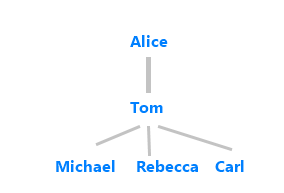

# Patterns improve prediction accuracy
Patterns are designed to improve accuracy when several utterances are very similar.  A pattern allows you to gain more accuracy for an intent without providing many more utterances.

## Patterns solve low intent confidence
Consider a Human Resources app that reports on the organizational chart in relation to an employee. Given an employee's name and relationship, LUIS returns the employees involved. Consider an employee, Tom, with a manager name Alice, and a team of subordinates named: Michael, Rebecca, and Carl.

|Utterances|Intent predicted|Intent score|
|--|--|--|
|Who is Tom's subordinate?|GetOrgChart|.30|
|Who is the subordinate of Tom?|GetOrgChart|.30|

If an app has between 10 and 20 utterances with different lengths of sentence, different word order, and even different words (synonyms of "subordinate", "manage", "report"), LUIS may return a low confidence score. Create a pattern to help LUIS understand the importance of the word order.

Patterns solve the following situations:

* The intent score is low
* The correct intent is not the top score but too close to the top score.

## Patterns are not a guarantee of intent
Patterns use a mix of prediction technologies. Setting an intent for a template utterance in a pattern is not a guarantee of the intent prediction but it is a strong signal.

## Patterns do not improve machine-learning entity detection

A pattern is primarily meant to help the prediction of intents and roles. The _pattern.any_ entity is used to extract free-form entities. While patterns use entities, a pattern does not help detect a machine-learning entity.

Do not expect to see improved entity prediction if you collapse multiple utterances into a single pattern. For simple entities to fire, you need to add utterances or use list entities else your pattern will not fire.

## Patterns use entity roles
If two or more entities in a pattern are contextually related, patterns use entity [roles](luis-concept-roles.md) to extract contextual information about entities.

## Prediction scores with and without patterns
Given enough example utterances, LUIS would be able to increase prediction confidence without patterns. Patterns increase the confidence score without having to provide as many utterances.

## Pattern matching
A pattern is matched based on detecting the entities inside the pattern first, then validating the rest of the words and word order of the pattern. Entities are required in the pattern for a pattern to match. The pattern is applied at the token level, not the character level.

## Pattern-only apps
You can build an app with intents that have no example utterances, as long as there's a pattern for each intent. For a pattern-only app, the pattern shouldn't contain machine-learning entities because these do require example utterances.

## Pattern.any entity

[!INCLUDE [Pattern.any entity - concepts](./includes/pattern-any-entity.md)]

## Best practices
Learn [best practices](luis-concept-best-practices.md).

## Pattern syntax

Learn pattern syntax from the [pattern syntax reference](reference-pattern-syntax.md).

## Next steps

Learn more about patterns:

* [How to add patterns](luis-how-to-model-intent-pattern.md)
* [How to add pattern.any entity](luis-how-to-add-entities.md#add-a-patternany-entity)
* [Patterns Syntax](reference-pattern-syntax.md)

> [!div class="nextstepaction"]
> [Learn how to implement patterns in this tutorial](luis-tutorial-pattern.md)
