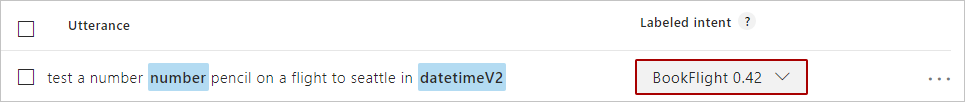

# Prediction scores indicate prediction accuracy for intent and entities

A prediction score indicates the degree of confidence LUIS has for prediction results, based on a user utterance.

A prediction score is between zero (0) and one (1). An example of a highly confident LUIS score is 0.99. An example of a score of low confidence is 0.01. 

|Score value|Confidence|
|--|--|
|1|definite match|
|0.99|high confidence|
|0.01|low confidence|
|0|definite failure to match|

When an utterance results in a low-confidence score, LUIS highlights that in the [LUIS](luis-reference-regions.md) website **Intent** page, with the identified **labeled-intent** outlined with red.

## Top-scoring intent

Every utterance prediction returns a top-scoring intent. This prediction is a numerical comparison of prediction scores. The top 2 scores can have a very small difference between them. LUIS doesn't indicate this proximity other than returning the top score.  

## Return prediction score for all intents

A test or endpoint result can include all intents. This configuration is set on the [endpoint](https://aka.ms/v1-endpoint-api-docs) with the `verbose=true` query string name/value pair.

## Review intents with similar scores

Reviewing the score for all intents is a good way to verify that not only is the correct intent identified, but that the next identified intent's score is significantly lower consistently for utterances.

If multiple intents have close prediction scores, based on the context of an utterance, LUIS may switch between the intents. To fix this situation, continue to add utterances to each intent with a wider variety of contextual differences or you can have the client application, such as a chat bot, make programmatic choices about how to handle the 2 top intents.

The 2 intents, which are too-closely scored, may invert due to non-deterministic training. The top score could become the second top and the second top score could become the first top score. In order to prevent this situation, add example utterances to each of the top two intents for that utterance with word choice and context that differentiates the 2 intents. The two intents should have about the same number of example utterances. A rule of thumb for separation to prevent inversion due to training, is a 15% difference in scores.

You can turn off the non-deterministic training by [training with all data](luis-how-to-train.md#train-with-all-data).

## Differences with predictions between different training sessions

When you train the same model in a different app, and the scores are not the same, this difference is because there is non-deterministic training (an element of randomness). Secondly, any overlap of an utterance to more than one intent means the top intent for the same utterance can change based on training.

If your chat bot requires a specific LUIS score to indicate confidence in an intent, you should use the score difference between the top two intents. This situation provides flexibility for variations in training.

## E (exponent) notation

Prediction scores can use exponent notation, *appearing* above the 0-1 range, such as `9.910309E-07`. This score is an indication of a very **small** number.

|E notation score |Actual score|
|--|--|
|9.910309E-07|.0000009910309|

## Punctuation

Punctuation is a separate token in LUIS. An utterance that contains a period at the end versus an utterance that does not contain a period at the end are two separate utterances and may get two different predictions. Make sure the model handles punctuation either in the [example utterances](luis-concept-utterance.md) (having and not having punctuation) or in the [patterns](luis-concept-patterns.md) where it is easier to ignore punctuation with the special syntax: `I am applying for the {Job} position[.]`

## Next steps

See [Add entities](luis-how-to-add-entities.md) to learn more about how to add entities to your LUIS app.
