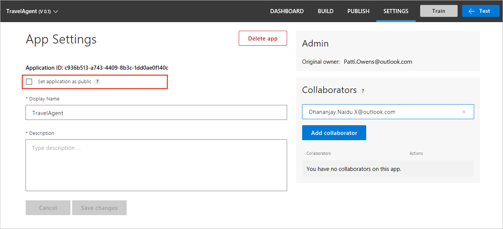

# Authoring and endpoint user access
Authoring access is available for owners and collaborators. For a private app, endpoint access is available for owners and collaborators. For a public app, endpoint access is available to everyone that has their own LUIS account and has the public app's ID. 

## Access to authoring
Access to the app from the [LUIS](luis-reference-regions.md#luis-website) website or the [authoring APIs](https://aka.ms/luis-authoring-apis) is controlled by the owner of the app. 

The owner and all collaborators have access to author the app. 

|Authoring access includes|Notes|
|--|--|
|Add or remove endpoint keys||
|Exporting version||
|Export endpoint logs||
|Importing version||
|Make app public|When an app is public, anyone with an authoring or endpoint key can query the app.|
|Modify model|
|Publish|
|Review endpoint utterances for [active learning](luis-how-to-review-endoint-utt.md)|
|Train|

## Access to endpoint
Access to the endpoint to query LUIS is controlled by the **Public** setting of the app on the **Settings** page. A private app's endpoint query is checked for an authorized key with remaining quota hits. A public app's endpoint query has to also provide an endpoint key (from whoever is making the query) which is also checked for remaining quota hits. 

The endpoint key is passed either in the querystring of the GET request or the header of the POST request.

### Private app endpoint security
A private app's endpoint is only available to the following:

|Key and user|Explanation|
|--|--|--|
|Owner's authoring key| Up to 1000 endpoint hits|
|Collaborators' authoring keys| Up to 1000 endpoint hits|
|Endpoint keys added from **[Publish](luis-how-to-publish-app.md)** page|Owner and collaborators can add endpoint keys|

Other authoring or endpoint keys have **no** access.

### Public app endpoint access
Configure the app as **public** on the **Settings** page of the app. Once an app is configured as public, _any_ valid LUIS authoring key or LUIS endpoint key can query your app, as long as the key has not used the entire endpoint quota.

A user who is not an owner or collaborator, can only access a public app if given the app ID. LUIS doesn't have a public _market_ or other way to search for a public app.  

## Microsoft user accounts
Authors and collaborators can add keys to LUIS on the Publish page. The Microsoft user account that creates the LUIS key in the Azure portal needs to be either the app owner or an app collaborator. 

See [Azure Active Directory tenant user](luis-how-to-collaborate.md#azure-active-directory-tenant-user) to learn more about Active Directory user accounts. 

<!--
### Individual consent
If the Microsoft user account is part of an Azure Active Directory (AAD), and the active directory doesn't allow users to give consent, then you can provide individual consent as part of the login process. 

### Administrator consent
If the Microsoft user account is part of an Azure Active Directory (AAD), and the active directory doesn't allow users to give consent, then the administrator can give individual consent via the method discussed in this [blog](https://blogs.technet.microsoft.com/tfg/2017/10/15/english-tips-to-manage-azure-ad-users-consent-to-applications-using-azure-ad-graph-api/). 
-->
## Securing the endpoint 
You can control who can see your LUIS endpoint key by calling it in a server-to-server environment. If you are using LUIS from a bot, the connection between the bot and LUIS is already secure. If you are calling the LUIS endpoint directly, you should create a server-side API (such as an Azure [function](https://azure.microsoft.com/services/functions/)) with controlled access (such as [AAD](https://azure.microsoft.com/services/active-directory/)). When the server-side API is called and authentication and authorization are verified, pass the call on to LUIS. While this strategy doesn’t prevent man-in-the-middle attacks, it obfuscates your endpoint from your users, allows you to track access, and allows you to add endpoint response logging (such as [Application Insights](https://azure.microsoft.com/services/application-insights/)).  

## Security Compliance
LUIS successfully completed the ISO 27001:2013 and ISO 27018:2014 audit with ZERO non-conformities (findings) in the audit report. Additionally, LUIS also obtained the CSA STAR Certification with the highest possible Gold Award for the maturity capability assessment. Azure is the only major public cloud service provider to earn this certification. For more details, you can find the LUIS included in the updated scope statement in Azure’s main [compliance overview](https://gallery.technet.microsoft.com/Overview-of-Azure-c1be3942) document that is referenced on [Trust Center](https://www.microsoft.com/en-us/trustcenter/compliance/iso-iec-27001) ISO pages.  

## Next steps

See [Best Practices](luis-concept-best-practices.md) to learn how to use intents and entities for the best predictions.
