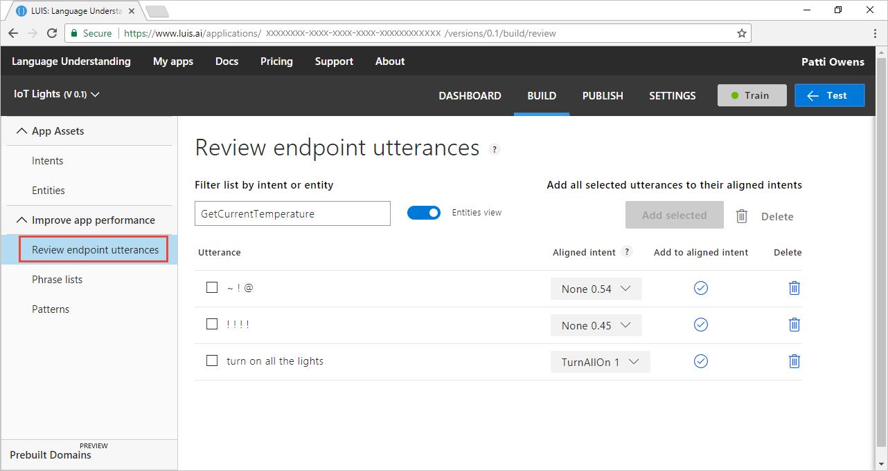

# Testing example utterances in LUIS

Testing is the process of providing sample utterances to LUIS and getting a response of LUIS-recognized intents and entities. 

You can [test](luis-interactive-test.md) LUIS interactively, one utterance at a time, or provide a [batch](luis-concept-batch-test.md) of utterances. With testing, you compare the current [active](luis-concept-version.md#active-version) model to the published model. 

## What is a score in testing?
See [Prediction score](luis-concept-prediction-score.md) concepts to learn more about prediction scores.

## Interactive testing
Interactive testing is done from the **Test** panel of the website. You can enter an utterance to see how intents and entities are identified and scored. If LUIS isn't predicting the intents and entities as you expect on an utterance in the testing pane, copy it to the **Intent** page as a new utterance. Then label the parts of that utterance, and train LUIS. 

## Batch testing
See [batch testing](luis-concept-batch-test.md) if you are testing more than one utterance at a time.

## Endpoint testing
You can test using the [endpoint](luis-glossary.md#endpoint) with a maximum of two versions of your app. With your main or live version of your app set as the **production** endpoint, add a second version to the **staging** endpoint. This approach gives you three versions of an utterance: the current model in the Test pane of the [LUIS](luis-reference-regions.md) website, and the two versions at the two different endpoints. 

All endpoint testing counts toward your usage quota. 

## Do not log tests
If you test against an endpoint, and do not want the utterance logged, remember to use the `logging=false` query string configuration.

## Where to find utterances
LUIS stores all logged utterances in the query log, available for download on the [LUIS](luis-reference-regions.md) website **Apps** list page, as well as the LUIS [authoring APIs](https://go.microsoft.com/fwlink/?linkid=2092087). 

Any utterances LUIS is unsure of are listed in the **[Review endpoint utterances](luis-how-to-review-endpoint-utterances.md)** page of the [LUIS](luis-reference-regions.md) website. 

 
## Remember to train
Remember to [train](luis-how-to-train.md) LUIS after you make changes to the model. Changes to the LUIS app are not seen in testing until the app is trained. 

## Best practices
Learn [best practices](luis-concept-best-practices.md).

## Next steps

* Learn more about [testing](luis-interactive-test.md) your utterances.
