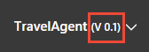

# Understand how and when to use a LUIS version

Versions, in LUIS, are similar to versions in traditional programming. Each version is a snapshot in time of the app. Before you make changes to the app, create a new version. It is easier to go back to the exact version, then to try to remove intents and utterances to a previous state.

Create different models of the same app with [versions](luis-how-to-manage-versions.md). 

## Version ID
The version ID consists of characters, digits or '.' and cannot be longer than 10 characters.

## Initial version
The initial version (0.1) is the default active version. 

## Active version
To [set a version](luis-how-to-manage-versions.md#set-active-version) as the active means it is currently edited and tested in the [LUIS](luis-reference-regions.md) website. Set a version as active to access its data, make updates, as well as to test and publish it.

The name of the currently active version is displayed in the top, left panel after the app name. 

## Versions and publishing slots
You publish to either the stage and product slots. Each slot can have a different version or the same version. This is useful for verifying changes between model versions via the endpoint, which is available to bots or other LUIS calling applications. 

## Clone a version
Clone a version to create a copy of an existing version and save it as a new version. Clone a version to use the same content of the existing version as a starting point for the new version. Once you clone a version, the new version becomes the **active** version. 

## Import and export a version
You can import a version at the app level. That version becomes the active version and used the version ID in the "versionId" property of the app file. You can also import at the version level into an existing app. The new version becomes the active version. 

You can export a version at the app level or you can export a version at the version level. The only difference is that the app-level exported version is the currently active version while at the version level, you can choose any version to export on the **[Settings](luis-how-to-manage-versions.md)** page. 

The exported file does not contain machine-learned information because the app is retrained after it is imported. The exported file does not contain collaborators -- you need to add these back once the version is imported into the new app.

## Export each version as app backup
In order to back up your LUIS app, export each version on the **[Settings](luis-how-to-manage-versions.md)** page.

## Delete a version
You can delete all versions except the active version from the Versions list on Settings page. 

## Version availability at the endpoint
Trained versions are not automatically available at your app [endpoint](luis-glossary.md#endpoint). You must [publish](luis-how-to-publish-app.md) or republish a version in order for it to be available at your app endpoint. You can publish to **Staging** and **Production**, giving you up to two versions of the app available at the endpoint. If you need more versions of the app available at an endpoint, you should export the version and reimport to a new app. The new app has a different app ID.

## Collaborators
The owner and all [collaborators](luis-how-to-collaborate.md) have full access to all versions of the app.

## Next steps

See how to add [versioning](luis-how-to-manage-versions.md) on the app settings page. 

Learn how to design [intents](luis-concept-intent.md) into the model.
