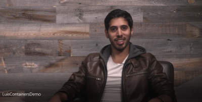
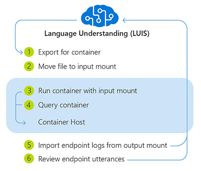
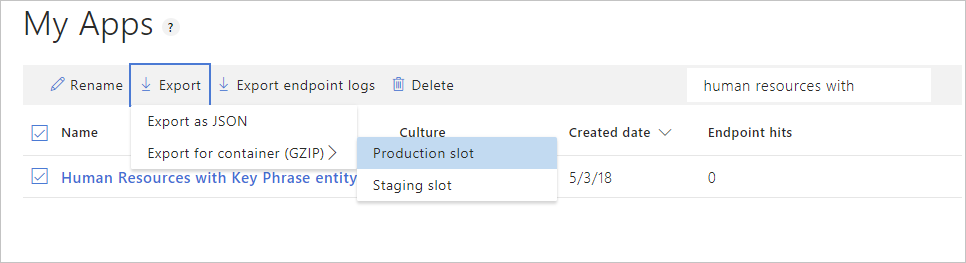
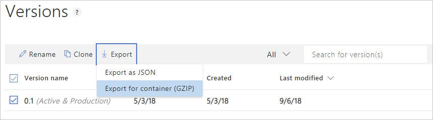
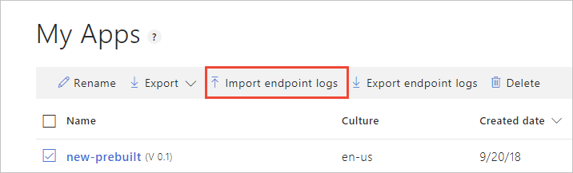

# Install and run LUIS docker containers

The Language Understanding (LUIS) container loads your trained or published Language Understanding model. As a [LUIS app](https://www.luis.ai), the docker container provides access to the query predictions from the container's API endpoints. You can collect query logs from the container and upload them back to the Language Understanding app to improve the app's prediction accuracy.

The following video demonstrates using this container.

[](https://aka.ms/luis-container-demo)

If you don't have an Azure subscription, create a [free account](https://azure.microsoft.com/free/?WT.mc_id=A261C142F) before you begin.

## Prerequisites

To run the LUIS container, note the following prerequisites:

|Required|Purpose|
|--|--|
|Docker Engine| You need the Docker Engine installed on a [host computer](#the-host-computer). Docker provides packages that configure the Docker environment on [macOS](https://docs.docker.com/docker-for-mac/), [Windows](https://docs.docker.com/docker-for-windows/), and [Linux](https://docs.docker.com/engine/installation/#supported-platforms). For a primer on Docker and container basics, see the [Docker overview](https://docs.docker.com/engine/docker-overview/).<br><br> Docker must be configured to allow the containers to connect with and send billing data to Azure. <br><br> **On Windows**, Docker must also be configured to support Linux containers.<br><br>|
|Familiarity with Docker | You should have a basic understanding of Docker concepts, like registries, repositories, containers, and container images, as well as knowledge of basic `docker` commands.|
|Azure `Cognitive Services` resource and LUIS [packaged app](luis-how-to-start-new-app.md) file |In order to use the container, you must have:<br><br>* A _Cognitive Services_ Azure resource and the associated billing key the billing endpoint URI. Both values are available on the Overview and Keys pages for the resource and are required to start the container. <br>* A trained or published app packaged as a mounted input to the container with its associated App ID. You can get the packaged file from the LUIS portal or the Authoring APIs. If you are getting LUIS packaged app from the [authoring APIs](#authoring-apis-for-package-file), you will also need your _Authoring Key_.<br><br>These requirements are used to pass command-line arguments to the following variables:<br><br>**{AUTHORING_KEY}**: This key is used to get the packaged app from the LUIS service in the cloud and upload the query logs back to the cloud. The format is `xxxxxxxxxxxxxxxxxxxxxxxxxxxxxxxx`.<br><br>**{APP_ID}**: This ID is used to select the App. The format is `xxxxxxxx-xxxx-xxxx-xxxx-xxxxxxxxxxxx`.<br><br>**{API_KEY}**: This key is used to start the container. You can find the endpoint key in two places. The first is the Azure portal within the _Cognitive Services_ resource's keys list. The endpoint key is also available in the LUIS portal on the Keys and Endpoint settings page. Do not use the starter key.<br><br>**{ENDPOINT_URI}**: The endpoint as provided on the Overview page.<br><br>The [authoring key and endpoint key](luis-limits.md#key-limits) have different purposes. Do not use them interchangeably. |

[!INCLUDE [Gathering required container parameters](../containers/includes/container-gathering-required-parameters.md)]

### Authoring APIs for package file

Authoring APIs for packaged apps:

* [Published package API](https://westus.dev.cognitive.microsoft.com/docs/services/5890b47c39e2bb17b84a55ff/operations/apps-packagepublishedapplicationasgzip)
* [Not-published, trained-only package API](https://westus.dev.cognitive.microsoft.com/docs/services/5890b47c39e2bb17b84a55ff/operations/apps-packagetrainedapplicationasgzip)

### The host computer

[!INCLUDE [Host Computer requirements](../../../includes/cognitive-services-containers-host-computer.md)]

### Container requirements and recommendations

This container supports minimum and recommended values for the settings:

|Container| Minimum | Recommended | TPS<br>(Minimum, Maximum)|
|-----------|---------|-------------|--|
|LUIS|1 core, 2-GB memory|1 core, 4-GB memory|20, 40|

* Each core must be at least 2.6 gigahertz (GHz) or faster.
* TPS - transactions per second

Core and memory correspond to the `--cpus` and `--memory` settings, which are used as part of the `docker run` command.

## Get the container image with `docker pull`

Use the [`docker pull`](https://docs.docker.com/engine/reference/commandline/pull/) command to download a container image from the `mcr.microsoft.com/azure-cognitive-services/luis` repository:

```
docker pull mcr.microsoft.com/azure-cognitive-services/luis:latest
```

For a full description of available tags, such as `latest` used in the preceding command, see [LUIS](https://go.microsoft.com/fwlink/?linkid=2043204) on Docker Hub.

[!INCLUDE [Tip for using docker list](../../../includes/cognitive-services-containers-docker-list-tip.md)]

## How to use the container

Once the container is on the [host computer](#the-host-computer), use the following process to work with the container.



1. [Export package](#export-packaged-app-from-luis) for container from LUIS portal or LUIS APIs.
1. Move package file into the required **input** directory on the [host computer](#the-host-computer). Do not rename, alter, overwrite, or decompress the LUIS package file.
1. [Run the container](#run-the-container-with-docker-run), with the required _input mount_ and billing settings. More [examples](luis-container-configuration.md#example-docker-run-commands) of the `docker run` command are available.
1. [Querying the container's prediction endpoint](#query-the-containers-prediction-endpoint).
1. When you are done with the container, [import the endpoint logs](#import-the-endpoint-logs-for-active-learning) from the output mount in the LUIS portal and [stop](#stop-the-container) the container.
1. Use LUIS portal's [active learning](luis-how-to-review-endpoint-utterances.md) on the **Review endpoint utterances** page to improve the app.

The app running in the container can't be altered. In order the change the app in the container, you need to change the app in the LUIS service using the [LUIS](https://www.luis.ai) portal or use the LUIS [authoring APIs](https://westus.dev.cognitive.microsoft.com/docs/services/5890b47c39e2bb17b84a55ff/operations/5890b47c39e2bb052c5b9c2f). Then train and/or publish, then download a new package and run the container again.

The LUIS app inside the container can't be exported back to the LUIS service. Only the query logs can be uploaded.

## Export packaged app from LUIS

The LUIS container requires a trained or published LUIS app to answer prediction queries of user utterances. In order to get the LUIS app, use either the trained or published package API.

The default location is the `input` subdirectory in relation to where you run the `docker run` command.

Place the package file in a directory and reference this directory as the input mount when you run the docker container.

### Package types

The input mount directory can contain the **Production**, **Staging**, and **Versioned** models of the app simultaneously. All the packages are mounted.

|Package Type|Query Endpoint API|Query availability|Package filename format|
|--|--|--|--|
|Versioned|GET, POST|Container only|`{APP_ID}_v{APP_VERSION}.gz`|
|Staging|GET, POST|Azure and container|`{APP_ID}_STAGING.gz`|
|Production|GET, POST|Azure and container|`{APP_ID}_PRODUCTION.gz`|

> [!IMPORTANT]
> Do not rename, alter, overwrite, or decompress the LUIS package files.

### Packaging prerequisites

Before packaging a LUIS application, you must have the following:

|Packaging Requirements|Details|
|--|--|
|Azure _Cognitive Services_ resource instance|Supported regions include<br><br>West US (`westus`)<br>West Europe (`westeurope`)<br>Australia East (`australiaeast`)|
|Trained or published LUIS app|With no [unsupported dependencies][unsupported-dependencies]. |
|Access to the [host computer](#the-host-computer)'s file system |The host computer must allow an [input mount](luis-container-configuration.md#mount-settings).|

### Export app package from LUIS portal

The LUIS [portal](https://www.luis.ai) provides the ability to export the trained or published app's package.

### Export published app's package from LUIS portal

The published app's package is available from the **My Apps** list page.

1. Sign on to the LUIS [portal](https://www.luis.ai).
1. Select the checkbox to the left of the app name in the list.
1. Select the **Export** item from the contextual toolbar above the list.
1. Select **Export for container (GZIP)**.
1. Select the environment of **Production slot** or **Staging slot**.
1. The package is downloaded from the browser.



### Export versioned app's package from LUIS portal

The versioned app's package is available from the **Versions** list page.

1. Sign on to the LUIS [portal](https://www.luis.ai).
1. Select the app in the list.
1. Select **Manage** in the app's navigation bar.
1. Select **Versions** in the left navigation bar.
1. Select the checkbox to the left of the version name in the list.
1. Select the **Export** item from the contextual toolbar above the list.
1. Select **Export for container (GZIP)**.
1. The package is downloaded from the browser.



### Export published app's package from API

Use the following REST API method, to package a LUIS app that you've already [published](luis-how-to-publish-app.md). Substituting your own appropriate values for the placeholders in the API call, using the table below the HTTP specification.

```http
GET /luis/api/v2.0/package/{APP_ID}/slot/{SLOT_NAME}/gzip HTTP/1.1
Host: {AZURE_REGION}.api.cognitive.microsoft.com
Ocp-Apim-Subscription-Key: {AUTHORING_KEY}
```

| Placeholder | Value |
|-------------|-------|
| **{APP_ID}** | The application ID of the published LUIS app. |
| **{SLOT_NAME}** | The environment of the published LUIS app. Use one of the following values:<br/>`PRODUCTION`<br/>`STAGING` |
| **{AUTHORING_KEY}** | The authoring key of the LUIS account for the published LUIS app.<br/>You can get your authoring key from the **User Settings** page on the LUIS portal. |
| **{AZURE_REGION}** | The appropriate Azure region:<br/><br/>`westus` - West US<br/>`westeurope` - West Europe<br/>`australiaeast` - Australia East |

To download the published package, refer to the [API documentation here][download-published-package]. If successfully downloaded, the response is a LUIS package file. Save the file in the storage location specified for the input mount of the container.

### Export versioned app's package from API

Use the following REST API method, to package a LUIS application that you've already [trained](luis-how-to-train.md). Substituting your own appropriate values for the placeholders in the API call, using the table below the HTTP specification.

```http
GET /luis/api/v2.0/package/{APP_ID}/versions/{APP_VERSION}/gzip HTTP/1.1
Host: {AZURE_REGION}.api.cognitive.microsoft.com
Ocp-Apim-Subscription-Key: {AUTHORING_KEY}
```

| Placeholder | Value |
|-------------|-------|
| **{APP_ID}** | The application ID of the trained LUIS app. |
| **{APP_VERSION}** | The application version of the trained LUIS app. |
| **{AUTHORING_KEY}** | The authoring key of the LUIS account for the published LUIS app.<br/>You can get your authoring key from the **User Settings** page on the LUIS portal. |
| **{AZURE_REGION}** | The appropriate Azure region:<br/><br/>`westus` - West US<br/>`westeurope` - West Europe<br/>`australiaeast` - Australia East |

To download the versioned package, refer to the [API documentation here][download-versioned-package]. If successfully downloaded, the response is a LUIS package file. Save the file in the storage location specified for the input mount of the container.

## Run the container with `docker run`

Use the [docker run](https://docs.docker.com/engine/reference/commandline/run/) command to run the container. Refer to [gathering required parameters](#gathering-required-parameters) for details on how to get the `{ENDPOINT_URI}` and `{API_KEY}` values.

[Examples](luis-container-configuration.md#example-docker-run-commands) of the `docker run` command are available.

```console
docker run --rm -it -p 5000:5000 ^
--memory 4g ^
--cpus 2 ^
--mount type=bind,src=c:\input,target=/input ^
--mount type=bind,src=c:\output\,target=/output ^
mcr.microsoft.com/azure-cognitive-services/luis ^
Eula=accept ^
Billing={ENDPOINT_URI} ^
ApiKey={API_KEY}
```

* This example uses the directory off the `C:` drive to avoid any permission conflicts on Windows. If you need to use a specific directory as the input directory, you may need to grant the docker service permission.
* Do not change the order of the arguments unless you are familiar with docker containers.
* If you are using a different operating system, use the correct console/terminal, folder syntax for mounts, and line continuation character for your system. These examples assume a Windows console with a line continuation character `^`. Because the container is a Linux operating system, the target mount uses a Linux-style folder syntax.

This command:

* Runs a container from the LUIS container image
* Loads LUIS app from input mount at *C:\input*, located on container host
* Allocates two CPU cores and 4 gigabytes (GB) of memory
* Exposes TCP port 5000 and allocates a pseudo-TTY for the container
* Saves container and LUIS logs to output mount at *C:\output*, located on container host
* Automatically removes the container after it exits. The container image is still available on the host computer.

More [examples](luis-container-configuration.md#example-docker-run-commands) of the `docker run` command are available.

> [!IMPORTANT]
> The `Eula`, `Billing`, and `ApiKey` options must be specified to run the container; otherwise, the container won't start.  For more information, see [Billing](#billing).
> The ApiKey value is the **Key** from the **Azure Resources** page in the LUIS portal and is also available on the Azure `Cognitive Services` resource keys page.

[!INCLUDE [Running multiple containers on the same host](../../../includes/cognitive-services-containers-run-multiple-same-host.md)]

## Endpoint APIs supported by the container

Both V2 and [V3](luis-migration-api-v3.md) versions of the API are available with the container.

## Query the container's prediction endpoint

The container provides REST-based query prediction endpoint APIs. Endpoints for published (staging or production) apps have a _different_ route than endpoints for versioned apps.

Use the host, `http://localhost:5000`, for container APIs.

# [V3 prediction endpoint](#tab/v3)

|Package type|HTTP verb|Route|Query parameters|
|--|--|--|--|
|Published|GET, POST|`/luis/v3.0/apps/{appId}/slots/{slotName}/predict?`|`query={query}`<br>[`&verbose`]<br>[`&log`]<br>[`&show-all-intents`]|
|Versioned|GET, POST|`/luis/v3.0/apps/{appId}/versions/{versionId}/predict?`|`query={query}`<br>[`&verbose`]<br>[`&log`]<br>[`&show-all-intents`]|

The query parameters configure how and what is returned in the query response:

|Query parameter|Type|Purpose|
|--|--|--|
|`query`|string|The user's utterance.|
|`verbose`|boolean|A boolean value indicating whether to return all the metadata for the predicted models. Default is false.|
|`log`|boolean|Logs queries, which can be used later for [active learning](luis-how-to-review-endpoint-utterances.md). Default is false.|
|`show-all-intents`|boolean|A boolean value indicating whether to return all the intents or the top scoring intent only. Default is false.|

# [V2 prediction endpoint](#tab/v2)

|Package type|HTTP verb|Route|Query parameters|
|--|--|--|--|
|Published|[GET](https://westus.dev.cognitive.microsoft.com/docs/services/5819c76f40a6350ce09de1ac/operations/5819c77140a63516d81aee78), [POST](https://westus.dev.cognitive.microsoft.com/docs/services/5819c76f40a6350ce09de1ac/operations/5819c77140a63516d81aee79)|`/luis/v2.0/apps/{appId}?`|`q={q}`<br>`&staging`<br>[`&timezoneOffset`]<br>[`&verbose`]<br>[`&log`]<br>|
|Versioned|GET, POST|`/luis/v2.0/apps/{appId}/versions/{versionId}?`|`q={q}`<br>[`&timezoneOffset`]<br>[`&verbose`]<br>[`&log`]|

The query parameters configure how and what is returned in the query response:

|Query parameter|Type|Purpose|
|--|--|--|
|`q`|string|The user's utterance.|
|`timezoneOffset`|number|The timezoneOffset allows you to [change the timezone](luis-concept-data-alteration.md#change-time-zone-of-prebuilt-datetimev2-entity) used by the prebuilt entity datetimeV2.|
|`verbose`|boolean|Returns all intents and their scores when set to true. Default is false, which returns only the top intent.|
|`staging`|boolean|Returns query from staging environment results if set to true. |
|`log`|boolean|Logs queries, which can be used later for [active learning](luis-how-to-review-endpoint-utterances.md). Default is true.|

***

### Query the LUIS app

An example CURL command for querying the container for a published app is:

# [V3 prediction endpoint](#tab/v3)

To query a model in a slot, use the following API:

```bash
curl -G \
-d verbose=false \
-d log=true \
--data-urlencode "query=turn the lights on" \
"http://localhost:5000/luis/v3.0/apps/{APP_ID}/slots/production/predict"
```

To make queries to the **Staging** environment, replace `production` in the route with `staging`:

`http://localhost:5000/luis/v3.0/apps/{APP_ID}/slots/staging/predict`

To query a versioned model, use the following API:

```bash
curl -G \
-d verbose=false \
-d log=false \
--data-urlencode "query=turn the lights on" \
"http://localhost:5000/luis/v3.0/apps/{APP_ID}/versions/{APP_VERSION}/predict"
```

# [V2 prediction endpoint](#tab/v2)

To query a model in a slot, use the following API:

```bash
curl -X GET \
"http://localhost:5000/luis/v2.0/apps/{APP_ID}?q=turn%20on%20the%20lights&staging=false&timezoneOffset=0&verbose=false&log=true" \
-H "accept: application/json"
```
To make queries to the **Staging** environment, change the **staging** query string parameter value to true:

`staging=true`

To query a versioned model, use the following API:

```bash
curl -X GET \
"http://localhost:5000/luis/v2.0/apps/{APP_ID}/versions/{APP_VERSION}?q=turn%20on%20the%20lights&timezoneOffset=0&verbose=false&log=true" \
-H "accept: application/json"
```
The version name has a maximum of 10 characters and contains only characters allowed in a URL.

***

## Import the endpoint logs for active learning

If an output mount is specified for the LUIS container, app query log files are saved in the output directory, where `{INSTANCE_ID}` is the container ID. The app query log contains the query, response, and timestamps for each prediction query submitted to the LUIS container.

The following location shows the nested directory structure for the container's log files.
```
/output/luis/{INSTANCE_ID}/
```

From the LUIS portal, select your app, then select **Import endpoint logs** to upload these logs.



After the log is uploaded, [review the endpoint](https://docs.microsoft.com/azure/cognitive-services/luis/luis-concept-review-endpoint-utterances) utterances in the LUIS portal.

<!--  ## Validate container is running -->

[!INCLUDE [Container's API documentation](../../../includes/cognitive-services-containers-api-documentation.md)]

## Stop the container

To shut down the container, in the command-line environment where the container is running, press **Ctrl+C**.

## Troubleshooting

If you run the container with an output [mount](luis-container-configuration.md#mount-settings) and logging enabled, the container generates log files that are helpful to troubleshoot issues that happen while starting or running the container.

[!INCLUDE [Cognitive Services FAQ note](../containers/includes/cognitive-services-faq-note.md)]

## Billing

The LUIS container sends billing information to Azure, using a _Cognitive Services_ resource on your Azure account.

[!INCLUDE [Container's Billing Settings](../../../includes/cognitive-services-containers-how-to-billing-info.md)]

For more information about these options, see [Configure containers](luis-container-configuration.md).

<!--blogs/samples/video courses -->
[!INCLUDE [Discoverability of more container information](../../../includes/cognitive-services-containers-discoverability.md)]

## Summary

In this article, you learned concepts and workflow for downloading, installing, and running Language Understanding (LUIS) containers. In summary:

* Language Understanding (LUIS) provides one Linux container for Docker providing endpoint query predictions of utterances.
* Container images are downloaded from the Microsoft Container Registry (MCR).
* Container images run in Docker.
* You can use REST API to query the container endpoints by specifying the host URI of the container.
* You must specify billing information when instantiating a container.

> [!IMPORTANT]
> Cognitive Services containers are not licensed to run without being connected to Azure for metering. Customers need to enable the containers to communicate billing information with the metering service at all times. Cognitive Services containers do not send customer data (for example, the image or text that is being analyzed) to Microsoft.

## Next steps

* Review [Configure containers](luis-container-configuration.md) for configuration settings.
* See [LUIS container limitations](luis-container-limitations.md) for known capability restrictions.
* Refer to [Troubleshooting](troubleshooting.md) to resolve issues related to LUIS functionality.
* Use more [Cognitive Services Containers](../cognitive-services-container-support.md)

<!-- Links - external -->
[download-published-package]: https://westus.dev.cognitive.microsoft.com/docs/services/5890b47c39e2bb17b84a55ff/operations/apps-packagepublishedapplicationasgzip
[download-versioned-package]: https://westus.dev.cognitive.microsoft.com/docs/services/5890b47c39e2bb17b84a55ff/operations/apps-packagetrainedapplicationasgzip

[unsupported-dependencies]: luis-container-limitations.md#unsupported-dependencies-for-latest-container
