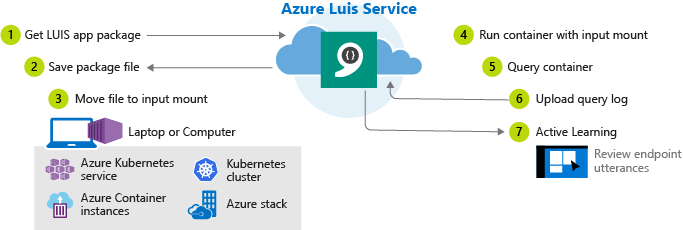

# Install and run containers

Containerization is an approach to software distribution in which an application or service is packaged, including configuration and dependencies, as a single container image. The container is deployed on a container host with little or no modification. Using a Cognitive Service container has [several features and benefits](cognitive-services-container-support.md#features-and-benefits). Additionally, the LUIS container allows you to extend beyond current transactions per second (TPS) limits.

If you don't have an Azure subscription, create a [free account](https://azure.microsoft.com/free/?WT.mc_id=A261C142F) before you begin.

## Features

Features of the LUIS container included:

* Use an existing LUIS app's trained or published model. 
* Get prediction queries from the container's endpoint.
* Optionally, capture query logs and upload to [LUIS.ai](https://www.luis.ai) to [improve prediction accuracy](luis-concept-review-endpoint-utterances.md) through active learning.  

## Prerequisites

You must satisfy the following prerequisites before using Cognitive Services Containers:

|Required|Purpose|
|--|--|
|Docker Engine | To complete this preview, you need Docker Engine installed on a host computer. Docker provides packages that configure the Docker environment on [macOS](https://docs.docker.com/docker-for-mac/), [Windows](https://docs.docker.com/docker-for-windows/), and [Linux](https://docs.docker.com/engine/installation/#supported-platforms). For a primer on Docker and container basics, see the [Docker overview](https://docs.docker.com/engine/docker-overview/).<br><br> Docker must be configured to allow the containers to connect with and send usage data to Azure. <br><br> **On Windows**, Docker must also be configured to support Linux containers.|
|Familiarity with Azure Container Registry and Docker | You should have a basic understanding of both Azure Container Registry and Docker concepts, like registries, repositories, containers, and container images, as well as knowledge of basic `docker` commands.<br><br>For Azure Container Registry basics, see the [Azure Container Registry overview](https://docs.microsoft.com/azure/container-registry/container-registry-intro).| 
|LUIS app|In order to use the container, you must have a trained or published app packaged as a mounted input to the container. You need the Authoring Key, the App ID, and the Endpoint Key and Endpoint URL.<br><br>**{AUTHORING_KEY}**: This key is used to get the packaged app from the LUIS service in the cloud and upload the query logs back to the cloud. The format is `xxxxxxxxxxxxxxxxxxxxxxxxxxxxxxxx`.<br><br>**{APPLICATION_ID}**: This ID is used to select the App, either on the container or in the cloud. The format is `xxxxxxxx-xxxx-xxxx-xxxx-xxxxxxxxxxxx`.<br><br>**{ENDPOINT_KEY}**: This key is used to start the container. You can find the endpoint key in two places. The first is the Azure portal within the LUIS resource's keys list. The endpoint key is also available in the LUIS portal on the Keys and Endpoint settings page. Do not use the starter key.<br><br>**{BILLING_ENDPOINT}**: The billing endpoint value is available on the Azure portal's Language Understanding Overview page. An example is: `https://westus.api.cognitive.microsoft.com/luis/v2.0`<br><br>The LUIS resource associated with this app must use the **F0 pricing tier**. |

### Server requirements and recommendations

This container supports minimum and recommended values for the settings:

|Setting| Minimum | Recommended |
|-----------|---------|-------------|
|Cores|1 core<BR>at least 2.6 gigahertz (GHz) or faster|1 core|
|Memory|2 GB|4 GB|
|Transactions per second<BR>(TPS)|20 TPS|40 TPS|

## Get container image

Use the [docker pull](https://docs.docker.com/engine/reference/commandline/pull/) command to download a container image from the `mcr.microsoft.com/azure-cognitive-services/luis` repository:

```Docker
docker pull mcr.microsoft.com/azure-cognitive-services/luis/microsoft/cognitive-services-luis:latest
```

For a full description of available tags, such as `latest` used in the preceding command, see [LUIS]() on Docker Hub. [TBD: what is the link?]

> [!TIP]
> You can use the [docker images](https://docs.docker.com/engine/reference/commandline/images/) command to list your downloaded container images. For example, the following command lists the ID, repository, and tag of each downloaded container image, formatted as a table:
>
>  ```Docker
>  docker images --format "table {{.ID}}\t{{.Repository}}\t{{.Tag}}"
>  ``` 

## How to use container

Once the container is on the host computer, use the following process to work with the container.



1. [Request LUIS app package](#request-luis-app-package).
1. Save package file (*.gz) to the local file system. 
1. Move package file into the required input directory on the host computer. Do not rename, alter, or decompress LUIS package file.

    The host is the computer that runs the docker container. It can be the local computer or any docker hosting service including Azure Kubernetes, Azure Container instances, Kubernetes cluster, and Azure Stack.

1. [Run the container](#run-the-container) with the required _input mount_ and optional output mount.
1. Use container, [querying the container's prediction endpoint](#query-the-container). 
1. When you are done with the container, [upload the query log](#upload-container-logs-for-active-learning) to the LUIS portal.
1. Use LUIS portal's [active learning](luis-how-to-review-endoint-utt.md) on the **Review endpoint utterances** page to improve the app.

The app running in the container can't be altered. In order the change the app in the container, you need to change the app in the LUIS service using the [LUIS](https://www.luis.ai) portal or use the LUIS [authoring APIs](https://westus.dev.cognitive.microsoft.com/docs/services/5890b47c39e2bb17b84a55ff/operations/5890b47c39e2bb052c5b9c2f), train and or publish, then download a new package and run the container again.

The LUIS app inside the container can't be exported back to the LUIS service. Only the query logs can be uploaded. 

## Get packaged app

The LUIS container requires a trained or published LUIS app to answer prediction queries of user utterances. In order to get the LUIS app, use either the [published](get-a-published-models-package.md) or [trained](get-a-trained-models-package.md) download API. 

The resulting gzip file needs to be in the input location you specify in the `docker run` command. The default location is the `input` subdirectory in relation to where you run the `docker run` command.  

Place the package file in a directory and reference this directory as the input mount when you run the docker container. 

### Package types

The input mount directory can contain the **Production**, **Staging**, and **Trained** versions of the app simultaneously. All the packages are mounted. The production and staging endpoints are available through the same GET/POST [APIs](#container-apis) as the Azure LUIS service provides. The trained version has its own GET/POST [APIs, which are only available on the container. There is no corresponding API on the Azure LUIS service. 

|Version|API|Availability|
|--|--|--|
|Trained|Get, Post|Container only|
|Staging|Get, Post|Azure and container|
|Production|Get, Post|Azure and container|

For information on how to query the container, see [Performing LUIS operations](#performing-luis-operations).

>**Important:** Do not rename, alter, or decompress LUIS package files.

### Packaging prerequisites

Before packaging a LUIS application, you must have the following:

|Packaging Requirements|Details|
|--|--|
|Azure LUIS resource instance|Supported regions include<br><br>West US (```westus```)<br>West Europe (```westeurope```)<br>Australia East (```australiaeast```)|
|Trained or published LUIS app|With no [unsupported dependencies](#unsupported-dependencies). |
|Access to file system for host computer |The host computer must use an [input mount](#using-mounts-with-luis).|
  
### Request published model's package

Use the following REST API method, to package a LUIS app that you've already [published](luis-how-to-publish-app.md). Substituting your own appropriate values for the placeholders in the API call, using the table below the HTTP specification.

```http
GET /luis/webapi/v2.0/package/{APPLICATION_ID}/slot/{APPLICATION_ENVIRONMENT}/gzip HTTP/1.1
Host: {AZURE_REGION}.api.cognitive.microsoft.com
Ocp-Apim-Subscription-Key: {AUTHORING_KEY}
```

| Placeholder | Value |
|-------------|-------|
|{APPLICATION_ID} | The application ID of the published LUIS app. |
|{APPLICATION_ENVIRONMENT} | The environment of the published LUIS app. Use one of the following values:<br/>```PRODUCTION```<br/>```STAGING``` |
|{AUTHORING_KEY} | The authoring key of the LUIS account for the published LUIS app.<br/>You can get your authoring key from the **User Settings** page on the LUIS portal. |
|{AZURE_REGION} | The appropriate Azure region:<br/><br/>```westus``` - West US<br/>```westeurope``` - West Europe<br/>```australiaeast``` - Australia East |

Use the following CURL command to download the published package, substituting your own values:

```bash
curl -X GET \
https://{AZURE_REGION}.api.cognitive.microsoft.com/luis/webapi/v2.0/package/{APPLICATION_ID}/slot/{APPLICATION_ENVIRONMENT}/gzip  \
 -H "Ocp-Apim-Subscription-Key: {AUTHORING_KEY}" \
 -o {APPLICATION_ID}_{APPLICATION_ENVIRONMENT}.gz
```

If successful, the response is a LUIS package file. Save the file in the storage location specified for the input mount of the container. The LUIS package file for a _published app_ uses the following naming convention:

`{APPLICATION_ID}_{APPLICATION_ENVIRONMENT}.gz`

### Request trained model's package

Use the following REST API method, to package a LUIS application that you've already [trained](luis-how-to-train.md). Substituting your own appropriate values for the placeholders in the API call, using the table below the HTTP specification.

```http
GET /luis/webapi/v2.0/package/{APPLICATION_ID}/versions/{APPLICATION_VERSION}/gzip HTTP/1.1
Host: {AZURE_REGION}.api.cognitive.microsoft.com
Ocp-Apim-Subscription-Key: {AUTHORING_KEY}
```

| Placeholder | Value |
|-------------|-------|
|{APPLICATION_ID} | The application ID of the trained LUIS application. |
|{APPLICATION_VERSION} | The application version of the trained LUIS application. |
|{AUTHORING_KEY} | The authoring key of the LUIS account for the published LUIS app.<br/>You can get your authoring key from the **User Settings** page on the LUIS portal.  |
|{AZURE_REGION} | The appropriate Azure region:<br/><br/>```westus``` - West US<br/>```westeurope``` - West Europe<br/>```australiaeast``` - Australia East |

Use the following CURL command to download the trained package:

```bash
curl -X GET \
https://{AZURE_REGION}.api.cognitive.microsoft.com/luis/webapi/v2.0/package/{APPLICATION_ID}/versions/{APPLICATION_VERSION}/gzip  \
 -H "Ocp-Apim-Subscription-Key: {AUTHORING_KEY}" \
 -o {APPLICATION_ID}_v{APPLICATION_VERSION}.gz
```

If successful, the response is a LUIS package file. Save the file in the storage location specified for the input mount of the container. The LUIS package file for a _trained app_ uses the following naming convention:

`{APPLICATION_ID}_v{APPLICATION_VERSION}.gz`

> ![Note]
> The lowercase letter `v` precedes the `{APPLICATION_VERSION}` in the -o argument value. 

## Run the container 

Use the [docker run](https://docs.docker.com/engine/reference/commandline/run/) command to run the container. This command:

* Runs a container from the LUIS container image
* Loads LUIS app from input mount at c:\input, located on container host
* Allocates two CPU cores and 6 gigabytes (GB) of memory
* Exposes TCP port 5000 and allocates a pseudo-TTY for the container
* Saves container and LUIS logs to output mount at c:\output, located on container host
* Automatically removes the container after it exits

```bash
docker run --rm -it -p 5000:5000 --memory 6g --cpus 2 --mount type=bind,src=c:\input,target=/input --mount type=bind,source=c:\output,destination=/output mcr.microsoft.com/azure-cognitive-services/luis/microsoft/cognitive-services-luis Eula=accept Billing={BILLING_ENDPOINT} ApiKey={APPLICATION_ID}
```

Do not change the order of the arguments unless you are very familiar with docker containers.

| Placeholder | Value |
|-------------|-------|
|{APPLICATION_ID} | The application ID of the trained LUIS application. |
|{BILLING_ENDPOINT} | The billing endpoint value is available on the Azure portal's Language Understanding Overview page.|

> [!IMPORTANT]
> The `Eula`, `Billing`, and `ApiKey` options must be specified to run the container; otherwise, the container won't start.  For more information, see [Billing](#billing).
> The ApiKey value is the **Key** from the Keys and Endpoints page in the LUIS portal and is also available on the Azure Language Understanding Resource keys page.  

### Container APIs

The container provides REST-based API endpoints. Endpoints for published (staging or production) apps have a _different_ route than endpoints for trained apps. 

Use the host, https://localhost:5000, for container APIs. 

|Package type|Method|Route|Query parameters|
|--|--|--|--|
|Published|[Get](https://westus.dev.cognitive.microsoft.com/docs/services/5819c76f40a6350ce09de1ac/operations/5819c77140a63516d81aee78), [Post](https://westus.dev.cognitive.microsoft.com/docs/services/5819c76f40a6350ce09de1ac/operations/5819c77140a63516d81aee79)|/luis/v2.0/apps/{appId}?|q={q}<br>[&timezoneOffset]<br>[&verbose]<br>[&log]<br>[&staging]|
|Trained|Get, Post|/luis/v2.0/apps/{appId}/versions/{versionId}?|q={q}<br>[&timezoneOffset]<br>[&verbose]<br>[&log]|

## API for published app

An example CURL command for querying the container for a published app is:

```bash
curl -X GET \
"http://localhost:5000/luis/v2.0/apps/{APPLICATION_ID}?q=turn%20on%20the%20lights&staging=false&timezoneOffset=0&verbose=false&log=true" \
-H "accept: application/json"
```
To make queries to the **Staging** environment, change the **staging** query string parameter value to true: 

`staging=true`

## API for trained app

An example CURL command for querying the container for a trained app is: 

```bash
curl -X GET \
"http://localhost:5000/luis/v2.0/apps/{APPLICATION_ID}/versions/{APPLICATION_VERSION}?q=turn%20on%20the%20lights&timezoneOffset=0&verbose=false&log=true" \
-H "accept: application/json"
```
The version name has a maximum of 10 characters and only contain characters allowed in a URL. 

### Query container from an SDK

Query operations from an SDK are available for published packaged apps only. Use the [Azure Cognitive Services LUIS Client Library](https://www.nuget.org/packages/Microsoft.Azure.CognitiveServices.Language.LUIS.Runtime/) to query the container.  

> [!IMPORTANT]
> You must have Azure Cognitive Services LUIS Client Library version 2.0.0 or later.

## Upload container logs for active learning

If an output mount is specified for the LUIS container, app query log files are saved in the output directory, where {INSTANCE_ID} is the container ID. 

???TDB: if more than one app is running in container, like stage and production, is there more than 1 log?
`
/output/luis/{INSTANCE_ID}/
`

The app query log contains the query, response, and timestamps for each prediction query submitted to the LUIS container. 

Upload the app query log to the Language Understanding (LUIS) service by using the following REST API method, substituting the appropriate values for your own values:

| Placeholder | Value |
|-------------|-------|
|{APPLICATION_ID} | The application ID of the trained or published LUIS app. |
|{AUTHORING_KEY} | The authoring key of your LUIS account.<br/>You can get your authoring key from the **User Settings** page for your LUIS account on the LUIS portal. |
|{AZURE_REGION} | One of the following values for the appropriate Azure region:<br><br/>```westus``` - West US<br/>```westeurope``` - West Europe<br/>```australiaeast``` - Australia East |
|{QUERY_LOG_FILE} | The full path and file name of the application query log file. |

```http
POST /webapi/v2.0/apps/{APPLICATION_ID}/unlabeled HTTP/1.1
Host: {AZURE_REGION}.api.cognitive.microsoft.com
APIM-SUBSCRIPTION-ID: {AUTHORING_KEY}
Content-Type: multipart/form-data
Content-Disposition: form-data; name=""; filename="{QUERY_LOG_FILE}"
```

An example CURL command for uploading the query log is:

```bash
curl -X POST \
"http://westus.api.cognive.microsoft.com/luis/webapi/v2.0/apps/{APPLICATION_ID}/unlabeled" \
-H "APIM-SUBSCRIPTION-ID: {AUTHORING_KEY}" \
-H "Content-Type: multipart/form-data"
-H "Content-Disposition: form-data; name=""; filename="{QUERY_LOG_FILE}""
```

If successful, the method responds with an HTTP 200 status code. After the log is uploaded, [review the endpoint](https://docs.microsoft.com/azure/cognitive-services/luis/luis-concept-review-endpoint-utterances) utterances in the LUIS portal.

## Stop the container

To shut down the container, in the command-line environment where the container is running, press **Ctrl+C**.

## Container's API documentation

The container provides a full set of documentation for the endpoints as well as a `Try it now` feature. This feature allows you to enter your settings into a web-based HTML form and make the query without having to write any code. Once the query returns, an example CURL command is provided to demonstrate the HTTP headers and body format required. 

> [!TIP]
> Read the [OpenAPI specification](https://swagger.io/docs/specification/about/), describing the API operations supported by the container, from the `/swagger` relative URI. For example:
>
>  ```http
>  http://localhost:5000/swagger
>  ```

### Billing

The LUIS container sends billing information to Azure, using a LUIS resource on your Azure account. 

Cognitive Services containers are not licensed to run without being connected to Azure for metering. Customers need to enable the containers to communicate billing information with the metering service at all times. Cognitive Services containers do not send customer data (the utterance) to Microsoft. 

The `docker run` uses the following arguments for billing purposes:

| Option | Description |
|--------|-------------|
| `ApiKey` | The API key of the LUIS resource used to track billing information.<br/>The value of this option must be set to an API key for the provisioned LUIS Azure resource specified in `Billing`. |
| `Billing` | The endpoint of the LUIS resource used to track billing information.<br/>The value of this option must be set to the endpoint URI of a provisioned LUIS Azure resource.|
| `Eula` | Indicates that you've accepted the license for the container.<br/>The value of this option must be set to `accept`. |

> [!IMPORTANT]
> All three options must be specified with valid values, or the container won't start.

For more information about these options, see [Configure containers](luis-container-configuration.md).

## Unsupported dependencies

You can use a LUIS application if it **doesn't include** any of the following dependencies:

|Do not use<br>in trained app|Don't use<br>in published app|Unsupported app configurations|Details|
|--|--|--|--|
|X|X|Unsupported container cultures| German (de-DE)<br>Dutch (nl-NL)<br>Japanese (ja-JP)<br>|
|X|X|Unsupported domains|Prebuilt domains, including prebuilt domain intents and entities|
|X|X|Unsupported entities for all cultures|[KeyPhrase](https://docs.microsoft.com/azure/cognitive-services/luis/luis-reference-prebuilt-keyphrase) prebuilt entity for all cultures|
|X|X|Unsupported entities for English (en-US) culture|[GeographyV2](https://docs.microsoft.com/azure/cognitive-services/luis/luis-reference-prebuilt-geographyv2) and [PersonName](https://docs.microsoft.com/azure/cognitive-services/luis/luis-reference-prebuilt-person) prebuilt entities|
|X|X|Unsupported entities for Chinese (zh-CN) culture|[PersonName](https://docs.microsoft.com/azure/cognitive-services/luis/luis-reference-prebuilt-person) prebuilt entity for Chinese| 
||X|Speech priming|External dependencies are not supported in the container.|
||X|Sentiment analysis|External dependencies are not supported in the container.|
||X|Bing spell check|External dependencies are not supported in the container.|

## Next steps

* Review [Configure containers](luis-container-configuration.md) for configuration settings
* Refer to [Frequently asked questions (FAQ)](luis-resources-faq.md) to resolve issues related to LUIS functionality.