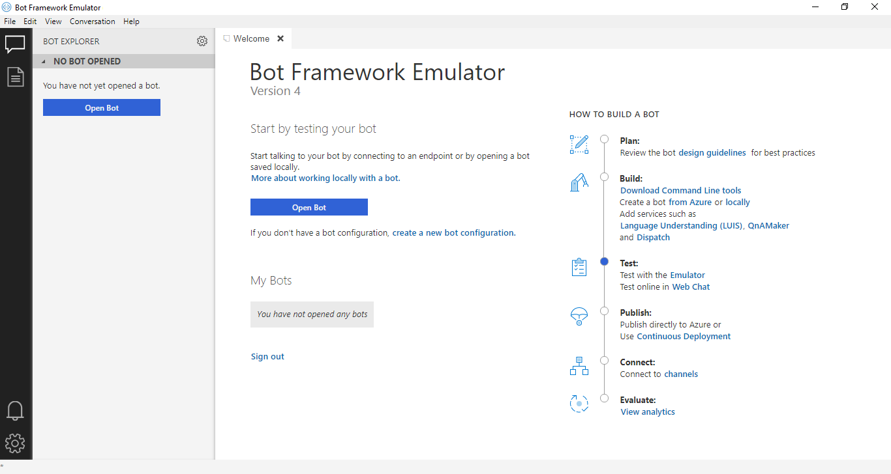
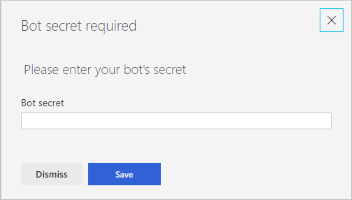
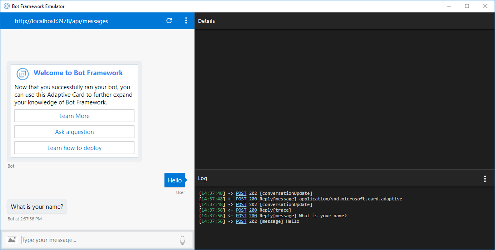

# Tutorial: LUIS bot in C#
Using C#, you can build a chat bot integrated with language understanding (LUIS). This bot uses the HomeAutomation app to implement a bot solution. The bot is built the Azure [Web app bot](https://docs.microsoft.com/azure/bot-service/) with [Bot Framework version](https://github.com/Microsoft/botbuilder-js) v4.

**In this tutorial, you learn how to:**

> [!div class="checklist"]
> * Create a web app bot. This process creates a new LUIS app for you.
> * Add a prebuilt domain to the new LUIS model
> * Download the project created by the Web bot service
> * Start bot & emulator locally on your computer
> * Modify bot code for new LUIS intents
> * View utterance results in bot

## Prerequisites

* [Bot emulator](https://aka.ms/abs/build/emulatordownload)
* [Visual Studio](https://visualstudio.microsoft.com/downloads/)


## Create web app bot

1. In the [Azure portal](https://portal.azure.com), select **Create new resource**.

2. In the search box, search for and select **Web App Bot**. Select **Create**.

3. In **Bot Service**, provide the required information:

    |Setting|Purpose|Suggested setting|
    |--|--|--|
    |Bot name|Resource name|`luis-csharp-bot-` + `<your-name>`, for example, `luis-csharp-bot-johnsmith`|
    |Subscription|Subscription where to create bot.|Your primary subscription.
    |Resource group|Logical group of Azure resources|Create a new group to store all resources used with this bot, name the group `luis-csharp-bot-resource-group`.|
    |Location|Azure region - this doesn't have to be the same as the LUIS authoring or publishing region.|`westus`|
    |Pricing tier|Used for service request limits and billing.|`F0` is the free tier.
    |App name|The name is used as the subdomain when your bot is deployed to the cloud (for example, humanresourcesbot.azurewebsites.net).|`luis-csharp-bot-` + `<your-name>`, for example, `luis-csharp-bot-johnsmith`|
    |Bot template|Bot framework settings - see next table|
    |LUIS App location|Must be the same as the LUIS resource region|`westus`|

4. In the **Bot template settings**, select the following, then choose the **Select** button under these settings:

    |Setting|Purpose|Selection|
    |--|--|--|
    |SDK version|Bot framework version|**SDK v4**|
    |SDK language|Programming language of bot|**C#**|
    |Echo/Basic bot|Type of bot|**Basic bot**|
    
5. Select **Create**. This creates and deploys the bot service to Azure. Part of this process creates a LUIS app named `luis-csharp-bot-XXXX`. This name is based on the bot and app name's in the previous section.

    [  ](./media/bfv4-csharp/create-web-app-service.png#lightbox)

6. Leave this browser tab open. For any steps with the LUIS portal, open a new browser tab. Continue to the next section when the new bot service is deployed.

## Add prebuilt domain to model
Part of the bot service deployment creates a new LUIS app with intents and example utterances. The bot provides intent mapping to the new LUIS app for the following intents: 

|Basic bot LUIS intents|example utterance|
|--|--|
|Cancel|`stop`|
|Greeting|`hello`|
|Help|`help`|
|None|Anything outside the domain of the app.|

Add the prebuilt HomeAutomation app to the model to handle utterances like: `Turn off the living room lights`

1. Go to [LUIS](https://www.luis.ai) portal and sign in.
2. On the **My Apps** page, select the **Created date** column to sort by the date the app was created. The Azure Bot service created a new app in the previous section. Its name is `luis-csharp-bot-` + `<your-name>` + 4 random characters.
3. Open the app and select the **Build** section in the top navigation.
4. From the left navigation, select **Prebuilt Domains**.
5. Select the **HomeAutomation** domain by select **Add domain** on its card.
6. Select **Train** in the top right menu.
7. Select **Publish** in the top right menu. 

    The app created by the Azure Bot service now has new intents:

    |Basic bot new intents|example utterance|
    |--|--|
    |HomeAutomation.TurnOn|`turn the fan to high`
    |HomeAutomation.TurnOff|`turn off ac please`|

## Download the web app bot 
In order to develop the web app bot code, download the code and use on your local computer. 

1. In the Azure portal, still on the web app bot resource, select the **Application Settings** and copy the values of **botFilePath** and **botFileSecret**. You need to add these to an environment file later. 

2. In the Azure portal, select **Build** from the **Bot management** section. 

3. Select **Download Bot source code**. 

    [  ](../../../includes/media/cognitive-services-luis/bfv4/download-code.png#lightbox)

4. When the source code is zipped, a message will provide a link to download the code. Select the link. 

5. Save the zip file to your local computer and extract the files. Open the project. 

6. Open the bot.cs file and look for `_services.LuisServices`. This is where the user utterance entered into the bot is sent to LUIS.

    ```csharp
    /// <summary>
    /// Run every turn of the conversation. Handles orchestration of messages.
    /// </summary>
    /// <param name="turnContext">Bot Turn Context.</param>
    /// <param name="cancellationToken">Task CancellationToken.</param>
    /// <returns>A <see cref="Task"/> representing the asynchronous operation.</returns>
    public async Task OnTurnAsync(ITurnContext turnContext, CancellationToken cancellationToken)
    {
        var activity = turnContext.Activity;

        if (activity.Type == ActivityTypes.Message)
        {
            // Perform a call to LUIS to retrieve results for the current activity message.
            var luisResults = await _services.LuisServices[LuisConfiguration].RecognizeAsync(turnContext, cancellationToken).ConfigureAwait(false);

            // If any entities were updated, treat as interruption.
            // For example, "no my name is tony" will manifest as an update of the name to be "tony".
            var topScoringIntent = luisResults?.GetTopScoringIntent();

            var topIntent = topScoringIntent.Value.intent;
            switch (topIntent)
            {
                case GreetingIntent:
                    await turnContext.SendActivityAsync("Hello.");
                    break;
                case HelpIntent:
                    await turnContext.SendActivityAsync("Let me try to provide some help.");
                    await turnContext.SendActivityAsync("I understand greetings, being asked for help, or being asked to cancel what I am doing.");
                    break;
                case CancelIntent:
                    await turnContext.SendActivityAsync("I have nothing to cancel.");
                    break;
                case NoneIntent:
                default:
                    // Help or no intent identified, either way, let's provide some help.
                    // to the user
                    await turnContext.SendActivityAsync("I didn't understand what you just said to me.");
                    break;
            }
        }
        else if (activity.Type == ActivityTypes.ConversationUpdate)
        {
            if (activity.MembersAdded.Any())
            {
                // Iterate over all new members added to the conversation.
                foreach (var member in activity.MembersAdded)
                {
                    // Greet anyone that was not the target (recipient) of this message.
                    // To learn more about Adaptive Cards, see https://aka.ms/msbot-adaptivecards for more details.
                    if (member.Id != activity.Recipient.Id)
                    {
                        var welcomeCard = CreateAdaptiveCardAttachment();
                        var response = CreateResponse(activity, welcomeCard);
                        await turnContext.SendActivityAsync(response).ConfigureAwait(false);
                    }
                }
            }
        }

    }
    ```

    The bot sends the user's utterance to LUIS and gets the results. The top intent determines the conversation flow. 


## Start the bot
Before changing any code or settings, verify the bot works. 

1. In Visual Studio, open the solution file. 

2. Create an `appsettings.json` file to hold the bot variables the bot code looks for:

    ```JSON
    {
    "botFileSecret": "",
    "botFilePath": ""

    }
    ```

    Set the values of the variables to the values you copied from the Azure bot service's Application Settings in Step 1 of the **[Download the web app bot](#download-the-web-app-bot)** section.

3. In Visual Studio, start the bot. A browser window opens with the web app bot's web site at `http://localhost:3978/`.

## Start the emulator

1. Begin the Bot Emulator.

2. In the bot emulator, select the *.bot file in the root of the project. This `.bot` file includes the bot's URL endpoint for messages:

    [  ](../../../includes/media/cognitive-services-luis/bfv4/bot-emulator-v4.png#lightbox)

3. Enter the bot secret you copied from the Azure bot service's Application Settings in Step 1 of the **[Download the web app bot](#download-the-web-app-bot)** section. This allows the emulator to access any encrypted fields in the `.bot` file.

    

4. In the bot emulator, enter `Hello` and get the proper response for the basic bot.

    [  ](../../../includes/media/cognitive-services-luis/bfv4/emulator-test.png#lightbox)

## Modify bot code 

In the `BasicBot.cs` file, add code to handle the new intents. 

1. At the top of the file, find the **Supported LUIS Intents** section, and add constants for the HomeAutomation intents:

    ```csharp
    // Supported LUIS Intents
    public const string GreetingIntent = "Greeting";
    public const string CancelIntent = "Cancel";
    public const string HelpIntent = "Help";
    public const string NoneIntent = "None";
    public const string TurnOnIntent = "HomeAutomation_TurnOn"; // new intent
    public const string TurnOffIntent = "HomeAutomation_TurnOff"; // new intent
    ```

    Notice that the period, `.`, between the domain and the intent from the LUIS portal's app is replaced with an underscore, `_`. 

2. Find the **OnTurnAsync** method that receives the LUIS prediction of the utterance. Add code in the switch statement to return the LUIS response for the two HomeAutomation intents. 

    ```csharp
    case TurnOnIntent:
        await turnContext.SendActivityAsync("TurnOn intent found, JSON response: " + luisResults?.Entities.ToString());
        break;
    case TurnOffIntent:
        await turnContext.SendActivityAsync("TurnOff intent found, JSON response: " + luisResults?.Entities.ToString());
        break;
    ```

    The bot doesn't have the exact same response as a LUIS REST API request so it is important to learn the differences by looking at the response JSON. The text and intents properties are the same but the entities property values have been modified. 

    ```JSON
    {
        "$instance": {
            "HomeAutomation_Device": [
                {
                    "startIndex": 23,
                    "endIndex": 29,
                    "score": 0.9776345,
                    "text": "lights",
                    "type": "HomeAutomation.Device"
                }
            ],
            "HomeAutomation_Room": [
                {
                    "startIndex": 12,
                    "endIndex": 22,
                    "score": 0.9079433,
                    "text": "livingroom",
                    "type": "HomeAutomation.Room"
                }
            ]
        },
        "HomeAutomation_Device": [
            "lights"
        ],
        "HomeAutomation_Room": [
            "livingroom"
        ]
    }
    ```


## View results in bot

1. In the bot emulator, enter the utterance: `Turn on the livingroom lights to 50%`

2. The bot responds with:

    ```JSON
    TurnOn intent found, JSON response: {"$instance":{“HomeAutomation_Device”:[{“startIndex”:23,“endIndex”:29,“score”:0.9776345,“text”:“lights”,“type”:“HomeAutomation.Device”}],“HomeAutomation_Room”:[{“startIndex”:12,“endIndex”:22,“score”:0.9079433,“text”:“livingroom”,“type”:“HomeAutomation.Room”}]},“HomeAutomation_Device”:[“lights”],“HomeAutomation_Room”:[“livingroom”]}
    ```    

## Learn more about Bot Framework
Azure Bot service uses the Bot Framework SDK. Learn more about the SDK and bot framework:

* [Azure Bot Service](https://docs.microsoft.com/en-us/azure/bot-service/bot-service-overview-introduction?view=azure-bot-service-4.0) v4 documentation
* [Bot Builder Samples](https://github.com/Microsoft/botbuilder-samples)
* [Bot Builder SDK](https://docs.microsoft.com/en-us/javascript/api/botbuilder-core/?view=botbuilder-ts-latest)
* [Bot Builder tools](https://github.com/Microsoft/botbuilder-tools):

## Next steps

You created an Azure bot service, copied the bot secret and `.bot` file path, downloaded the zip file of the code. You added the prebuilt HomeAutomation domain to the LUIS app created as part of the new Azure bot service, then trained and published the app again. You extracted the code project, created an environment file (`.env`), and set the bot secret and the `.bot` file path. In the bot.js file, you added code to handle the two new intents. Then you tested the bot in the bot emulator to see the LUIS response for an utterance of one of the new intents. 


> [!div class="nextstepaction"]
> [Build a custom domain in LUIS](luis-quickstart-intents-only.md)
