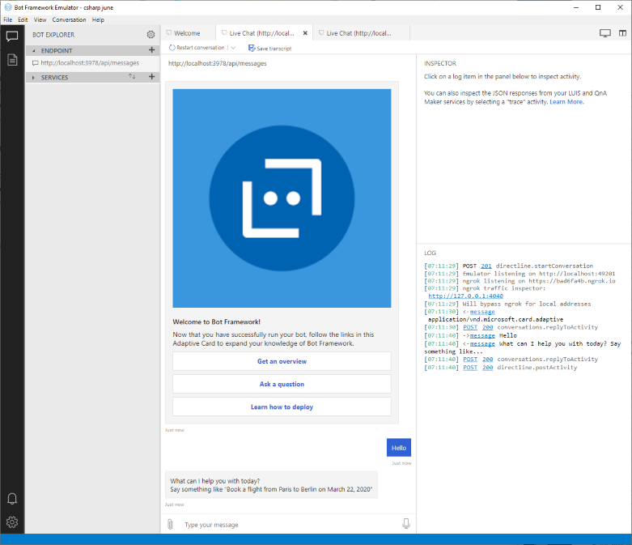
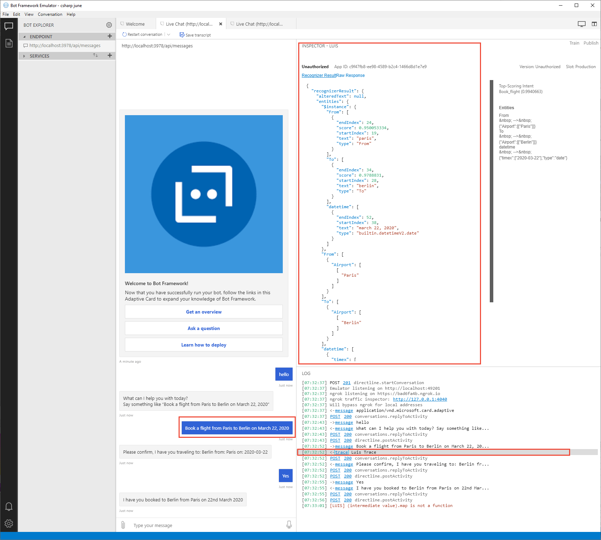

# Tutorial: Use a Web App Bot enabled with Language Understanding in C#

Use C# to build a chat bot integrated with language understanding (LUIS). The bot is built with the Azure [Web app bot](https://docs.microsoft.com/azure/bot-service/) resource and [Bot Framework version](https://github.com/Microsoft/botbuilder-dotnet) V4.

**In this tutorial, you learn how to:**

> [!div class="checklist"]
> * Create a web app bot. This process creates a new LUIS app for you.
> * Download the bot project created by the Web bot service
> * Start bot & emulator locally on your computer
> * View utterance results in bot

## Prerequisites

* [Bot emulator](https://aka.ms/abs/build/emulatordownload)
* [Visual Studio](https://visualstudio.microsoft.com/downloads/)


## Create a web app bot resource

1. In the [Azure portal](https://portal.azure.com), select **Create new resource**.

1. In the search box, search for and select **Web App Bot**. Select **Create**.

1. In **Bot Service**, provide the required information:

    |Setting|Purpose|Suggested setting|
    |--|--|--|
    |Bot name|Resource name|`luis-csharp-bot-` + `<your-name>`, for example, `luis-csharp-bot-johnsmith`|
    |Subscription|Subscription where to create bot.|Your primary subscription.
    |Resource group|Logical group of Azure resources|Create a new group to store all resources used with this bot, name the group `luis-csharp-bot-resource-group`.|
    |Location|Azure region - this doesn't have to be the same as the LUIS authoring or publishing region.|`westus`|
    |Pricing tier|Used for service request limits and billing.|`F0` is the free tier.
    |App name|The name is used as the subdomain when your bot is deployed to the cloud (for example, humanresourcesbot.azurewebsites.net).|`luis-csharp-bot-` + `<your-name>`, for example, `luis-csharp-bot-johnsmith`|
    |Bot template|Bot framework settings - see next table|
    |LUIS App location|Must be the same as the LUIS resource region|`westus`|
    |App service plan/Location|Do not change from provided default value.|
    |Application Insights|Do not change from provided default value.|
    |Microsoft App ID and password|Do not change from provided default value.|

1. In the **Bot template**, select the following, then choose the **Select** button under these settings:

    |Setting|Purpose|Selection|
    |--|--|--|
    |SDK version|Bot framework version|**SDK v4**|
    |SDK language|Programming language of bot|**C#**|
    |Bot|Type of bot|**Basic bot**|
    
1. Select **Create**. This creates and deploys the bot service to Azure. Part of this process creates a LUIS app named `luis-csharp-bot-XXXX`. This name is based on the /Azure Bot Service app name.

    [](./media/bfv4-csharp/create-web-app-service.png#lightbox)

    Wait until the bot service is created before continuing.

## The bot has a Language Understanding model

The bot service creation process also creates a new LUIS app with intents and example utterances. The bot provides intent mapping to the new LUIS app for the following intents: 

|Basic bot LUIS intents|example utterance|
|--|--|
|Book flight|`Travel to Paris`|
|Cancel|`bye`|
|None|Anything outside the domain of the app.|

## Test the bot in Web Chat

1. While still in the Azure portal for the new bot, select **Test in Web Chat**. 
1. In the **Type your message** textbox, enter the text `hello`. The bot responds with information about the bot framework, as well as example queries for the specific LUIS model such as booking a flight to Paris. 

    

    You can use the test functionality for quickly testing your bot. For more complete testing, including debugging, download the bot code and use Visual Studio. 

## Download the web app bot source code
In order to develop the web app bot code, download the code and use on your local computer. 

1. In the Azure portal, select **Build** from the **Bot management** section. 

1. Select **Download Bot source code**. 

    [](../../../includes/media/cognitive-services-luis/bfv4/download-code.png#lightbox)

1. When the pop-up dialog asks **Include app settings in the downloaded zip file?**, select **Yes**.

1. When the source code is zipped, a message will provide a link to download the code. Select the link. 

1. Save the zip file to your local computer and extract the files. Open the project with Visual Studio. 

## Review code to send utterance to LUIS and get response

1. Open the **LuisHelper.cs** file. This is where the user utterance entered into the bot is sent to LUIS. The response from LUIS is returned from the method as a **BookDetails** object. When you create your own bot, you should also create your own object to return the details from LUIS. 


    ```csharp
    // Copyright (c) Microsoft Corporation. All rights reserved.
    // Licensed under the MIT License.
    
    using System;
    using System.Linq;
    using System.Threading;
    using System.Threading.Tasks;
    using Microsoft.Bot.Builder;
    using Microsoft.Bot.Builder.AI.Luis;
    using Microsoft.Extensions.Configuration;
    using Microsoft.Extensions.Logging;
    
    namespace Microsoft.BotBuilderSamples
    {
        public static class LuisHelper
        {
            public static async Task<BookingDetails> ExecuteLuisQuery(IConfiguration configuration, ILogger logger, ITurnContext turnContext, CancellationToken cancellationToken)
            {
                var bookingDetails = new BookingDetails();
    
                try
                {
                    // Create the LUIS settings from configuration.
                    var luisApplication = new LuisApplication(
                        configuration["LuisAppId"],
                        configuration["LuisAPIKey"],
                        "https://" + configuration["LuisAPIHostName"]
                    );
    
                    var recognizer = new LuisRecognizer(luisApplication);
    
                    // The actual call to LUIS
                    var recognizerResult = await recognizer.RecognizeAsync(turnContext, cancellationToken);
    
                    var (intent, score) = recognizerResult.GetTopScoringIntent();
                    if (intent == "Book_flight")
                    {
                        // We need to get the result from the LUIS JSON which at every level returns an array.
                        bookingDetails.Destination = recognizerResult.Entities["To"]?.FirstOrDefault()?["Airport"]?.FirstOrDefault()?.FirstOrDefault()?.ToString();
                        bookingDetails.Origin = recognizerResult.Entities["From"]?.FirstOrDefault()?["Airport"]?.FirstOrDefault()?.FirstOrDefault()?.ToString();
    
                        // This value will be a TIMEX. And we are only interested in a Date so grab the first result and drop the Time part.
                        // TIMEX is a format that represents DateTime expressions that include some ambiguity. e.g. missing a Year.
                        bookingDetails.TravelDate = recognizerResult.Entities["datetime"]?.FirstOrDefault()?["timex"]?.FirstOrDefault()?.ToString().Split('T')[0];
                    }
                }
                catch (Exception e)
                {
                    logger.LogWarning($"LUIS Exception: {e.Message} Check your LUIS configuration.");
                }
    
                return bookingDetails;
            }
        }
    }
    ```

1. Open **BookingDetails.cs** to view how the object abstracts the LUIS information. 

    ```csharp
    // Copyright (c) Microsoft Corporation. All rights reserved.
    // Licensed under the MIT License.
    
    namespace Microsoft.BotBuilderSamples
    {
        public class BookingDetails
        {
            public string Destination { get; set; }
    
            public string Origin { get; set; }
    
            public string TravelDate { get; set; }
        }
    }
    ```

1. Open **Dialogs -> BookingDialog.cs** to understand how the BookingDetails object is used to manage the conversation flow. Travel details are asked in steps, then the entire booking is confirmed and finally repeated back to the user. 

    ```csharp
    // Copyright (c) Microsoft Corporation. All rights reserved.
    // Licensed under the MIT License.
    
    using System.Threading;
    using System.Threading.Tasks;
    using Microsoft.Bot.Builder;
    using Microsoft.Bot.Builder.Dialogs;
    using Microsoft.Recognizers.Text.DataTypes.TimexExpression;
    
    namespace Microsoft.BotBuilderSamples.Dialogs
    {
        public class BookingDialog : CancelAndHelpDialog
        {
            public BookingDialog()
                : base(nameof(BookingDialog))
            {
                AddDialog(new TextPrompt(nameof(TextPrompt)));
                AddDialog(new ConfirmPrompt(nameof(ConfirmPrompt)));
                AddDialog(new DateResolverDialog());
                AddDialog(new WaterfallDialog(nameof(WaterfallDialog), new WaterfallStep[]
                {
                    DestinationStepAsync,
                    OriginStepAsync,
                    TravelDateStepAsync,
                    ConfirmStepAsync,
                    FinalStepAsync,
                }));
    
                // The initial child Dialog to run.
                InitialDialogId = nameof(WaterfallDialog);
            }
    
            private async Task<DialogTurnResult> DestinationStepAsync(WaterfallStepContext stepContext, CancellationToken cancellationToken)
            {
                var bookingDetails = (BookingDetails)stepContext.Options;
    
                if (bookingDetails.Destination == null)
                {
                    return await stepContext.PromptAsync(nameof(TextPrompt), new PromptOptions { Prompt = MessageFactory.Text("Where would you like to travel to?") }, cancellationToken);
                }
                else
                {
                    return await stepContext.NextAsync(bookingDetails.Destination, cancellationToken);
                }
            }
    
            private async Task<DialogTurnResult> OriginStepAsync(WaterfallStepContext stepContext, CancellationToken cancellationToken)
            {
                var bookingDetails = (BookingDetails)stepContext.Options;
    
                bookingDetails.Destination = (string)stepContext.Result;
    
                if (bookingDetails.Origin == null)
                {
                    return await stepContext.PromptAsync(nameof(TextPrompt), new PromptOptions { Prompt = MessageFactory.Text("Where are you traveling from?") }, cancellationToken);
                }
                else
                {
                    return await stepContext.NextAsync(bookingDetails.Origin, cancellationToken);
                }
            }
            private async Task<DialogTurnResult> TravelDateStepAsync(WaterfallStepContext stepContext, CancellationToken cancellationToken)
            {
                var bookingDetails = (BookingDetails)stepContext.Options;
    
                bookingDetails.Origin = (string)stepContext.Result;
    
                if (bookingDetails.TravelDate == null || IsAmbiguous(bookingDetails.TravelDate))
                {
                    return await stepContext.BeginDialogAsync(nameof(DateResolverDialog), bookingDetails.TravelDate, cancellationToken);
                }
                else
                {
                    return await stepContext.NextAsync(bookingDetails.TravelDate, cancellationToken);
                }
            }
    
            private async Task<DialogTurnResult> ConfirmStepAsync(WaterfallStepContext stepContext, CancellationToken cancellationToken)
            {
                var bookingDetails = (BookingDetails)stepContext.Options;
    
                bookingDetails.TravelDate = (string)stepContext.Result;
    
                var msg = $"Please confirm, I have you traveling to: {bookingDetails.Destination} from: {bookingDetails.Origin} on: {bookingDetails.TravelDate}";
    
                return await stepContext.PromptAsync(nameof(ConfirmPrompt), new PromptOptions { Prompt = MessageFactory.Text(msg) }, cancellationToken);
            }
    
            private async Task<DialogTurnResult> FinalStepAsync(WaterfallStepContext stepContext, CancellationToken cancellationToken)
            {
                if ((bool)stepContext.Result)
                {
                    var bookingDetails = (BookingDetails)stepContext.Options;
    
                    return await stepContext.EndDialogAsync(bookingDetails, cancellationToken);
                }
                else
                {
                    return await stepContext.EndDialogAsync(null, cancellationToken);
                }
            }
    
            private static bool IsAmbiguous(string timex)
            {
                var timexProperty = new TimexProperty(timex);
                return !timexProperty.Types.Contains(Constants.TimexTypes.Definite);
            }
        }
    }
    ```


## Start the bot code in Visual Studio

In Visual Studio, start the bot. A browser window opens with the web app bot's web site at `http://localhost:3978/`. A home page displays with information about your bot.


## Use the bot emulator to test the bot

1. Begin the Bot Emulator and select **Open Bot**.
1. In the **Open a bot** pop-up dialog, enter your bot URL, such as `http://localhost:3978/api/messages`. The `/api/messages` route is the web address for the bot.
1. Enter the **Microsoft App ID** and **Microsoft App password**, found in the **appsettings.json** file in the root of the bot code you downloaded.

    Optionally, you can create a new bot configuration and copy the `appId` and `appPassword` from the **appsettings.json** file in the Visual Studio project for the bot. The name of the bot configuration file should be the same as the bot name. 

    ```json
    {
        "name": "<bot name>",
        "description": "<bot description>",
        "services": [
            {
                "type": "endpoint",
                "appId": "<appId from appsettings.json>",
                "appPassword": "<appPassword from appsettings.json>",
                "endpoint": "http://localhost:3978/api/messages",
                "id": "<don't change this value>",
                "name": "http://localhost:3978/api/messages"
            }
        ],
        "padlock": "",
        "version": "2.0",
        "overrides": null,
        "path": "<local path to .bot file>"
    }
    ```

1. In the bot emulator, enter `Hello` and get the same response for the basic bot as you received in the **Test in Web Chat**.

    [](./media/bfv4-csharp/ask-bot-emulator-a-question-and-get-response.png#lightbox)


## Ask bot a question for the Book Flight intent

1. In the bot emulator, book a flight by entering the following utterance: 

    ```bot
    Book a flight from Paris to Berlin on March 22, 2020
    ```

    The bot emulator asks to confirm. 

1. Select **Yes**. The bot responds with a summary of its actions. 
1. From the log of the bot emulator, select the line that includes `Luis Trace`. This displays the JSON response from LUIS for the intent and entities of the utterance.

    [](./media/bfv4-csharp/ask-luis-book-flight-question-get-json-response-in-bot-emulator.png#lightbox)

[!INCLUDE [Bot Information](../../../includes/cognitive-services-qnamaker-luis-bot-info.md)]

## Next steps

See more [samples](https://github.com/microsoft/botframework-solutions) with conversational bots. 

> [!div class="nextstepaction"]
> [Build a Language Understanding app with a custom subject domain](luis-quickstart-intents-only.md)
