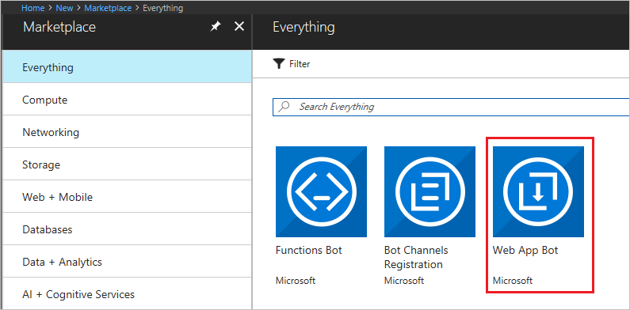
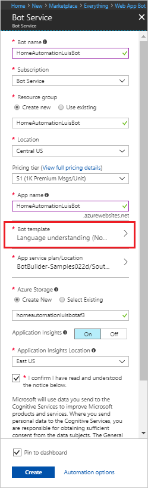
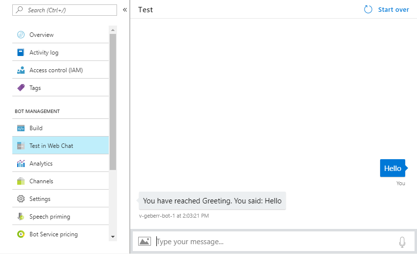
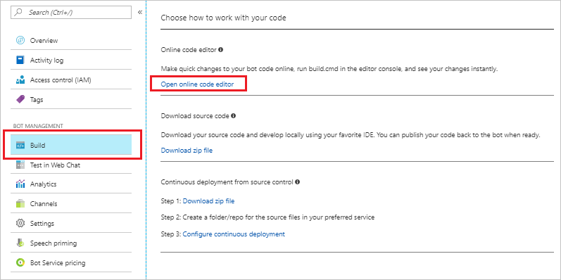
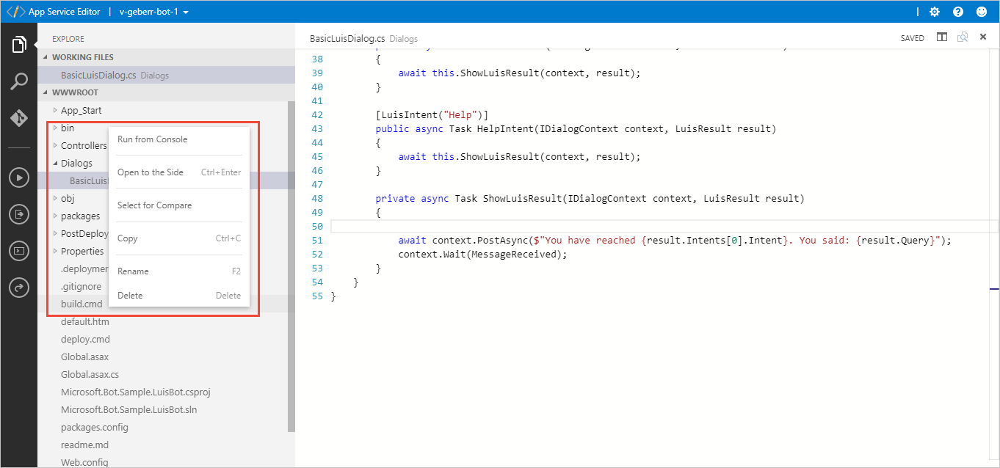
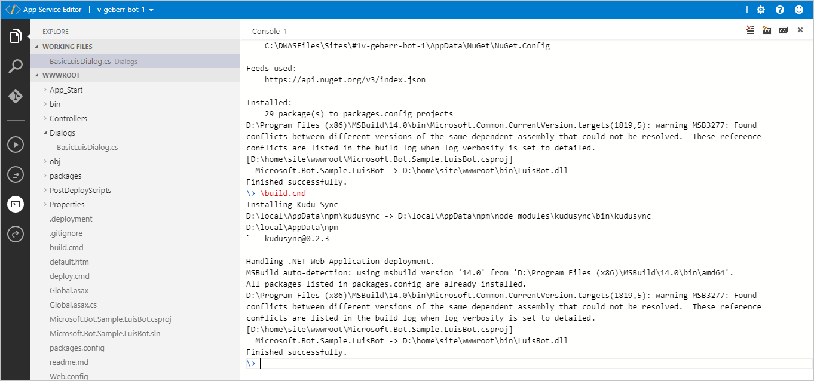
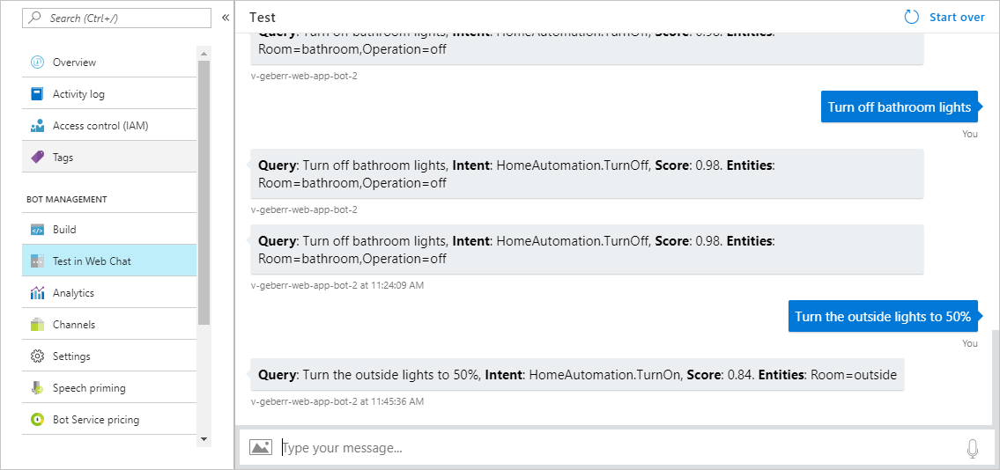

# LUIS bot in C#

Using C#, build a chat bot integrated with language understanding (LUIS). This chat bot uses the prebuilt HomeAutomation domain to quickly implement a bot solution. The bot is built with the Bot Framework 3.x and the Azure Web app bot.

## Prerequisite

* [HomeAutomation LUIS app](luis-get-started-create-app.md). The intents from this LUIS app map to the bot's dialog handlers. 

## LUIS HomeAutomation Intents

| Intent | Example utterance | Bot functionality |
|:----:|:----------:|---|
| HomeAutomation.TurnOn | Turn on the lights. | When the LUIS intent `HomeAutomation.TurnOn` is detected, the bot invokes the `OnIntent` dialog handler. This dialog is where you'd call an IoT service to turn on a device and tell the user that the device has been turned on. |
| HomeAutomation.TurnOff | Turn off the bedroom lights. | When the LUIS intent `HomeAutomation.TurnOff` is detected, the bot invokes the `OffIntent` dialog handler. This dialog is where you'd call an IoT service to turn off a device and tell the user that the device has been turned off. |

## Create a Language Understanding bot with Bot Service

1. In the [Azure portal](https://portal.azure.com), select **Create new resource** in the top left menu.

    

2. In the search box, search for **Web App Bot**. 

    

3. In the Web App Bot window, click **Create**.

4. In **Bot Service**, provide the required information, and click **Create**. This creates and deploys the bot service and LUIS app to Azure. If you want to use [speech priming](https://docs.microsoft.com/bot-framework/bot-service-manage-speech-priming), review [region requirements](luis-resources-faq.md#what-luis-regions-support-bot-framework-speech-priming) before creating your bot. 
    * Set **App name** to your bot’s name. The name is used as the subdomain when your bot is deployed to the cloud (for example, mynotesbot.azurewebsites.net). <!-- This name is also used as the name of the LUIS app associated with your bot. Copy it to use later, to find the LUIS app associated with the bot. -->
    * Select the subscription, [resource group](https://docs.microsoft.com/azure/azure-resource-manager/resource-group-overview), App service plan, and [location](https://azure.microsoft.com/regions/).
    * For **Bot template**, select:
        * **SDK v3**
        * **C#**
        * **Language understanding**
    * Select the **LUIS App Location**. This is the authoring [region](luis-reference-regions.md) the app is created in.
    * Select the confirmation checkbox for the legal notice. The terms of the legal notice are below the checkbox.

    

5. Confirm that the bot service has been deployed.
    * Click Notifications (the bell icon that is located along the top edge of the Azure portal). The notification changes from **Deployment started** to **Deployment succeeded**.
    * After the notification changes to **Deployment succeeded**, click **Go to resource** on that notification.

> [!Note]
> This web app bot creation process also created a new LUIS app for you. It has been trained and published for you. 

## Try the default bot

Confirm that the bot has been deployed by selecting the **Notifications** checkbox. The notifications changes from **Deployment in progress...** to **Deployment succeeded**. Click **Go to resource** button to open the bot's resources.

Once the bot is deployed, click **Test in Web Chat** to open the Web Chat pane. Type "hello" in Web Chat.

  

The bot responds by saying "You have reached Greeting. You said: hello".  This response confirms that the bot has received your message and passed it to a default LUIS app that it created. This default LUIS app detected a Greeting intent. In the next step, you'll connect the bot to the LUIS app you previously created instead of the default LUIS app.

## Connect your LUIS app to the bot

Open **Application Settings** and edit the **LuisAppId** field to contain the application ID of your LUIS app. If you created your HomeAutomation LUIS app in a region other than West US, you need to change the **LuisAPIHostName** as well. The **LuisAPIKey** is currently set to your authoring key. You change this to your endpoint key when your traffic exceeds the free tier quota. 

  

> [!Note]
> If you don't have the LUIS app ID of the [Home Automation app](luis-get-started-create-app.md), log in to the [LUIS](luis-reference-regions.md) website using the same account you use to log in to Azure. 
> 1. Click on **My apps**. 
> 2. Find the LUIS app you previously created, that contains the intents and entities from the HomeAutomation domain.
> 3. In the **Settings** page for the LUIS app, find and copy the app ID. Make sure it is [trained](luis-interactive-test.md) and [published](luis-how-to-publish-app.md). 

    > [!WARNING]
    > If you delete your app ID or LUIS key, the bot will stop working.

## Modify the bot code

1. Click **Build** and then click **Open online code editor**.

   

2. Right click `build.cmd` and choose **Run from Console** to build the app. There are several build steps the service completes automatically for you. The build is complete when it finished with "Finished successfully."

3. In the code editor, open `/Dialogs/BasicLuisDialog.cs`. It contains the following code:

   [!code-csharp[Default BasicLuisDialog.cs](~/samples-luis/documentation-samples/tutorial-web-app-bot/csharp/Default_BasicLuisDialog.cs "Default BasicLuisDialog.cs")]

## Change code to HomeAutomation intents

1. Remove the three intent attributes and methods for **Greeting**, **Cancel**, and **Help**. These intents are not used in the HomeAutomation prebuilt domain. Make sure to keep the **None** intent attribute and method. 

2. Add dependencies to the top of the file, with the other dependencies:

   [!code-csharp[Dependencies](~/samples-luis/documentation-samples/tutorial-web-app-bot/csharp/BasicLuisDialog.cs?range=4-5&dedent=8 "dependencies")]

3. Add constants to manage strings at the top of the `BasicLuisDialog ` class:

   [!code-csharp[Add Intent and Entity Constants](~/samples-luis/documentation-samples/tutorial-web-app-bot/csharp/BasicLuisDialog.cs?range=23-32&dedent=8 "Add Intent and Entity Constants")]

4. Add the code for the new intents of `HomeAutomation.TurnOn` and `HomeAutomation.TurnOff` inside the `BasicLuisDialog ` class:

   [!code-csharp[Add Intents](~/samples-luis/documentation-samples/tutorial-web-app-bot/csharp/BasicLuisDialog.cs?range=61-71&dedent=8 "Add Intents")]

5. Add the code to get any entities found by LUIS inside the `BasicLuisDialog ` class:

   [!code-csharp[Collect entities](~/samples-luis/documentation-samples/tutorial-web-app-bot/csharp/BasicLuisDialog.cs?range=34-53&dedent=8 "Collect entities")]

6. Change **ShowLuisResult** method in the `BasicLuisDialog ` class to round the score, collect the entities, and display the response message in the chatbot:

   [!code-csharp[Display message in chatbot](~/samples-luis/documentation-samples/tutorial-web-app-bot/csharp/BasicLuisDialog.cs?range=73-83&dedent=8 "Display message in chatbot")]

## Build the bot
In the code editor, right-click on `build.cmd` and select **Run from Console**.

The code view is replaced with a terminal window showing the progress and results of the build.

> [!TIP]
> An alternative method to build the bot is to select the bot name in the top blue bar, and select **Open Kudu Console**. The console opens to **D:\home**. 
> 
> Change the directory to **D:\home\site\wwwroot** by typing:
> `cd site\wwwroot`
>
> Run the build script by typing:
> `build.cmd`

## Test the bot

In the Azure portal, click on **Test in Web Chat** to test the bot. Type messages like "Turn on the lights", and "turn off my heater" to invoke the intents that you added to it.

   

> [!TIP]
> You can retrain your LUIS app without any modification to your bot's code. See [Add example utterances](https://docs.microsoft.com/azure/cognitive-services/LUIS/add-example-utterances) and [train and test your LUIS app](https://docs.microsoft.com/azure/cognitive-services/LUIS/luis-interactive-test). 

## Download the bot to debug
If your bot isn't working, download the project to your local machine and continue [debugging](https://docs.microsoft.com/bot-framework/bot-service-debug-bot#debug-a-c-bot). 

## Learn more about Bot Framework
Learn more about [Bot Framework](https://dev.botframework.com/) and the [3.x](https://github.com/Microsoft/BotBuilder) and [4.x](https://github.com/Microsoft/botbuilder-dotnet) SDKs.

## Next steps

Add the LUIS intents and Bot service dialogs for handling **Help**, **Cancel**, and **Greeting** intents. Remember to train, publish and to [build](#build-the-bot) the web app bot. Both LUIS and the bot should have the same intents.

> [!div class="nextstepaction"]
> [Add intents](./luis-how-to-add-intents.md)
> [Speech priming](https://docs.microsoft.com/bot-framework/bot-service-manage-speech-priming)

<!-- Links -->
[Github-BotFramework-Emulator-Download]: https://aka.ms/bot-framework-emulator
[Github-LUIS-Samples]: https://github.com/Microsoft/LUIS-Samples
[Github-LUIS-Samples-cs-hotel-bot]: https://github.com/Microsoft/LUIS-Samples/tree/master/bot-integration-samples/hotel-finder/csharp
[Github-LUIS-Samples-cs-hotel-bot-readme]: https://github.com/Microsoft/LUIS-Samples/blob/master/bot-integration-samples/hotel-finder/csharp/README.md
[BFPortal]: https://dev.botframework.com/
[RegisterInstructions]: https://docs.microsoft.com/bot-framework/portal-register-bot
[BotFramework]: https://docs.microsoft.com/bot-framework/
[VisualStudio]: https://www.visualstudio.com/

<!-- tested on Win10 -->
