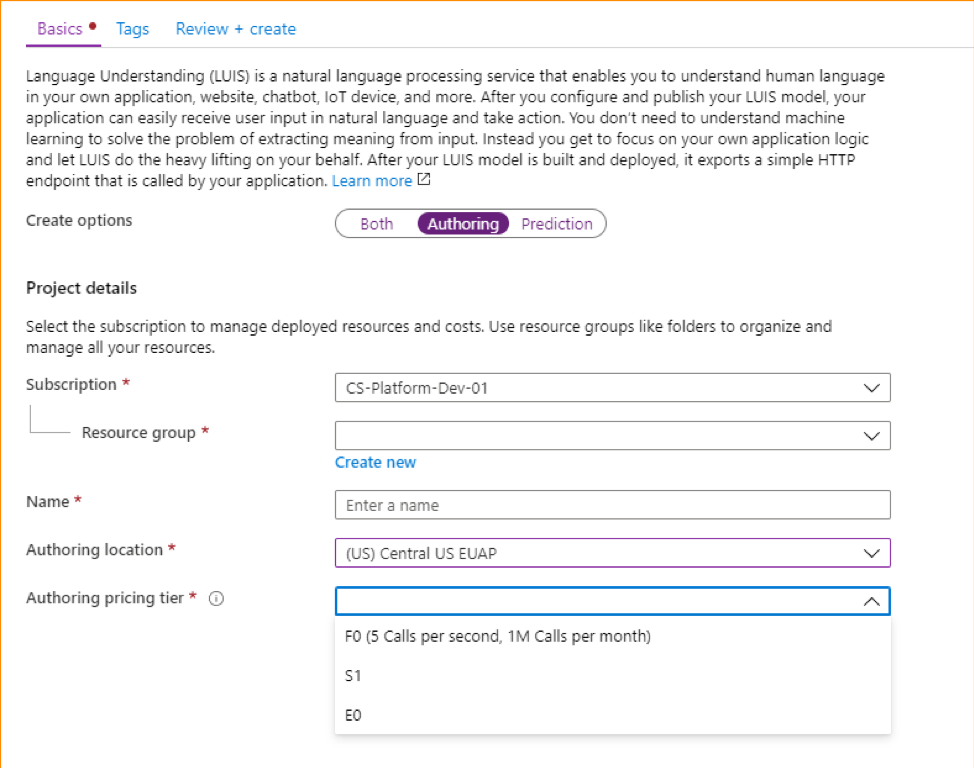

# Language Understanding service encryption of data at rest

The Language Understanding service automatically encrypts your data when it is persisted to the cloud. The Language Understanding service encryption protects your data and helps you meet your organizational security and compliance commitments.

## About Cognitive Services encryption

Data is encrypted and decrypted using [FIPS 140-2](https://en.wikipedia.org/wiki/FIPS_140-2) compliant [256-bit AES](https://en.wikipedia.org/wiki/Advanced_Encryption_Standard) encryption. Encryption and decryption are transparent, meaning encryption and access are managed for you. Your data is secure by default and you don’t need to modify your code or applications to take advantage of encryption.

## About encryption key management

By default, your subscription uses Microsoft-managed encryption keys. There is also an option to manage your subscription with your own keys. Customer-managed keys (CMK), offer greater flexibility to create, rotate, disable, and revoke access controls. You can also audit the encryption keys used to protect your data.

## Customer-managed keys with Azure Key Vault

There is also an option to manage your subscription with your own keys. Customer-managed keys (CMK), also known as Bring your own key (BYOK), offer greater flexibility to create, rotate, disable, and revoke access controls. You can also audit the encryption keys used to protect your data.

You must use Azure Key Vault to store your customer-managed keys. You can either create your own keys and store them in a key vault, or you can use the Azure Key Vault APIs to generate keys. The Cognitive Services resource and the key vault must be in the same region and in the same Azure Active Directory (Azure AD) tenant, but they can be in different subscriptions. For more information about Azure Key Vault, see [What is Azure Key Vault?](https://docs.microsoft.com/azure/key-vault/key-vault-overview).

### Customer-managed keys for Language Understanding

To request the ability to use customer-managed keys, fill out and submit the [LUIS Service Customer-Managed Key Request Form](https://aka.ms/cogsvc-cmk). It will take approximately 3-5 business days to hear back on the status of your request. Depending on demand, you may be placed in a queue and approved as space becomes available. Once approved for using CMK with LUIS, you'll need to create a new Language Understanding resource from the Azure portal and select E0 as the Pricing Tier. The new SKU will function the same as the F0 SKU that is already available except for CMK. Users won’t be able to upgrade from the F0 to the new E0 SKU.

E0 resources are only available for Authoring service and that the E0 tier will initially only be supported in West US Region.

### Regional availability

Customer-managed keys are currently available in the **West US** region.

### Limitations

There are some limitations when using the E0 tier with existing/previously created applications:

* Migration to an E0 resource will be blocked. Users will only be able to migrate their apps to F0 resources. After you've migrated an existing resource to F0, you can create a new resource in the E0 tier. Learn more about [migration here](https://docs.microsoft.com/azure/cognitive-services/luis/luis-migration-authoring).  
* Moving applications to or from an E0 resource will be blocked. A work around for this limitation is to export your existing application, and import it as an E0 resource.
* The Bing Spell check feature isn't supported.
* Logging end-user traffic is disabled if your application is E0.
* The Speech priming capability from the Azure Bot service isn't supported for applications in the E0 tier. This feature is available via the Azure Bot Service, which doesn't support CMK.
* The speech priming capability from the portal requires Azure Blob Storage. For more information, see [bring your own storage](../Speech-Service/speech-encryption-of-data-at-rest.md#bring-your-own-storage-byos-for-customization-and-logging).

### Enable customer-managed keys

A new Cognitive Services resource is always encrypted using Microsoft-managed keys. It's not possible to enable customer-managed keys at the time that the resource is created. Customer-managed keys are stored in Azure Key Vault, and the key vault must be provisioned with access policies that grant key permissions to the managed identity that is associated with the Cognitive Services resource. The managed identity is available only after the resource is created using the Pricing Tier for CMK.

To learn how to use customer-managed keys with Azure Key Vault for Cognitive Services encryption, see:

- [Configure customer-managed keys with Key Vault for Cognitive Services encryption from the Azure portal](../Encryption/cognitive-services-encryption-keys-portal.md)

Enabling customer managed keys will also enable a system assigned managed identity, a feature of Azure AD. Once the system assigned managed identity is enabled, this resource will be registered with Azure Active Directory. After being registered, the managed identity will be given access to the Key Vault selected during customer managed key setup. You can learn more about [Managed Identities](https://docs.microsoft.com/azure/active-directory/managed-identities-azure-resources/overview).

> [!IMPORTANT]
> If you disable system assigned managed identities, access to the key vault will be removed and any data encrypted with the customer keys will no longer be accessible. Any features depended on this data will stop working.

> [!IMPORTANT]
> Managed identities do not currently support cross-directory scenarios. When you configure customer-managed keys in the Azure portal, a managed identity is automatically assigned under the covers. If you subsequently move the subscription, resource group, or resource from one Azure AD directory to another, the managed identity associated with the resource is not transferred to the new tenant, so customer-managed keys may no longer work. For more information, see **Transferring a subscription between Azure AD directories** in [FAQs and known issues with managed identities for Azure resources](https://docs.microsoft.com/azure/active-directory/managed-identities-azure-resources/known-issues#transferring-a-subscription-between-azure-ad-directories).  

### Store customer-managed keys in Azure Key Vault

To enable customer-managed keys, you must use an Azure Key Vault to store your keys. You must enable both the **Soft Delete** and **Do Not Purge** properties on the key vault.

Only RSA keys of size 2048 are supported with Cognitive Services encryption. For more information about keys, see **Key Vault keys** in [About Azure Key Vault keys, secrets and certificates](https://docs.microsoft.com/azure/key-vault/about-keys-secrets-and-certificates#key-vault-keys).

### Rotate customer-managed keys

You can rotate a customer-managed key in Azure Key Vault according to your compliance policies. When the key is rotated, you must update the Cognitive Services resource to use the new key URI. To learn how to update the resource to use a new version of the key in the Azure portal, see the section titled **Update the key version** in [Configure customer-managed keys for Cognitive Services by using the Azure portal](../Encryption/cognitive-services-encryption-keys-portal.md).

Rotating the key does not trigger re-encryption of data in the resource. There is no further action required from the user.

### Revoke access to customer-managed keys

To revoke access to customer-managed keys, use PowerShell or Azure CLI. For more information, see [Azure Key Vault PowerShell](https://docs.microsoft.com/powershell/module/az.keyvault//) or [Azure Key Vault CLI](https://docs.microsoft.com/cli/azure/keyvault). Revoking access effectively blocks access to all data in the Cognitive Services resource, as the encryption key is inaccessible by Cognitive Services.

## Next steps

* [LUIS Service Customer-Managed Key Request Form](https://aka.ms/cogsvc-cmk)
* [Learn more about Azure Key Vault](https://docs.microsoft.com/azure/key-vault/key-vault-overview)
