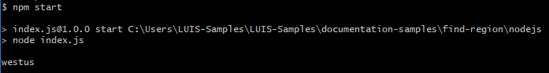

# Find endpoint region with Node.js
If you have the LUIS app ID and the LUIS subscription ID, you can find which region to use for endpoint queries.

> [!NOTE] 
> The complete Node.js solution is available from the [**LUIS-Samples** Github repository](https://github.com/Microsoft/LUIS-Samples/blob/master/documentation-samples/find-region/nodejs/).

## LUIS endpoint query strategy
Each LUIS endpoint query requires:

* An endpoint key
* An app ID
* A region

If the LUIS endpoint query uses the correct endpoint key and app ID but the wrong region, the response code is 401. The 401 request is not counted toward the subscription quota. Turn this request into a strategy to poll all regions to find the correct region. The correct region is the only request that returns a 2xx status code. 

|Response code|Parameters|
|--|--|
|2xx|correct endpoint key correct app ID correct host region|
|401|correct endpoint key correct app ID _incorrect_ host region|

## Node.js code to find region
The console application takes the LUIS app ID and the endpoint key and returns all regions associated with it. Currently, an endpoint key is created by region so only one region should return.

Include the NPM dependencies:

[!code-javascript[Add the dependencies](~/samples-luis/documentation-samples/find-region/nodejs/index.js?range=5-6 "Add the dependencies")]

Add constants. Replace the variable values for `subscriptionKey` and `appId` with your own values.  

[!code-javascript[Add constants](~/samples-luis/documentation-samples/find-region/nodejs/index.js?range=8-25 "Add constants")]

Add `searchRegions` function to find the region. All incorrect regions return 401, which is caught and ignored.

[!code-javascript[Find region](~/samples-luis/documentation-samples/find-region/nodejs/index.js?range=27-37 "Find region")]

Call the `searchRegions` function and return single region:

[!code-javascript[Call the function](~/samples-luis/documentation-samples/find-region/nodejs/index.js?range=39-43 "Call the function")]

When the application is run, the terminal shows the region for the app ID.

## Next steps

Learn more about LUIS [regions](luis-reference-regions.md).
