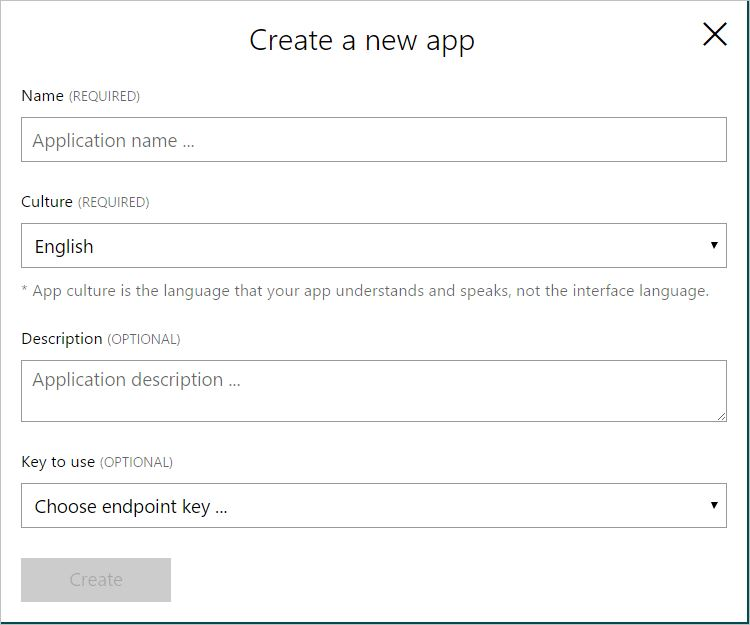
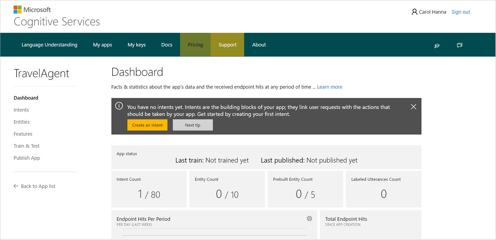

# Create your first LUIS app in ten minutes

This Quickstart helps you create your first Language Understanding Intelligent Service (LUIS) app in just a few minutes. When you're finished, you'll have a LUIS endpoint up and running in the cloud.

You are going to create a travel app, that helps you book flights and check the weather at your destination. The how-to topics refer to this application and build on it.

## Before you begin
To use Microsoft Cognitive Service APIs, you first need to create a [Cognitive Services API account](https://docs.microsoft.com/azure/cognitive-services/cognitive-services-apis-create-account) in the Azure portal.

If you don't have an Azure subscription, create a [free account](https://azure.microsoft.com/free/?WT.mc_id=A261C142F) before you begin.

## 1. Create a new app
You can create and manage your applications on **My Apps** page. You can always access this page by clicking **My Apps** on the top navigation bar of the [LUIS web page](https://www.luis.ai).

1. On the **My Apps** page, click **New App**.
2. In the dialog box, name your application "TravelAgent".

    
3. Choose your application culture (for TravelAgent app, we’ll choose English), and then click **Create**. 

    >[!NOTE]
    >The culture cannot be changed once the application is created. 

LUIS creates the TravelAgent app and opens its main page which looks like the following screen. Use the navigation links in the left panel to move through your app pages to define data and work on your app. 

## 2. Add intents
Your first task in the app is to add intents. Intents are the intentions or requested actions conveyed by the user's utterances. They are the main building block of your app. You now need to define the intents (for example, book a flight) that you want your application to detect. Go to the **Intents** page in the side menu to create your intents by clicking the **Add Intent** button.

For more detail on how to add intents, see [Add intents](add-intents.md).

## 3. Add utterances
Now that you've defined intents, you can start seeding examples to every intent to teach the machine learning model the different patterns (for example, "book a flight to Seattle departing on June 8th".) Select an intent you just added and start adding and saving utterances to your intent.

## 4. Add entities
Now that you have your intents, you can proceed to add entities. Entities describe information relevant to the intent, and sometimes are essential for your app to perform its task. An example for this app would be the airline on which to book a flight. Add a simple entity named "Airline" to your TravelAgent app.

For more information about entities, see [Add entities](add-entities.md).

## 5. Label entities in utterances
Next, you need to label examples of the entities to teach LUIS what this entity can look like. Highlight relevant tokens as entities in the utterances you added.

## 6. Add prebuilt entities
It might be useful to add one of the pre-existing entities, which we call *prebuilt* entities. Those types of entities are ready to be used directly and don't need to be labeled. Go to the **Entities** page to add prebuilt entities relevant to your app. Add the `ordinal` and `datetime` prebuilt entities to your app.

## 7. Train your app
Select **Train & Test** in the left panel, and then click **Train Application** to train your app based on the intents, utterances, entities you defined in the previous steps.

## 8. Test your app
Once you've trained your app, you can test it by typing a test utterance and pressing Enter. The results display the score associated with each intent. Check that the top scoring intent corresponds to the intent of each test utterance.

## 9. Publish your app
Select **Publish App** from the left-side menu and click **Publish**. 

## 10. Use your app
Copy the endpoint URL from the Publish App page and paste it into a browser. Append a query like "Book a flight to Boston" at the end of the URL and submit the request. The JSON containing results should show in the browser window.

## Next steps

* Try to improve your app's performance by continuing to add and label utterances.
* Try adding [Features](Add-Features.md) to enrich your model and improve performance in language understanding. Features help your app identify alternative interchangeable words/phrases, as well as commonly-used patterns specific to your domain.
