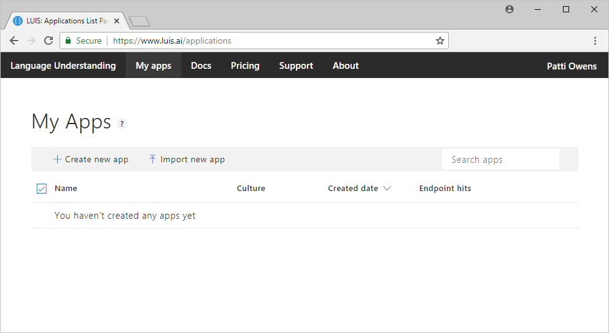
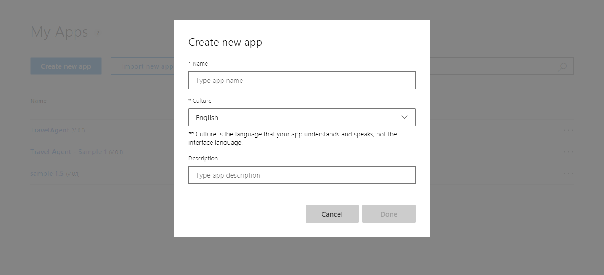
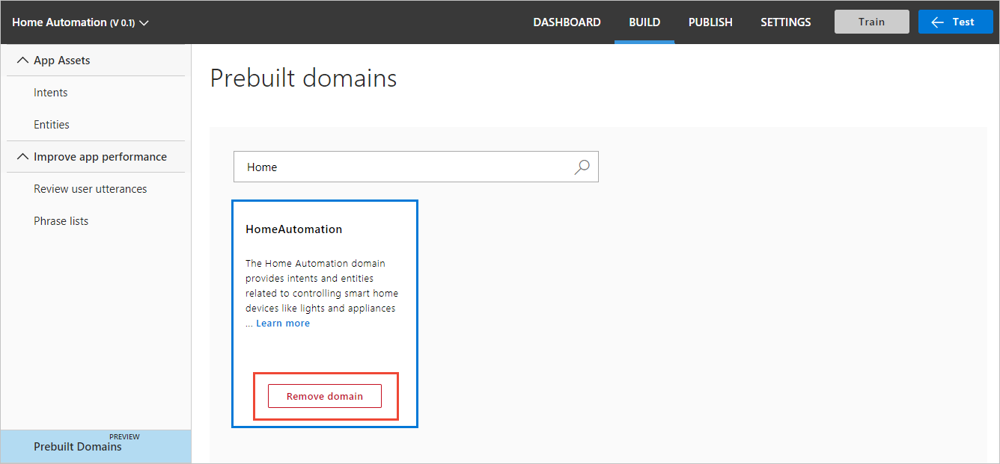
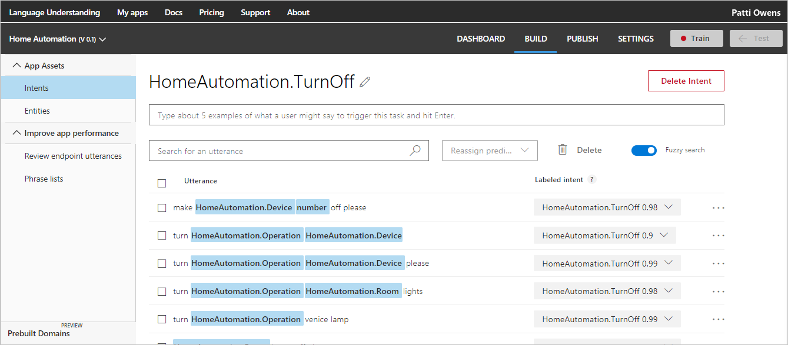
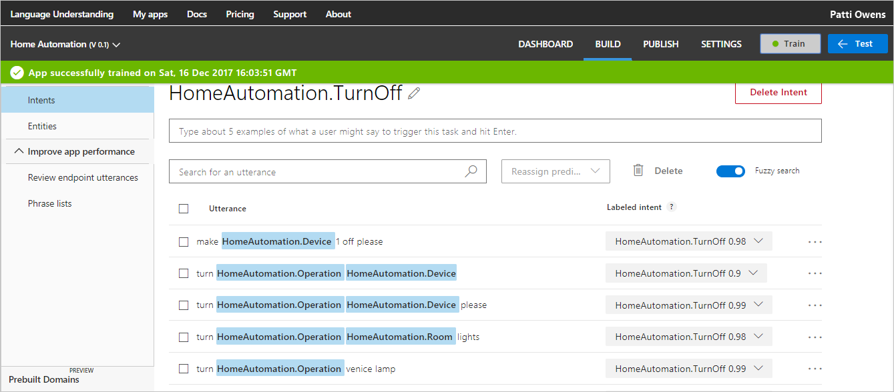
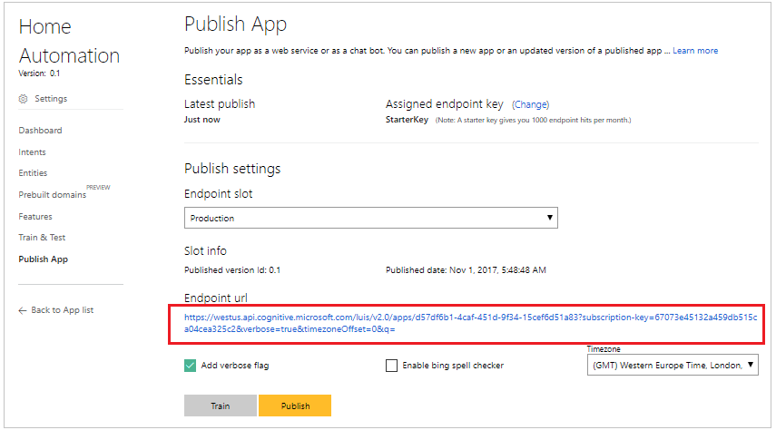
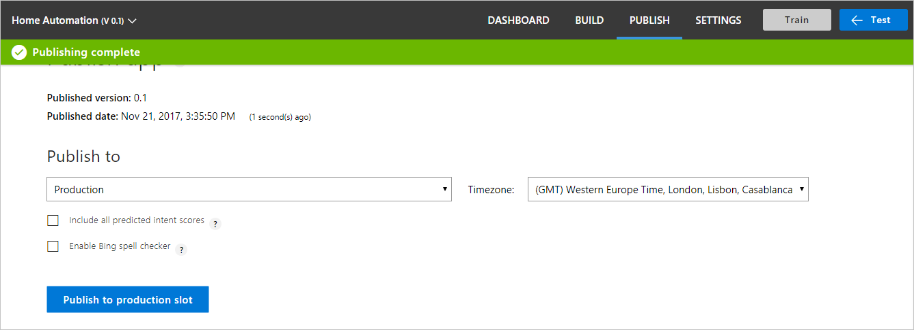
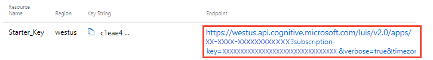
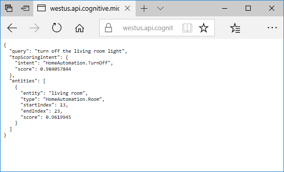

# Quickstart: Use prebuilt Home automation app

In this quickstart, create a LUIS app that uses the prebuilt domain `HomeAutomation` for turning lights and appliances on and off. This prebuilt domain provides intents, entities, and example utterances for you. When you're finished, you'll have a LUIS endpoint running in the cloud.

## Prerequisites

For this article, you need a free LUIS account, created on the LUIS portal at [http://www.luis.ai](http://www.luis.ai). 

## Create a new app
You can create and manage your applications on **My Apps**. 

1. Sign in to the LUIS portal.

2. Select **Create new app**.

    [](media/luis-quickstart-new-app/app-list.png)

3. In the dialog box, name your application "Home Automation".

    [](media/luis-quickstart-new-app/create-new-app-dialog.png)

4. Choose your application culture. For this Home Automation app, choose English. Then select **Done**. LUIS creates the Home Automation app. 

    >[!NOTE]
    >The culture cannot be changed once the application is created. 

## Add prebuilt domain

Select **Prebuilt domains** in the left-side navigation pane. Then search for "Home". Select **Add domain**.

[](media/luis-quickstart-new-app/home-automation.png)

When the domain is successfully added, the prebuilt domain box displays a **Remove domain** button.

[](media/luis-quickstart-new-app/remove-domain.png)

## Intents and entities

Select **Intents** in the left-side navigation pane to review the HomeAutomation domain intents. 

[](media/luis-quickstart-new-app/home-automation-intents.png)

Each intent has sample utterances.

> [!NOTE]
> **None** is an intent provided by all LUIS apps. You use it to handle utterances that don't correspond to functionality your app provides. 

Select the **HomeAutomation.TurnOff** intent. You can see that the intent contains a list of utterances that are labeled with entities.

[](media/luis-quickstart-new-app/home-automation-turnon.png)

## Train your app

Select **Train** in the top navigation.

[](media/luis-quickstart-new-app/trained.png)

## Test your app
Once you've trained your app, you can test it. Select **Test** in the top navigation. Type a test utterance like "Turn off the lights" into the Interactive Testing pane, and press Enter. 

```
Turn off the lights
```

Check that the top scoring intent corresponds to the intent you expected for each test utterance.

In this example, "Turn off the lights" is correctly identified as the top scoring intent of "HomeAutomation.TurnOff."

[](media/luis-quickstart-new-app/test.png)


Select **Test** again to collapse the test pane. 

## Publish your app
Select **Publish** from the top navigation. 

[](media/luis-quickstart-new-app/publish.png)

Select the Production slot and the **Publish** button.

The green notification bar at the top indicates the app successfully published.

[](media/luis-quickstart-new-app/published.png)

After you've successfully published, you can use the endpoint URL displayed in the **Publish app** page.

[](media/luis-quickstart-new-app/endpoint.png)

## Use your app
You can test your published endpoint in a browser using the generated URL. Open this URL in your browser, set the URL parameter "&q" to your test query. For example, add `turn off the living room light` to the end of your URL, and then press Enter. The browser displays the JSON response of your HTTP endpoint.


[](media/luis-quickstart-new-app/turn-off-living-room.png)

## Clean up resources
When no longer needed, delete the LUIS app. To do so, select the ellipsis (***...***) button to the right of the app name in the app list, select **Delete**. On the pop-up dialog **Delete app?**, select **Ok**.

## Next steps

You can call the endpoint from code:

> [!div class="nextstepaction"]
> [Call a LUIS endpoint using code](luis-get-started-cs-get-intent.md)
