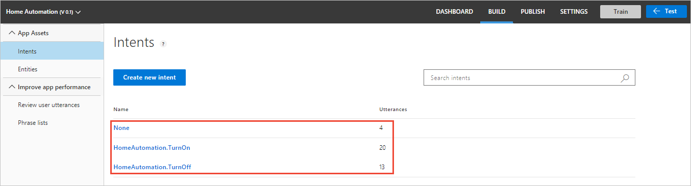

# Quickstart: Use prebuilt Home automation app

In this quickstart, create a LUIS app that uses the prebuilt domain `HomeAutomation` for turning lights and appliances on and off. This prebuilt domain provides intents, entities, and example utterances for you. When you're finished, you'll have a LUIS endpoint running in the cloud.

## Prerequisites

For this article, you need a free LUIS account, created on the LUIS portal at [https://www.luis.ai](https://www.luis.ai). 

[!INCLUDE [Sign in to LUIS](./includes/sign-in-process.md)]

## Create a new app
You can create and manage your applications on **My Apps**. 

1. In the LUIS portal, on the My apps list, select **+ Create**.

    

1. In the dialog box, name your application `Home Automation` then select **Done**. LUIS creates the app.

    

    >[!NOTE]
    >The culture cannot be changed once the application is created. 

## Add prebuilt domain

Select **Prebuilt domains** then search for **HomeAutomation**. Select **Add domain** on the HomeAutomation card.


When the domain is successfully added, the prebuilt domain box displays a **Remove domain** button.

## Intents and entities

Select **Intents** to review the HomeAutomation domain intents. The prebuilt domain intents have sample utterances.



> [!NOTE]
> **None** is an intent provided by all LUIS apps. You use it to handle utterances that don't correspond to functionality your app provides. 

Select the **HomeAutomation.TurnOff** intent. You can see that the intent contains a list of utterances that are labeled with entities.

[](media/luis-quickstart-new-app/home-automation-turnoff.png)

## Train the LUIS app

[!INCLUDE [LUIS How to Train steps](../../../includes/cognitive-services-luis-tutorial-how-to-train.md)]

## Test your app
Once you've trained your app, you can test it. Select **Test**. Type a test utterance like `Turn off the lights` into the interactive test pane, and press Enter. 

```
Turn off the lights
```

Check that the top scoring intent corresponds to the intent you expected for each test utterance.

In this example, `Turn off the lights` is correctly identified as the top scoring intent of **HomeAutomation.TurnOff**.


Select **Inspect** to review more information about the prediction.


Select **Test** again to collapse the test pane. 

<a name="publish-your-app"></a>

## Publish the app to get the endpoint URL

[!INCLUDE [LUIS How to Publish steps](./includes/howto-publish.md)]

<a name="query-the-v2-api-prediction-endpoint"></a>

## Query the V3 API prediction endpoint

[!INCLUDE [LUIS How to get endpoint first step](./includes/v3-prediction-endpoint.md)] 

1. In the browser address bar, for the query string, make sure the following name and value bars are in the URL. If they are not in the query string, add them:

    |Name/value pair|
    |--|
    |`verbose=true`|
    |`show-all-intents=true`|

1. In the browser address bar, go to the end of the URL and enter `turn off the living room light` for the _query_ value, then press Enter.

    ```json
    {
        "query": "turn off the living room light",
        "prediction": {
            "topIntent": "HomeAutomation.TurnOff",
            "intents": {
                "HomeAutomation.TurnOff": {
                    "score": 0.967174649
                }
            },
            "entities": {
                "HomeAutomation.Location": [
                    "living room"
                ],
                "HomeAutomation.DeviceName": [
                    [
                        "living room light"
                    ]
                ],
                "HomeAutomation.DeviceType": [
                    [
                        "light"
                    ]
                ],
                "$instance": {
                    "HomeAutomation.Location": [
                        {
                            "type": "HomeAutomation.Location",
                            "text": "living room",
                            "startIndex": 13,
                            "length": 11,
                            "score": 0.9494325,
                            "modelTypeId": 1,
                            "modelType": "Entity Extractor",
                            "recognitionSources": [
                                "model"
                            ]
                        }
                    ],
                    "HomeAutomation.DeviceName": [
                        {
                            "type": "HomeAutomation.DeviceName",
                            "text": "living room light",
                            "startIndex": 13,
                            "length": 17,
                            "modelTypeId": 5,
                            "modelType": "List Entity Extractor",
                            "recognitionSources": [
                                "model"
                            ]
                        }
                    ],
                    "HomeAutomation.DeviceType": [
                        {
                            "type": "HomeAutomation.DeviceType",
                            "text": "light",
                            "startIndex": 25,
                            "length": 5,
                            "modelTypeId": 5,
                            "modelType": "List Entity Extractor",
                            "recognitionSources": [
                                "model"
                            ]
                        }
                    ]
                }
            }
        }
    }
    ```

    Learn more about the [V3 prediction endpoint](luis-migration-api-v3.md).
    

## Clean up resources

[!INCLUDE [LUIS How to clean up resources](../../../includes/cognitive-services-luis-tutorial-how-to-clean-up-resources.md)]

## Next steps

You can call the endpoint from code:

> [!div class="nextstepaction"]
> [Call a LUIS endpoint using code](luis-get-started-cs-get-intent.md)
