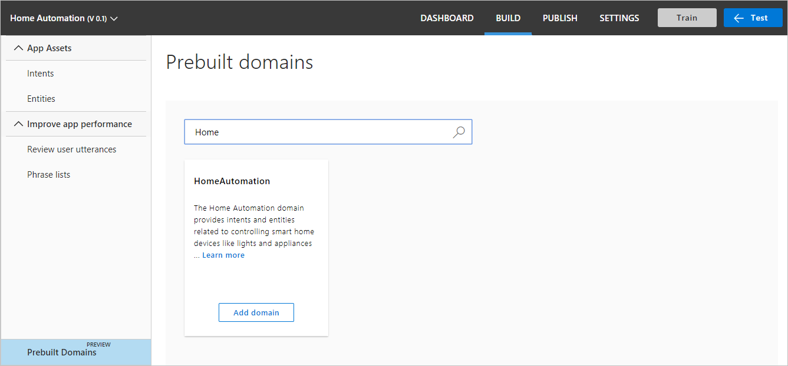
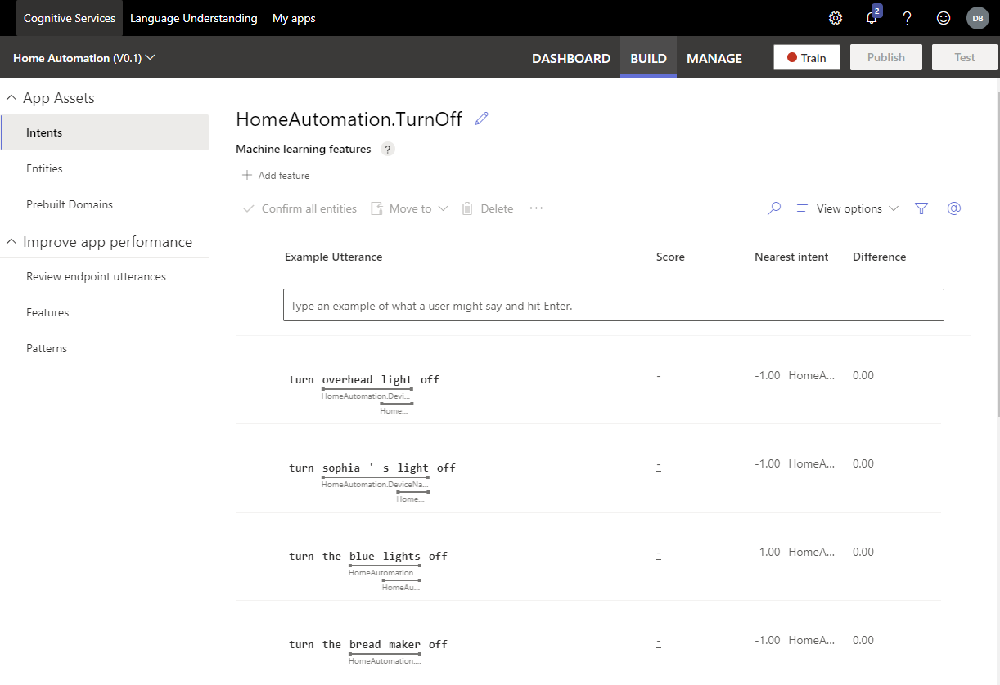
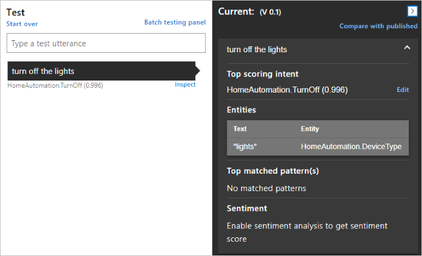
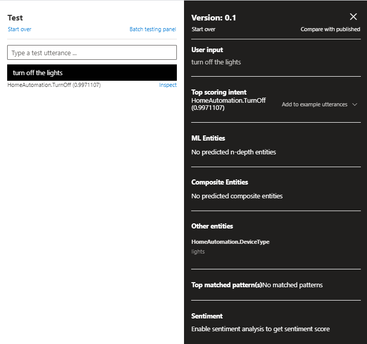

# Quickstart: Use prebuilt Home automation app

In this quickstart, create a LUIS app that uses the prebuilt domain `HomeAutomation` for turning lights and appliances on and off. This prebuilt domain provides intents, entities, and example utterances for you. When you're finished, you'll have a LUIS endpoint running in the cloud.

[!INCLUDE [Sign in to LUIS](./includes/sign-in-process.md)]

[!INCLUDE [Select authoring resource](./includes/select-authoring-resource.md)]

## Create a new app
You can create and manage your applications on **My Apps**.

### Create an application

To create an application, click  **+ New app**. 

In the window that appears, enter the following information:

|Name  |Description  |
|---------|---------|
|AName     | A name for the your app. For example "home automation".        |
|Culture     | The language that your app understands and speaks.   |
|Description | A description for your app.
|Prediction resource | The prediction resource that will receive queries. |

Select **Done**.

>[!NOTE]
>The culture cannot be changed once the application is created.

## Add prebuilt domain

1. In the left navigation, select **Prebuilt domains**.
1. Search for **HomeAutomation**.
1. Select **Add domain** on the HomeAutomation card.

    > [!div class="mx-imgBorder"]
    > 

    When the domain is successfully added, the prebuilt domain box displays a **Remove domain** button.

## Intents and entities

1. Select **Intents** in the left navigation menu to see the HomeAutomation domain intents. It has example utterances, such as `HomeAutomation.QueryState` and     `HomeAutomation.SetDevice`.

    > [!NOTE]
    > **None** is an intent provided by all LUIS apps. You use it to handle utterances that don't correspond to functionality your app provides.

1. Select the **HomeAutomation.TurnOff** intent. The intent contains a list of example utterances that are labeled with entities.

    > [!div class="mx-imgBorder"]
    > [](media/luis-quickstart-new-app/home-automation-turnoff.png)

1. If you want to view the entities for the app, select **Entities**. If you click on one of the entities, such as **HomeAutomation.DeviceName** you will see a list of values associated with it. 
 
    :::image type="content" source="media/luis-quickstart-new-app/entities-page.png" alt-text="Image alt text" lightbox="media/luis-quickstart-new-app/entities-page.png":::

## Train the LUIS app

[!INCLUDE [LUIS How to Train steps](includes/howto-train.md)]

## Test your app
Once you've trained your app, you can test it.

1. Select **Test** from the top-right navigation.

1. Type a test utterance like `Turn off the lights` into the interactive test pane, and press Enter. For example, *Turn off the lights*.

    In this example, `Turn off the lights` is correctly identified as the top scoring intent of **HomeAutomation.TurnOff**.

    

1. Select **Inspect** to view more information about the prediction.

    > [!div class="mx-imgBorder"]
    > 

1. Close the test pane.

<a name="publish-your-app"></a>

## Publish the app to get the endpoint URL

In order to receive a LUIS prediction in a chat bot or other client application, you need to publish the app to the prediction endpoint.

1. Select **Publish** in the top-right corner of the window.

1. Select the **Production** slot, then select **Done**.

    > [!div class="mx-imgBorder"]
    > 

1. Select the **Access your endpoint URLs** link in the notification to go to the **Azure Resources** page. The endpoint URLs are listed as the **Example Query**.

<!-- [!INCLUDE [LUIS How to Publish steps](./includes/howto-publish.md)] -->

<a name="query-the-v2-api-prediction-endpoint"></a>

## Query the V3 API prediction endpoint

[!INCLUDE [LUIS How to get endpoint first step](./includes/v3-prediction-endpoint.md)]

2. In the browser address bar, for the query string, make sure the following name and value bars are in the URL. If they are not in the query string, add them:

    |Name/value pair|
    |--|
    |`verbose=true`|
    |`show-all-intents=true`|

3. In the browser address bar, go to the end of the URL and enter `turn off the living room light` for the _query_ value, then press Enter.

    ```json
    {
        "query": "turn off the living room light",
        "prediction": {
            "topIntent": "HomeAutomation.TurnOff",
            "intents": {
                "HomeAutomation.TurnOff": {
                    "score": 0.969448864
                },
                "HomeAutomation.QueryState": {
                    "score": 0.0122336326
                },
                "HomeAutomation.TurnUp": {
                    "score": 0.006547436
                },
                "HomeAutomation.TurnDown": {
                    "score": 0.0050634006
                },
                "HomeAutomation.SetDevice": {
                    "score": 0.004951761
                },
                "HomeAutomation.TurnOn": {
                    "score": 0.00312553928
                },
                "None": {
                    "score": 0.000552945654
                }
            },
            "entities": {
                "HomeAutomation.Location": [
                    "living room"
                ],
                "HomeAutomation.DeviceName": [
                    [
                        "living room light"
                    ]
                ],
                "HomeAutomation.DeviceType": [
                    [
                        "light"
                    ]
                ],
                "$instance": {
                    "HomeAutomation.Location": [
                        {
                            "type": "HomeAutomation.Location",
                            "text": "living room",
                            "startIndex": 13,
                            "length": 11,
                            "score": 0.902181149,
                            "modelTypeId": 1,
                            "modelType": "Entity Extractor",
                            "recognitionSources": [
                                "model"
                            ]
                        }
                    ],
                    "HomeAutomation.DeviceName": [
                        {
                            "type": "HomeAutomation.DeviceName",
                            "text": "living room light",
                            "startIndex": 13,
                            "length": 17,
                            "modelTypeId": 5,
                            "modelType": "List Entity Extractor",
                            "recognitionSources": [
                                "model"
                            ]
                        }
                    ],
                    "HomeAutomation.DeviceType": [
                        {
                            "type": "HomeAutomation.DeviceType",
                            "text": "light",
                            "startIndex": 25,
                            "length": 5,
                            "modelTypeId": 5,
                            "modelType": "List Entity Extractor",
                            "recognitionSources": [
                                "model"
                            ]
                        }
                    ]
                }
            }
        }
    }
    ```

    Learn more about the [V3 prediction endpoint](luis-migration-api-v3.md).


## Clean up resources

[!INCLUDE [LUIS How to clean up resources](../../../includes/cognitive-services-luis-tutorial-how-to-clean-up-resources.md)]

## Next steps

You can call the endpoint from code:

> [!div class="nextstepaction"]
> [Call a LUIS endpoint using code](luis-get-started-cs-get-intent.md)
