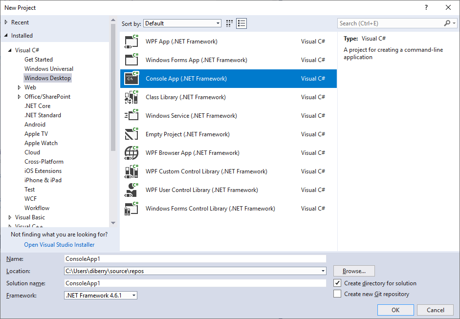
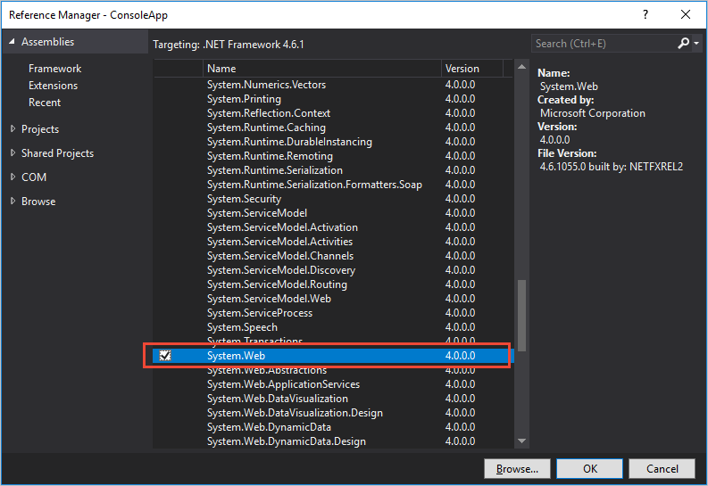
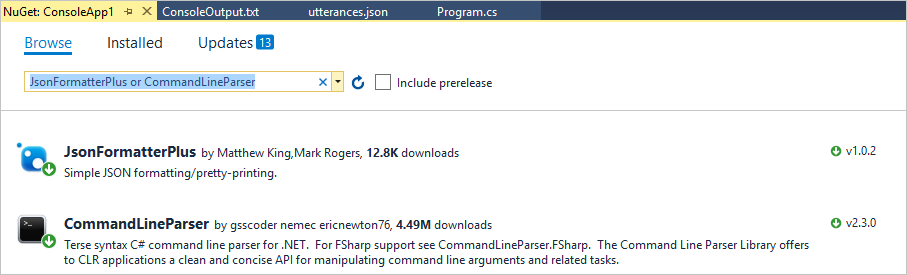
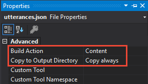

# Quickstart: Change model using C#

[!INCLUDE [Quickstart introduction for change model](../../../includes/cognitive-services-luis-qs-change-model-intro-para.md)]

## Prerequisites

[!INCLUDE [Quickstart prerequisites for changing model](../../../includes/cognitive-services-luis-qs-change-model-prereq.md)]
* Latest [**Visual Studio Community edition**](https://www.visualstudio.com/downloads/).
* C# programming language installed.
* [JsonFormatterPlus](https://www.nuget.org/packages/JsonFormatterPlus) and [CommandLine](https://www.nuget.org/packages/CommandLineParser/) NuGet packages

[!INCLUDE [Code is available in Azure-Samples GitHub repo](../../../includes/cognitive-services-luis-qs-change-model-luis-repo-note.md)]

## Example utterances JSON file

[!INCLUDE [Quickstart explanation of example utterance JSON file](../../../includes/cognitive-services-luis-qs-change-model-json-ex-utt.md)]

## Create quickstart code 

In Visual Studio, create a new **Windows Classic Desktop Console** app using the .NET Framework. Name the project `ConsoleApp1`.



### Add the System.Web dependency

The Visual Studio project needs **System.Web**. In the Solution Explorer, right-click on **References** and select **Add Reference** from the Assemblies section.



### Add other dependencies

The Visual Studio project needs **JsonFormatterPlus** and **CommandLineParser**. In the Solution Explorer, right-click on **References** and select **Manage NuGet Packages...**. Browse for and add each of the two packages. 




### Write the C# code
The **Program.cs** file should be:

```C#
using System;
using System.Collections.Generic;
using System.Linq;
using System.Text;
using System.Threading.Tasks;

namespace ConsoleApp1
{
    class Program
    {
        static void Main(string[] args)
        {
        }
    }
}
```

Update the dependencies so that are:

   [!code-csharp[Add the dependencies](~/samples-luis/documentation-samples/quickstarts/change-model/csharp/ConsoleApp1/Program.cs?range=1-11 "Add the dependencies")]


Add the LUIS IDs and strings to the **Program** class.

   [!code-csharp[Add the LUIS IDs and strings](~/samples-luis/documentation-samples/quickstarts/change-model/csharp/ConsoleApp1/Program.cs?range=19-30&dedent=8 "Add the LUIS IDs and strings")]

Add class to manage command-line parameters to the **Program** class.

   [!code-csharp[Add class to manage command line parameters.](~/samples-luis/documentation-samples/quickstarts/change-model/csharp/ConsoleApp1/Program.cs?range=32-46 "Add class to manage command-line parameters.")]

Add the GET request method to the **Program** class.

   [!code-csharp[Add the GET request.](~/samples-luis/documentation-samples/quickstarts/change-model/csharp/ConsoleApp1/Program.cs?range=49-59 "Add the GET request.")]


Add the POST request method to the **Program** class. 

   [!code-csharp[Add the POST request.](~/samples-luis/documentation-samples/quickstarts/change-model/csharp/ConsoleApp1/Program.cs?range=60-76 "Add the POST request.")]

Add example utterances from file method to the **Program** class.

   [!code-csharp[Add example utterances from file.](~/samples-luis/documentation-samples/quickstarts/change-model/csharp/ConsoleApp1/Program.cs?range=77-86 "Add example utterances from file.")]

After the changes are applied to the model, train the model. Add method to the **Program** class.

   [!code-csharp[After the changes are applied to the model, train the model.](~/samples-luis/documentation-samples/quickstarts/change-model/csharp/ConsoleApp1/Program.cs?range=87-96 "After the changes are applied to the model, train the model.")]

Training may not complete immediately, check status to verify training is complete. Add method to the **Program** class.

   [!code-csharp[Training may not complete immediately, check status to verify training is complete.](~/samples-luis/documentation-samples/quickstarts/change-model/csharp/ConsoleApp1/Program.cs?range=97-103 "Training may not complete immediately, check status to verify training is complete.")]

To manage command-line arguments, add the main code. Add method to the **Program** class.

   [!code-csharp[To manage command line arguments, add the main code.](~/samples-luis/documentation-samples/quickstarts/change-model/csharp/ConsoleApp1/Program.cs?range=104-137 "To manage command-line arguments, add the main code.")]

### Copy utterances.json to output directory

In the Solution Explorer, add the `utterances.json` by right-clicking in the Solution Explorer's project name, then selecting **Add**, then selecting **Existing item**. Select the `utterances.json` file. This adds the file to the project. Then it needs to be added to the output direction. Right-click the `utterances.json` and select **Properties**. In the properties windows, mark the **Build Action** of `Content`, and the **Copy to Output Directory** of `Copy Always`.  



## Build code

Build the code in Visual Studio. 

## Run code

In the project's /bin/Debug directory, run the application from a command line. 

```console
ConsoleApp1.exe --add utterances.json --train --status
```

This command-line displays the results of calling the add utterances API. 

[!INCLUDE [Quickstart response from API calls](../../../includes/cognitive-services-luis-qs-change-model-json-results.md)]

## Clean up resources
When you are done with the quickstart, remove all the files created in this quickstart. 

## Next steps
> [!div class="nextstepaction"] 
> [Build a LUIS app programmatically](luis-tutorial-node-import-utterances-csv.md) 
