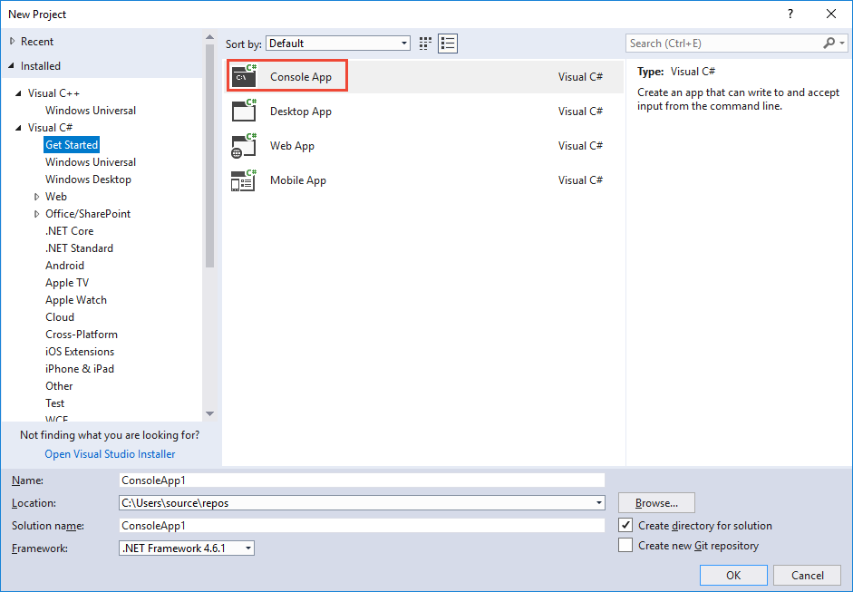
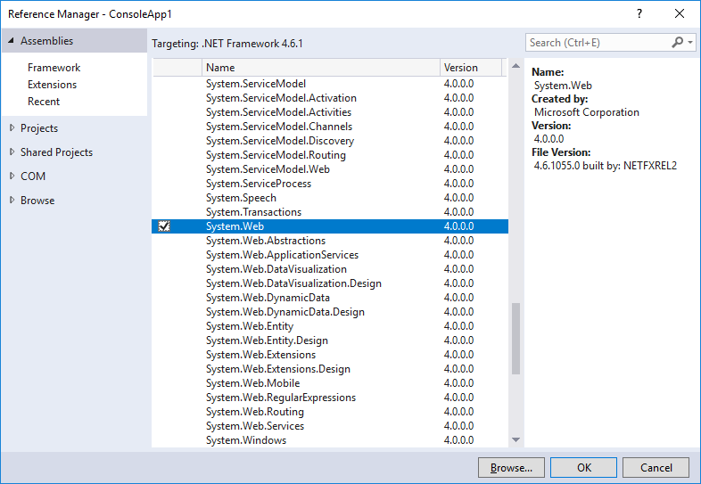

# Quickstart: Get intent using C#

[!INCLUDE [Quickstart introduction for endpoint](../../../includes/cognitive-services-luis-qs-endpoint-intro-para.md)]

## Prerequisites

* [Visual Studio Community 2017 edition](https://visualstudio.microsoft.com/vs/community/)
* C# programming language (included with VS Community 2017)
* Public app ID: df67dcdb-c37d-46af-88e1-8b97951ca1c2

[!INCLUDE [Use authoring key for endpoint](../../../includes/cognitive-services-luis-qs-endpoint-luis-repo-note.md)]

## Get LUIS key

[!INCLUDE [Use authoring key for endpoint](../../../includes/cognitive-services-luis-qs-endpoint-get-key-para.md)]

## Get intent with browser

[!INCLUDE [Use authoring key for endpoint](../../../includes/cognitive-services-luis-qs-endpoint-browser-para.md)]

## Get intent programmatically

Use C# to query the prediction endpoint GET [API](https://westus.dev.cognitive.microsoft.com/docs/services/5819c76f40a6350ce09de1ac/operations/5819c77140a63516d81aee78) to get the same results as you saw in the browser window in the previous section. 

1. Create a new console application in Visual Studio. 

    

2. In the Visual Studio project, in the Solutions Explorer, select **Add reference**, then select **System.Web** from the Assemblies tab.

    

3. Overwrite Program.cs with the following code:
    
   [!code-csharp[Console app code that calls a LUIS endpoint](~/samples-luis/documentation-samples/quickstarts/analyze-text/csharp/Program.cs)]

4. Replace the value of `YOUR_KEY` with your LUIS key.

5. Build and run the console application. It displays the same JSON that you saw earlier in the browser window.

    

## LUIS keys

[!INCLUDE [Use authoring key for endpoint](../../../includes/cognitive-services-luis-qs-endpoint-key-usage-para.md)]

## Clean up resources

When you are finished with this quickstart, close the Visual Studio project and remove the project directory from the file system. 

## Next steps

> [!div class="nextstepaction"]
> [Add utterances and train with C#](luis-get-started-cs-add-utterance.md)