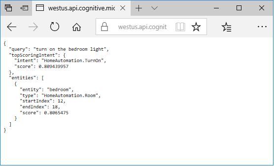
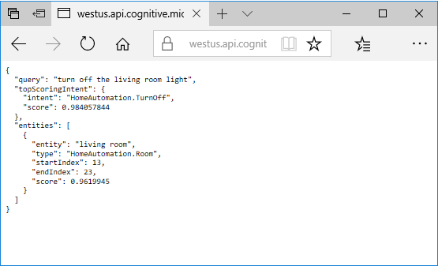

# Quickstart: Call a LUIS endpoint using Go
In this quickstart, pass utterances to a LUIS endpoint and get intent and entities back.

<!-- green checkmark -->
<!--
> [!div class="checklist"]
> * Create LUIS subscription and copy key value for later use
> * View LUIS endpoint results from browser to public sample IoT app
> * Create Visual Studio Go console app to make HTTPS call to LUIS endpoint
-->

<!-- link to free account -->
For this article, you need a free [LUIS](luis-reference-regions.md#luis-website) account in order to author your LUIS application.

## Prerequisites

* [Go](https://golang.org/) installed. 
* Your existing LUIS [**application ID**](./luis-get-started-create-app.md). The application ID is shown in the application dashboard.  


> [!NOTE] 
> The complete Go solution is available from the [**LUIS-Samples** Github repository](https://github.com/Microsoft/LUIS-Samples/blob/master/documentation-samples/endpoint-api-samples/go).

<a name="create-luis-subscription-key">
## Create LUIS endpoint key
1. You first need to create a [Language Understanding API account](https://docs.microsoft.com/azure/cognitive-services/cognitive-services-apis-create-account) in the Azure portal. If you don't have an Azure subscription, create a [free account](https://azure.microsoft.com/free/?WT.mc_id=A261C142F) before you begin.

2. Log in to the Azure portal at https://portal.azure.com. 

3. Follow the steps in [Creating Endpoint Keys using Azure](./luis-how-to-azure-subscription.md) to get a key.

4. Go back to the [LUIS](luis-reference-regions.md) website. Log in using your Azure account. 

    [](media/luis-get-started-cs-get-intent/app-list.png)

## Understand what LUIS returns

To understand what a LUIS app returns, you can paste the URL of a sample LUIS app into a browser window. The sample app is an IoT app that detects whether the user wants to turn on or turn off lights.

1. The endpoint of the sample app is in this format: `https://westus.api.cognitive.microsoft.com/luis/v2.0/apps/df67dcdb-c37d-46af-88e1-8b97951ca1c2?subscription-key=<YOUR_API_KEY>&verbose=false&q=turn%20on%20the%20bedroom%20light` Copy the URL and substitute your endpoint key for the value of the `subscription-key` field.

2. Paste the URL into a browser window and press Enter. The browser displays a JSON result that indicates that LUIS detects the `HomeAutomation.TurnOn` intent and the `HomeAutomation.Room` entity with the value `bedroom`.

    

3. Change the value of the `q=` parameter in the URL to `turn off the living room light`, and press Enter. The result now indicates that the LUIS detected the `HomeAutomation.TurnOff` intent and the `HomeAutomation.Room` entity with value `living room`. 

    

## Consume a LUIS result using the Endpoint API with Go 

You can use Go to access the same results you saw in the browser window in the previous step. 

1. Create a new Go named `endpoint.go` file with the following code.
    
   [!code-go[Go code that calls a LUIS endpoint](~/samples-luis/documentation-samples/endpoint-api-samples/go/endpoint.go?range=29-81)]

2. From a command prompt in the directory where you created the Go file, enter `go build endpoint.go` to compile the Go file. The command prompt does not return any information for a successful build.

3. Run the Go application from the command line by entering the following in the command prompt: 

```CMD
endpoint -appID <your-app-id> -endpointKey <add-your-endpoint-key> -version <your-version-id> -region westus
```

Replace `<your-app-id>` with the value of your app ID. Replace `<add-your-endpoint-key>` with the value of your endpoint key. Replace `<your-version-id>` with the value of your version ID, the default is `0.1`. 

The command prompt response is: 

    ```cmd
    appID has value df67dcdb-c37d-46af-88e1-8b97951ca1c2
    endpointKey has value b881189129024709a272286c6301b72b
    region has value westus
    utterance has value turn on the bedroom light
    response
    {
        "query": "turn on the bedroom light",
        "topScoringIntent": {
            "intent": "HomeAutomation.TurnOn",
            "score": 0.809439957
        },
        "entities": [
            {
            "entity": "bedroom",
            "type": "HomeAutomation.Room",
            "startIndex": 12,
            "endIndex": 18,
            "score": 0.8065475
            }
        ]
    }
    ```

## Clean up resources
The two resources created in this quickstart are the LUIS endpoint key and the Go project. Delete the LUIS endpoint key from the Azure portal. Close the Go file and remove it from the file system. 

## Next steps
> [!div class="nextstepaction"]
> [Add utterances](luis-get-started-go-add-utterance.md)