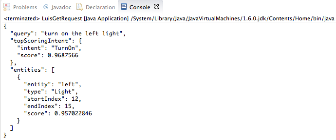

# Quickstart: Get intent using Java

[!INCLUDE [Quickstart introduction for endpoint](../../../includes/cognitive-services-luis-qs-endpoint-intro-para.md)]

## Prerequisites

* [JDK SE](http://www.oracle.com/technetwork/java/javase/downloads/index.html)  (Java Development Kit, Standard Edition)
* [Visual Studio Code](https://code.visualstudio.com/)
* Public app ID: df67dcdb-c37d-46af-88e1-8b97951ca1c2

[!INCLUDE [Use authoring key for endpoint](../../../includes/cognitive-services-luis-qs-endpoint-luis-repo-note.md)]

## Get LUIS key

[!INCLUDE [Use authoring key for endpoint](../../../includes/cognitive-services-luis-qs-endpoint-get-key-para.md)]

## Get intent with browser

[!INCLUDE [Use authoring key for endpoint](../../../includes/cognitive-services-luis-qs-endpoint-browser-para.md)]

## Get intent programmatically 

You can use Java to access the same results you saw in the browser window in the previous step. 

1. Copy the following code to create a class in a file named `LuisGetRequest.java`:

   [!code-java[Console app code that calls a LUIS endpoint](~/samples-luis/documentation-samples/quickstarts/analyze-text/java/call-endpoint.java)]

2. Replace the value of the `YOUR-KEY` variable with your LUIS key.

3. Compile the java program with `javac -cp ":lib/*" LuisGetRequest.java`. 

4. Run the application with `java -cp ":lib/*" LuisGetRequest.java`. It displays the same JSON that you saw earlier in the browser window.

    
    
## LUIS keys

[!INCLUDE [Use authoring key for endpoint](../../../includes/cognitive-services-luis-qs-endpoint-key-usage-para.md)]

## Clean up resources

Delete the Java file. 

## Next steps
> [!div class="nextstepaction"]
> [Add utterances](luis-get-started-java-add-utterance.md)