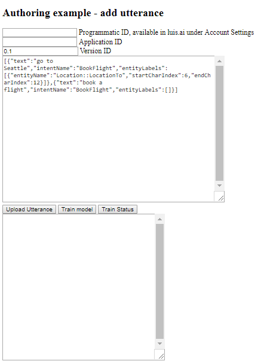

# Quickstart: Add utterances to app using JavaScript
In this quickstart, write a program to add an utterance to an intent using the Authoring APIs in Javascript.

<!-- green checkmark -->
<!--
> [!div class="checklist"]
> * Create Visual Studio console project 
> * Add method to call LUIS API to add utterance and train app
> * Add JSON file with example utterances for BookFlight intent
> * Run console and see training status for utterances
-->

For more information, see the technical documentation for the [add example utterance to intent](https://westus.dev.cognitive.microsoft.com/docs/services/5890b47c39e2bb17b84a55ff/operations/5890b47c39e2bb052c5b9c08), [train](https://westus.dev.cognitive.microsoft.com/docs/services/5890b47c39e2bb17b84a55ff/operations/5890b47c39e2bb052c5b9c45), and [training status](https://westus.dev.cognitive.microsoft.com/docs/services/5890b47c39e2bb17b84a55ff/operations/5890b47c39e2bb052c5b9c46) APIs.

For this article, you need a free [LUIS](luis-reference-regions.md#luis-website) account in order to author your LUIS application.

## Prerequisites
* Your LUIS [**authoring key**](luis-concept-keys.md#authoring-key). 
* Your existing LUIS **application ID** and **version ID**. 
* A new file named `add-utterances.html` project in VSCode.

> [!NOTE] 
> The complete `add-utterances.html` file is available from the [**LUIS-Samples** Github repository](https://github.com/Microsoft/LUIS-Samples/blob/master/documentation-samples/authoring-api-samples/javascript/add-utterance.html).


## Write the code
Create `add-utterances.html` and add the following code:

   [!code-javascript[Java Dependencies](~/samples-luis/documentation-samples/authoring-api-samples/javascript/add-utterance.html "Java Dependencies")]

## View in browser
1. Open the file in a browser.

2. Add your LUIS authoring ID, your LUIS application ID, and change the version if it is not `0.1`

3. Modify the **array of utterances** to add to your application. They are stored in the utteranceJSON variable. Change these values for your own domain and utterance needs. 

    ```json
    // example batch utterances
    var utteranceJSON = [
        {
            "text": "go to Seattle",
            "intentName": "BookFlight",
            "entityLabels": [
                {
                    "entityName": "Location::LocationTo",
                    "startCharIndex": 6,
                    "endCharIndex": 12
                }
            ]
        }
    ,
        {
            "text": "book a flight",
            "intentName": "BookFlight",
            "entityLabels": []
        }
    ];
    ```

4. Select the `Upload utterance` button. The LUIS results are displayed below the buttons.

5. Select the `Train model` button to train your application with these new utterances.

6. Select the `Train Status` button to see the training status. 



## Clean up resources
When you are done with the tutorial, remove Visual Studio and the console application if you don't need them anymore. 

## Next steps
> [!div class="nextstepaction"]
> [Integrate LUIS with a bot](luis-csharp-tutorial-build-bot-framework-sample.md)
