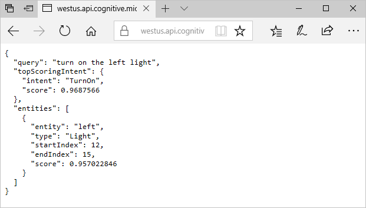
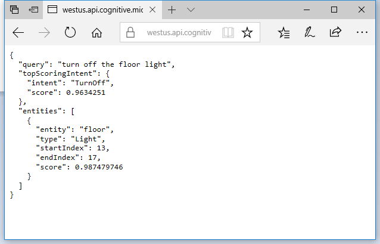
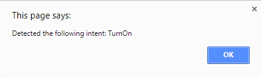

# Call a LUIS app using JavaScript

This quickstart shows you how to call your Language Understanding Intelligent Service (LUIS) app in just a few minutes. When you're finished, you'll be able to use JavaScript code to pass utterances to a LUIS endpoint and get results.

## Before you begin
You need a Cognitive Services API key to make calls to the sample LUIS app we use in this walkthrough. 
To get an API key follow these steps: 
  1. You first need to create a [Cognitive Services API account](https://docs.microsoft.com/azure/cognitive-services/cognitive-services-apis-create-account) in the Azure portal. If you don't have an Azure subscription, create a [free account](https://azure.microsoft.com/free/?WT.mc_id=A261C142F) before you begin.
  2. Log in to the Azure portal at https://portal.azure.com. 
  3. Follow the steps in [Creating Subscription Keys using Azure](./AzureIbizaSubscription.md) to get a key.
  4. Go back to https://www.luis.ai and log in using your Azure account. 

## Understand what LUIS returns

To understand what a LUIS app returns, you can paste the URL of a sample LUIS app into a browser window. The sample app you'll use is an IoT app that detects whether the user wants to turn on or turn off lights.

1. The endpoint of the sample app is in this format: `https://westus.api.cognitive.microsoft.com/luis/v2.0/apps/60340f5f-99c1-4043-8ab9-c810ff16252d?subscription-key=<YOUR_API_KEY>&verbose=false&q=turn%20on%20the%20left%20light`. Copy the URL and paste in your subscription key for the value of the `subscription-key` field.
2. Paste the URL into a browser window and press Enter. The browswer displays a JSON result that indicates that LUIS detects the `TurnOn` intent and the `Light` entity with the value `left`.

    
3. Change the value of the `q=` parameter in the URL to `turn off the floor light`, and press enter. The result now indicates that the LUIS detected the `TurnOff` intent and the `Light` entity with value `floor`. 

    

## Consume a LUIS result using the Endpoint API with JavaScript 

You can use JavaScript to access the same results you saw in the browser window in the previous step. 
1. Copy the code that follows and save it into an HTML file:

   [!code-javascript[Console app code that calls a LUIS endpoint](~/samples-luis/documentation-samples/endpoint-api-samples/javascript/call-endpoint.html)]
2. Replace `"YOUR SUBSCRIPTION KEY"` with your subscription key in this line of code: `xhrObj.setRequestHeader("Ocp-Apim-Subscription-Key","YOUR SUBSCRIPTION KEY");`

3. Open the file you saved using a web browser.  An alert window should pop up that says `Detected the following intent: TurnOn`.

## Next steps

* See the [LUIS Endpoint API reference](https://westus.dev.cognitive.microsoft.com/docs/services/5819c76f40a6350ce09de1ac/operations/5819c77140a63516d81aee78) to learn more about the parameters for calling your LUIS endpoint.
