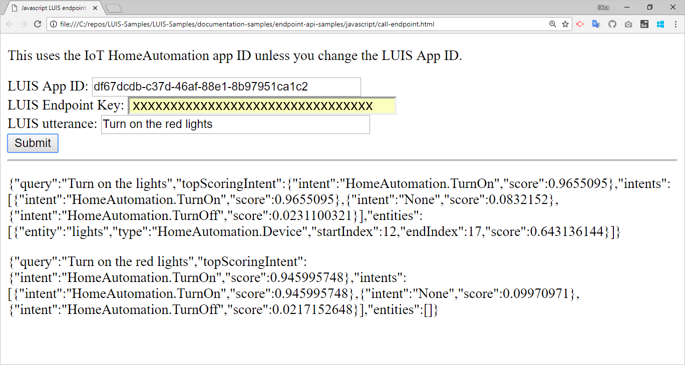

# Quickstart: Get intent using Javascript

[!INCLUDE [Quickstart introduction for endpoint](../../../includes/cognitive-services-luis-qs-endpoint-intro-para.md)]

[!INCLUDE [Use authoring key for endpoint](../../../includes/cognitive-services-luis-qs-endpoint-luis-repo-note.md)]

## Prerequisites

* [Visual Studio Code](https://code.visualstudio.com/)
* Public app ID: df67dcdb-c37d-46af-88e1-8b97951ca1c2

## Get LUIS key

[!INCLUDE [Use authoring key for endpoint](../../../includes/cognitive-services-luis-qs-endpoint-get-key-para.md)]

## Get intent with browser

[!INCLUDE [Use authoring key for endpoint](../../../includes/cognitive-services-luis-qs-endpoint-browser-para.md)]

## Get intent programmatically

You can use Javascript to access the same results you saw in the browser window in the previous step. 

1. Copy the code that follows and save it into an HTML file:

   [!code-html[Console app code that calls a LUIS endpoint](~/samples-luis/documentation-samples/quickstarts/analyze-text/javascript/call-endpoint.html)]

2. Open the file in a browser. Enter your LUIS endpoint key in the form and select **Submit**.

    

    The result display under the form. 

## LUIS keys

[!INCLUDE [Use authoring key for endpoint](../../../includes/cognitive-services-luis-qs-endpoint-key-usage-para.md)]

## Clean up resources

Delete the Javascript file.

## Next steps
> [!div class="nextstepaction"]
> [Add utterances](luis-get-started-javascript-add-utterance.md)
