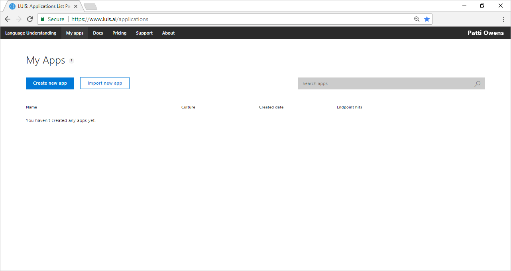
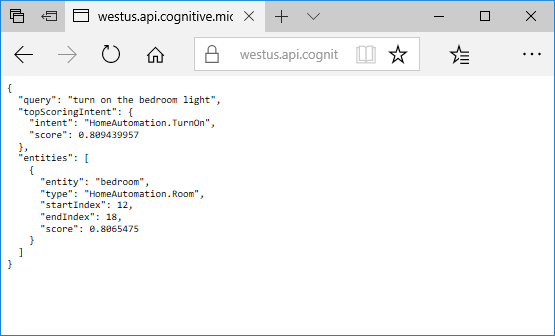

# Quickstart: Call a LUIS endpoint using Python
In this quickstart, pass utterances to a LUIS endpoint and get intent and entities back.

<!-- green checkmark -->
<!--
> [!div class="checklist"]
> * Create LUIS subscription and copy key value for later use
> * View LUIS endpoint results from browser to public sample IoT app
> * Create Visual Studio C# console app to make HTTPS call to LUIS endpoint
-->

For this article, you need a free [LUIS](luis-reference-regions.md#luis-website) account in order to author your LUIS application.

## Create LUIS endpoint key
You need a Cognitive Services API key to make calls to the sample LUIS app used in this walkthrough. 

To get an API key, follow these steps: 

1. You first need to create a [Cognitive Services API account](https://docs.microsoft.com/azure/cognitive-services/cognitive-services-apis-create-account) in the Azure portal. If you don't have an Azure subscription, create a [free account](https://azure.microsoft.com/free/?WT.mc_id=A261C142F) before you begin.

2. Log in to the Azure portal at https://portal.azure.com. 

3. Follow the steps in [Creating Endpoint Keys using Azure](./luis-how-to-azure-subscription.md) to get a key.

4. Go back to the [LUIS](luis-reference-regions.md) website and log in using your Azure account. 

    

## Understand what LUIS returns

To understand what a LUIS app returns, you can paste the URL of a sample LUIS app into a browser window. The sample app is an IoT app that detects whether the user wants to turn on or turn off lights.

1. The endpoint of the sample app is in this format: `https://westus.api.cognitive.microsoft.com/luis/v2.0/apps/df67dcdb-c37d-46af-88e1-8b97951ca1c2?subscription-key=<YOUR_API_KEY>&verbose=false&q=turn%20on%20the%20bedroom%20light` Copy the URL and substitute your endpoint key for the value of the `subscription-key` field.
2. Paste the URL into a browser window and press Enter. The browser displays a JSON result that indicates that LUIS detects the `HomeAutomation.TurnOn` intent and the `HomeAutomation.Room` entity with the value `bedroom`.

    
3. Change the value of the `q=` parameter in the URL to `turn off the living room light`, and press enter. The result now indicates that the LUIS detected the `HomeAutomation.TurnOff` intent and the `HomeAutomation.Room` entity with value `living room`. 

    

## Consume a LUIS result using the Endpoint API with Python

You can use Python to access the same results you saw in the browser window in the previous step.

1. Copy one of the following code snippets to a file called `quickstart-call-endpoint.py`:

   [!code-python[Console app code that calls a LUIS endpoint for Python 2.7](~/samples-luis/documentation-samples/quickstarts/analyze-text/python/2.x/quickstart-call-endpoint-2-7.py)]

   [!code-python[Console app code that calls a LUIS endpoint for Python 3.6](~/samples-luis/documentation-samples/quickstarts/analyze-text/python/3.x/quickstart-call-endpoint-3-6.py)]

2. Replace the value of the `Ocp-Apim-Subscription-Key` field with your LUIS endpoint key.

3. Install dependencies with `pip install requests`.

4. Run the script with `python ./quickstart-call-endpoint.py`. It displays the same JSON that you saw earlier in the browser window.
<!-- 

-->

## Clean up resources
The two resources created in this tutorial are the LUIS endpoint key and the C# project. Delete the LUIS endpoint key from the Azure portal. Close the Visual Studio project and remove the directory from the file system. 

## Next steps
> [!div class="nextstepaction"]
> [Add utterances](luis-get-started-python-add-utterance.md)