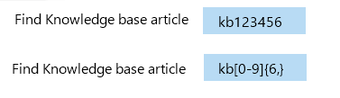

# Plan your LUIS app

It is important to plan your app before you start creating it in LUIS. Prepare an outline or schema of the possible intents and entities that are relevant to the domain-specific topic of your application.  

## Identify your domain
A LUIS app is centered around a domain-specific topic.  For example, you may have a travel app that performs booking of tickets, flights, hotels, and rental cars. Another app may provide content related to exercising, tracking fitness efforts and setting goals. 

> [!TIP]
> LUIS offers [prebuilt domains](luis-how-to-use-prebuilt-domains.md) for many common scenarios.
> Check to see if you can use a prebuilt domain as a starting point for your app.

## Identify your intents
Think about the [intents](luis-concept-intent.md) that are important to your application’s task. Let's take the example of a travel app, with functions to book a flight and check the weather at the user's destination. You can define the "BookFlight" and "GetWeather" intents for these actions. In a more complex app with more functions, you have more intents, and you should define them carefully so as to not be too specific. For example, "BookFlight" and "BookHotel" may need to be separate intents, but "BookInternationalFlight" and "BookDomesticFlight" may be too similar.

> [!NOTE]
> It is a best practice to use only as many intents as you need to perform the functions of your app. If you define too many intents, it becomes harder for LUIS to classify utterances correctly. If you define too few, they may be so general as to be overlapping.

## Identify your entities
To book a flight, you need some information like the destination, date, airline, ticket category, and travel class. You can add these as [entities](luis-concept-entity-types.md) because they are important for accomplishing an intent. 

When you determine which entities to use in your app, keep in mind that there are different types of entities for capturing relationships between types of objects. [Entities in LUIS](luis-concept-entity-types.md) provides more detail about the different types.

### Simple entity
A simple entity describes a single concept.

See [Data Extraction](luis-concept-data-extraction.md#simple-entity-data) to learn more about extracting the simple entity from the endpoint JSON query response. Try the simple entity [quickstart](luis-quickstart-primary-and-secondary-data.md) to learn more about how to use a simple entity.

### Hierarchical entity
A hierarchical entity is a special type of a **simple** entity; defining a category and its members in the form of parent-child relationship.

See [Data Extraction](luis-concept-data-extraction.md#hierarchical-entity-data) to learn more about extracting the hierarchical entity from the endpoint JSON query response. Try the hierarchical entity [quickstart](luis-quickstart-intent-and-hier-entity.md) to learn more about how to use a hierarchical entity.

### Composite entity
A composite entity is made up of other entities that form parts of a whole. 

See [Data Extraction](luis-concept-data-extraction.md#composite-entity-data) to learn more about extracting the composite entity from the endpoint JSON query response. Try the composite entity [tutorial](luis-tutorial-composite-entity.md) to learn more about how to use a composite entity.

### Prebuilt entity
LUIS provides [prebuilt entities](luis-prebuilt-entities.md) for common types like `Number`, which you can use for the number of tickets in a ticket order.

See [Data Extraction](luis-concept-data-extraction.md#prebuilt-entity-data) to learn more about extracting regular expression entities from the endpoint JSON query response. 

### List entity 
A list entity is an explicitly specified list of values. Each value consists of one or more synonyms. In a travel app, you might choose to create a list entity to represent airport names.

See [Data Extraction](luis-concept-data-extraction.md#list-entity-data) to learn more about extracting list entities from the endpoint JSON query response. Try the [quickstart](luis-quickstart-intent-and-list-entity.md) to learn more about how to use a list entity.

### Regular expression entity
A regular expression entity allows LUIS to extract data from an utterance based on a regex expression.

See [Data Extraction](luis-concept-data-extraction.md#regular-expression-entity-data) to learn more about extracting regular expression entities from the endpoint JSON query response. Try the [quickstart](luis-quickstart-intents-regex-entity.md) to learn more about how to use a regular expression entity.

## After getting endpoint utterances
After your app gets endpoint utterances, plan to implement prediction improvements with [active learning](luis-how-to-review-endoint-utt.md), [phrase lists](luis-concept-feature.md), and [patterns](luis-concept-patterns.md). 

### Pattern.any entity
Patterns.any is a variable-length placeholder used only in a [pattern's](luis-concept-patterns.md) template utterance to mark where the entity begins and ends. Template utterances conform to [proper syntax](luis-concept-patterns.md#pattern-syntax) to identify entities, and ignorable text.

## Next steps
* See [Create your first Language Understanding Intelligent Services (LUIS) app](luis-get-started-create-app.md) for a quick walkthrough of how to create a LUIS app.