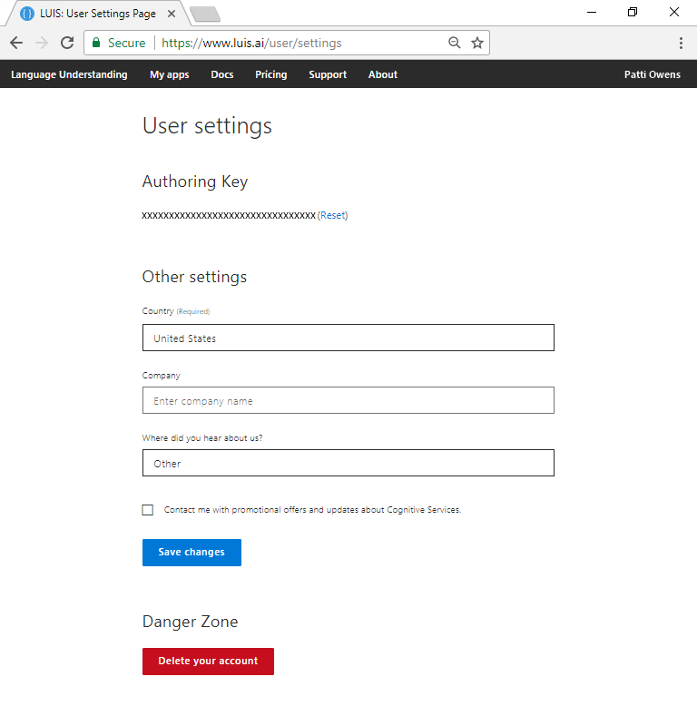

# Manage account and authoring key

The two key pieces of information for a LUIS account are the user account and the authoring key. Your login information is managed at [account.microsoft.com](https://account.microsoft.com). Your authoring key is managed from the [LUIS](luis-reference-regions.md) portal **Settings** page.

## Authoring key

This single, region-specific authoring key, on the **Settings** page, allows you to author all your apps from the [LUIS](luis-reference-regions.md) portal as well as the [authoring APIs](https://go.microsoft.com/fwlink/?linkid=2092087). As a convenience, the authoring key is allowed to make a [limited](luis-boundaries.md) number of endpoint queries each month.

The authoring key is used for any apps you own as well as any apps you are listed as a collaborator.

## Authoring key regions

The authoring key is specific to the [authoring region](luis-reference-regions.md#publishing-regions). The key does not work in a different region.

## Reset authoring key

If your authoring key is compromised, reset the key. The key is reset on all your apps in the [LUIS](luis-reference-regions.md) portal. If you author your apps via the authoring APIs, you need to change the value of `Ocp-Apim-Subscription-Key` to the new key.

## Delete account

See [Data storage and removal](luis-concept-data-storage.md#accounts) for information about what data is deleted when you delete your account.

## Next steps

Learn more about your [authoring key](luis-concept-keys.md#authoring-key).

