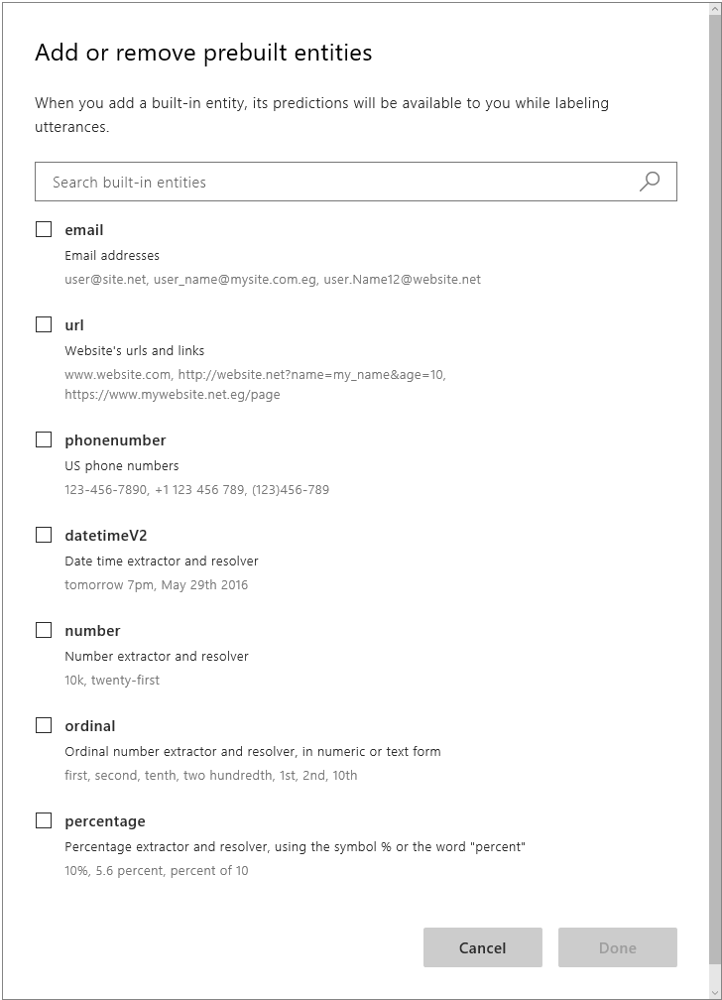
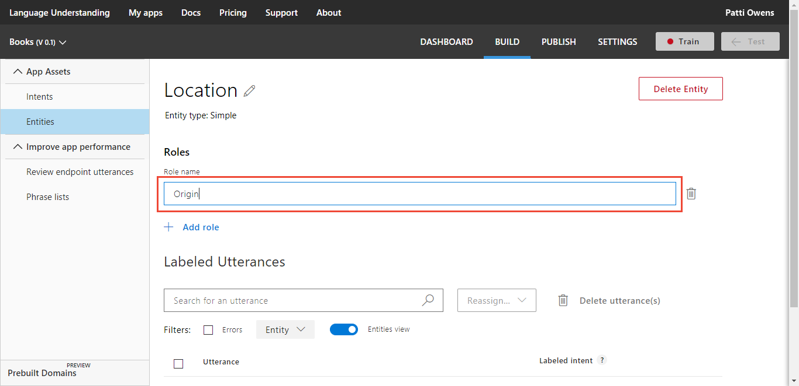
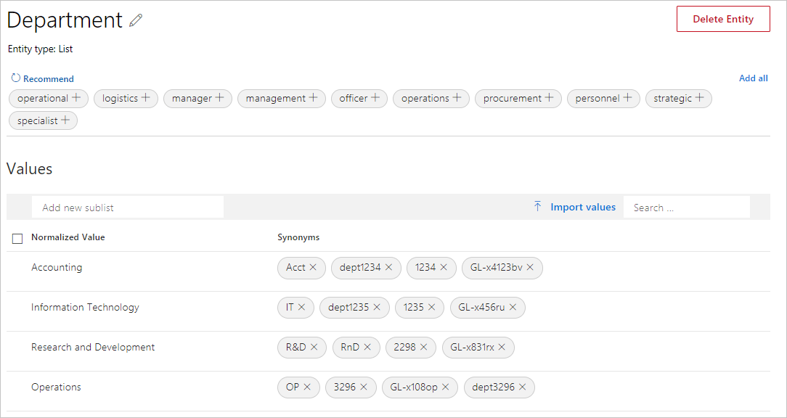

# Create entities without utterances

The entity represents a word or phrase inside the utterance that you want extracted. An entity represents a class including a collection of similar objects (places, things, people, events, or concepts). Entities describe information relevant to the intent, and sometimes they are essential for your app to perform its task. You can create entities when you add an utterance to an intent or apart from (before or after) adding an utterance to an intent.

You can add, edit, or delete entities in your LUIS app through the **Entities list** on the **Entities** page. LUIS offers two main types of entities: [prebuilt entities](luis-reference-prebuilt-entities.md), and your own [custom entities](luis-concept-entity-types.md#types-of-entities).

Once a machine-learned entity is created, you need to mark that entity in all the example utterance of all the intents it is in.

<a name="add-prebuilt-entity"></a>

## Add a prebuilt entity to your app

Common prebuilt entities added to an application are *number* and *datetimeV2*. 

1. In your app, from the **Build** section, select **Entities** in the left panel.
 
1. On the **Entities** page, select **Add prebuilt entities**.

1. In **Add prebuilt entities** dialog box, select the **number** and **datetimeV2** prebuilt entities. Then select **Done**.

    

<a name="add-simple-entities"></a>

## Add simple entities for single concepts

A simple entity describes a single concept. Use the following procedure to create an entity that extracts company department names such as *Human resources* or *Operations*.   

1. In your app, select the **Build** section, then select **Entities** in the left panel, then select **Create new entity**.

1. In the pop-up dialog box, type `Location` in the **Entity name** box, select **Simple** from the **Entity type** list, and then select **Done**.

    Once this entity is created, go to all intents that have example utterances that contain the entity. Select the text in the example utterance and mark the text as the entity. 

    A [phrase list](luis-concept-feature.md) is commonly used to boost the signal of a simple entity.

<a name="add-regular-expression-entities"></a>

## Add regular expression entities for highly structured concepts

A regular expression entity is used to pull out data from the utterance based on a regular expression you provide. 

1. In your app, select **Entities** from the left navigation, and then select **Create new entity**.

1. In the pop-up dialog box, enter `Human resources form name` in the **Entity name** box,  select **Regular expression** from the **Entity type** list, enter the regular expression `hrf-[0-9]{6}`, and then select **Done**. 

    This regular expression matches literal characters `hrf-`, then 6 digits to represent a form number for a Human resources form.

<a name="add-composite-entities"></a>

## Add composite entities to group into a parent-child relationship

You can define relationships between entities of different types by creating a composite entity. In the following example, the entity contains a regular expression, and a prebuilt entity of name.  

In the utterance `Send hrf-123456 to John Smith`, the text `hrf-123456` is matched to a human resources [regular expression](#add-regular-expression-entities) and `John Smith` is extracted with the prebuilt entity personName. Each entity is part of a larger, parent entity. 

1. In your app, select **Entities** from the left navigation of the **Build** section, and then select **Add prebuilt entity**.

1. Add the prebuilt entity **PersonName**. For instructions, see [Add Prebuilt Entities](#add-prebuilt-entity). 

1. Select **Entities** from the left navigation, and then select **Create new entity**.

1. In the pop-up dialog box, enter `SendHrForm` in the **Entity name** box, then select **Composite** from the **Entity type** list.

1. Select **Add Child** to add a new child.

1. In **Child #1**, select the entity **number** from the list.

1. In **Child #2**, select the entity **Human resources form name** from the list. 

1. Select **Done**.

<a name="add-pattern-any-entities"></a>

## Add Pattern.any entities to capture free-form entities

[Pattern.any](luis-concept-entity-types.md) entities are only valid in [patterns](luis-how-to-model-intent-pattern.md), not intents. This type of entity helps LUIS find the end of entities of varying length and word choice. Because this entity is used in a pattern, LUIS knows where the end of the entity is in the utterance template.

If an app has a `FindHumanResourcesForm` intent, the extracted form title may interfere with the intent prediction. In order to clarify which words are in the form title, use a Pattern.any within a pattern. The LUIS prediction begins with the utterance. First, the utterance is checked and matched for entities, when the entities are found, then the pattern is checked and matched. 

In the utterance `Where is Request relocation from employee new to the company on the server?`, the form title is tricky because it is not contextually obvious where the title ends and where the rest of the utterance begins. Titles can be any order of words including a single word, complex phrases with punctuation, and nonsensical ordering of words. A pattern allows you to create an entity where the full and exact entity can be extracted. Once the title is found, the `FindHumanResourcesForm` intent is predicted because that is the intent for the pattern.

1. From the **Build** section, select **Entities** in the left panel, and then select **Create new entity**.

1. In the **Add Entity** dialog box, enter `HumanResourcesFormTitle` in the **Entity name** box, and select **Pattern.any** as the **Entity type**.

    To use the pattern.any entity, add a pattern on the **Patterns** page, in the **Improve app performance** section, with the correct curly brace syntax, such as `Where is **{HumanResourcesFormTitle}** on the server?`.

    If you find that your pattern, when it includes a Pattern.any, extracts entities incorrectly, use an [explicit list](luis-concept-patterns.md#explicit-lists) to correct this problem. 

<a name="add-a-role-to-pattern-based-entity"></a>

## Add a role to distinguish different contexts

A role is a named subtype based on context. It is available in all entities including prebuilt and non-machine-learned entities. 

The syntax for a role is **`{Entityname:Rolename}`** where the entity name is followed by a colon, then the role name. For example, `Move {personName} from {LocationUsingRoles:Origin} to {LocationUsingRoles:Destination}`.

1. From the **Build** section, select **Entities** in the left panel.

1. Select **Create new entity**. Enter the name of `LocationUsingRoles`. Select the type **Simple** and select **Done**. 

1. Select **Entities** from the left panel, then select the new entity **LocationUsingRoles** created in the previous step.

1. In the **Role name** textbox, enter the name of the role `Origin` and enter. Add a second role name of `Destination`. 

    

<a name="add-list-entities"></a>

## Add list entities for exact matches

List entities represent a fixed, closed set of related words. 

For a Human Resources app, you can have a list of all departments along with any synonyms for the departments. You don't have to know all the values when you create the entity. You can add more after reviewing real user utterances with synonyms.

1. From the **Build** section, select **Entities** in the left panel, and then select **Create new entity**.

1. In the **Add Entity** dialog box, type `Department` in the **Entity name** box and select **List** as the **Entity type**. Select **Done**.
  
1. The list entity page allows you to add normalized names. In the **Values** textbox, enter a department name for the list, such as `HumanResources` then press Enter on the keyboard. 

1. To the right of the normalized value, enter synonyms, pressing Enter on the keyboard after each item.

1. If you want more normalized items for the list, select **Recommend** to see options from the [semantic dictionary](luis-glossary.md#semantic-dictionary).

    


1. Select an item in the recommended list to add it as a normalized value or select **Add all** to add all the items. 
    You can import values into an existing list entity using the following JSON format:

    ```JSON
    [
        {
            "canonicalForm": "Blue",
            "list": [
                "navy",
                "royal",
                "baby"
            ]
        },
        {
            "canonicalForm": "Green",
            "list": [
                "kelly",
                "forest",
                "avacado"
            ]
        }
    ]  
    ```

<a name="change-entity-type"></a>

## Do not change entity type

LUIS does not allow you to change the type of the entity because it doesn't know what to add or remove to construct that entity. In order to change the type, it is better to create a new entity of the correct type with a slightly different name. Once the entity is created, in each utterance, remove the old labeled entity name and add the new entity name. Once all the utterances have been relabeled, delete the old entity. 

<a name="create-a-pattern-from-an-utterance"></a>

## Create a pattern from an example utterance

See [Add pattern from existing utterance on intent or entity page](luis-how-to-model-intent-pattern.md#add-pattern-from-existing-utterance-on-intent-or-entity-page).

## Train your app after changing model with entities

After you add, edit, or remove entities, [train](luis-how-to-train.md) and [publish](luis-how-to-publish-app.md) your app for your changes to affect endpoint queries. 

## Next steps

For more information about prebuilt entities, see the [Recognizers-Text](https://github.com/Microsoft/Recognizers-Text) project. 

For information about how the entity appears in the JSON endpoint query response, see [Data Extraction](luis-concept-data-extraction.md)

Now that you have added intents, utterances and entities, you have a basic LUIS app. Learn how to [train](luis-how-to-train.md), [test](luis-interactive-test.md), and [publish](luis-how-to-publish-app.md) your app.
 
