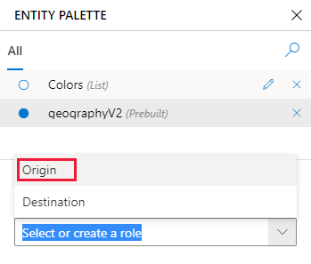

# Add entities to extract data 

Create entities to extract key data from user utterances in Language Understanding (LUIS) apps. Extracted entity data is used by your client application to fullfil customer requests.

The entity represents a word or phrase inside the utterance that you want extracted. Entities describe information relevant to the intent, and sometimes they are essential for your app to perform its task. You can create entities when you add an example utterance to an intent or apart from (before or after) adding an example utterance to an intent.

[!INCLUDE [Uses preview portal](includes/uses-portal-preview.md)]

## Plan entities, then create and label

Machine-learned entities can be created from the example utterances or created from the **Entities** page. 

In general, a best practice is to spend time planning the entities before creating a machine-learned entity in the portal. Then create the machine-learned entity from the example utterance with as much detail in the subcomponents and descriptors and constraints as you know at the time. The [decomposable entity tutorial](tutorial-machine-learned-entity.md) demonstrates how to use this method. 

As part of planning the entities, you may know you need text-matching entities (such as prebuilt entities, regular expression entities, or list entities). You can create these from the **Entities** page before they are labeled in example utterances. 

When labeling, you can either label individual entities then build up to a parent machine-learned entity. Or you can start with a parent machine-learned entity and decompose into child entities. 

> [!TIP] 
>Label all words that may indicate an entity, even if the words are not used when extracted in the client application. 

## Creating an entity before or with labeling

Use the following table to understand which entities where to create or add each entity to the app. 

|Entity type|Where to create entity in the LUIS portal|
|--|--|
|Machine-learned entity|Entities or Intent detail|
|List entity|Entities or Intent detail|
|Regular expression entity|Entities|
|Pattern.any entity|Entities|
|Prebuilt entity|Entities|
|Prebuilt domain entity|Entities|

You can create all the entities from the **Entities** page, or you can create a couple of the entities as part of labeling the entity in the example utterance on the **Intent detail** page. You can only _label_ an entity in an example utterance from the **Intent detail** page. 

## Create a machine-learned entity

[!INCLUDE [Create and label entities in machine-learned tutorial](includes/decomposable-tutorial-links.md)]

## Create a text-matching entity

Use text-matching entities provide several ways to extract data:

|Text-matching entities|Purpose|
|--|--|
|[List entity](#add-list-entities-for-exact-matches)|list of canonical names along with synonyms as alternative forms|
|Regular expression entity|match text using a regular expression entity|
|[Prebuilt entity](tutorial-machine-learned-entity.md#add-prebuilt-number-to-help-extract-data)|match common data types such as number, email, date|
|Prebuilt domain entity|match using selected subject domains|
|[Pattern.any](#add-a-patternany-entity)| to match entities that may be easily confused with the surrounding text|  

Prebuilt entities work without providing any custom training data. The other entities need you to provide either customer training data (such as List entity's items) or an expression (such as a regular expression or pattern.any).

### How to create a new custom entity

1. In the LUIS portal, goto the **Manage** section, then the **Entities** page. 
1. Select **+ Create**, then select the entity type. 
1. Continue configuring the entity then select **Create** when you are done. 

### Add list entities for exact matches

List entities represent a fixed, closed set of related words. While you, as the author, can change the list, LUIS won't grow or shrink the list. You can also import to an existing list entity using a [list entity .json format(reference-entity-list.md#example-json-to-import-into-list-entity). 

The following list demonstrates the canonical name and the synonyms. 

|Color - list item name|Color - synonyms|
|--|--|
|Red|crimson, blood, apple, fire-engine|
|Blue|sky, azure, cobalt|
|Green|kelly, lime|

Use the procedure to create a list entity. Once the list entity is created, you don't need to label example utterances in an intent. List items and synonyms are matched using exact text. 

1. From the **Build** section, select **Entities** in the left panel, and then select **+ Create**.

1. In the **Create an entity type** dialog box, enter the name of the entity, such as `Colors` and select **List**.
1. In the **Create a list entity** dialog box, in the **Add new sublist....**, enter the list item name, such as `Green`, then add synonyms.

    > [!div class="mx-imgBorder"]
    >  

1. When you are finished adding list items and synonyms, select **Create**.

    When you are done with a group of changes to the app, remember to **Train** the app. Do not train the app after a single change. 

    > [!NOTE]
    > This procedure demonstrates creating and labeling a list entity from an example utterance in the **Intent detail** page. You can also create the same entity from the **Entities** page.

## Add a role for an entity

A role is a named subtype of an entity, based on context. 

### Add a role to distinguish different contexts

In the following utterance, there are two locations, and each is specified semantically by the words around it such as `to` and `from`: 

`Pick up the package from Seattle and deliver to New York City.`

In this procedure, add `origin` and `destination` roles to a prebuilt geographyV2 entity.

1. From the **Build** section, select **Entities** in the left panel.

1. Select **+ Add prebuilt entity**. Select **geographyV2** then select **Done**. This adds a prebuilt entity to the app.
    
    If you find that your pattern, when it includes a Pattern.any, extracts entities incorrectly, use an [explicit list](reference-pattern-syntax.md#explicit-lists) to correct this problem. 

1. Select the newly added prebuilt geographyV2 entity from the **Entities** page list of entities. 
1. To add a new role, select **+** next to **No roles added**.
1. In the **Type role...** textbox, enter the name of the role `Origin` then enter. Add a second role name of `Destination` then enter. 

    > [!div class="mx-imgBorder"]
    > 

    The role is added to the prebuilt entity but isn't added to any utterances using that entity. 

### Label text with a role in an example utterance

1. Go to the Intent details page, which has example utterances that use the role. 
1. To label with the role, select the entity label (solid line under text) in the example utterance, then select **View in entity palette** from the drop-down list. 

    > [!div class="mx-imgBorder"]
    >    

    The entity palette opens to the right. 

1. Select the entity, then go to the bottom of the palette and select the role. 

    > [!div class="mx-imgBorder"]
    > 

## Add a pattern.any entity

[Pattern.any](luis-concept-entity-types.md) entities are only valid in [patterns](luis-how-to-model-intent-pattern.md), not intents' example utterances. This type of entity helps LUIS find the end of entities of varying length and word choice. Because this entity is used in a pattern, LUIS knows where the end of the entity is in the utterance template.

### Steps to create a pattern.any entity

1. From the **Build** section, select **Entities** in the left panel, and then select **+ Create**.

1. In the **Choose an entity type** dialog box, enter the entity name in the **Name** box, and select **Pattern.Any** as the **Type** then select **Create**.

    Once you [create a pattern utterance](luis-how-to-model-intent-pattern.md) using this entity, the entity is extracted with a combined machine-learned and text-matching algorithm. 

### Create a pattern template utterance to use pattern.any entity

To use the pattern.any entity, add a pattern on the **Patterns** page, in the **Improve app performance** section, with the correct curly brace syntax, such as `Where is **{HumanResourcesFormTitle}** on the server?`.

If you find that your pattern, when it includes a Pattern.any, extracts entities incorrectly, use an [explicit list](reference-pattern-syntax.md#explicit-lists) to correct this problem. 

## Do not change entity type

LUIS does not allow you to change the type of the entity because it doesn't know what to add or remove to construct that entity. In order to change the type, it is better to create a new entity of the correct type with a slightly different name. Once the entity is created, in each utterance, remove the old labeled entity name and add the new entity name. Once all the utterances have been relabeled, delete the old entity. 

## Next steps

> [!div class="nextstepaction"] 
> [Use prebuilt models](howto-add-prebuilt-models.md) 

Learn more about:
* How to [train](luis-how-to-train.md)
* How to [test](luis-interactive-test.md)
* How to [publish](luis-how-to-publish-app.md)
* Patterns:
    * [Concepts](luis-concept-patterns.md)
    * [Syntax](reference-pattern-syntax.md)
* [Prebuilt entities GitHub repository](https://github.com/Microsoft/Recognizers-Text)
* [Data Extraction concepts](luis-concept-data-extraction.md)

 
