# Add example utterances and label with entities

Example utterances are text examples of user questions or commands. To teach Language Understanding (LUIS), you need to add [example utterances](luis-concept-utterance.md) to an [intent](luis-concept-intent.md).

Generally, add an example utterance to an intent first, and then create entities and label utterances on the intent page. If you would rather create entities first, see [Add entities](luis-how-to-add-entities.md).

## Add an utterance
On an intent page, enter a relevant example utterance you expect from your users, such as `book 2 adult business tickets to Paris tomorrow on Air France` in the text box below the intent name, and then press Enter. 
 
>[!NOTE]
>LUIS converts all utterances to lowercase.

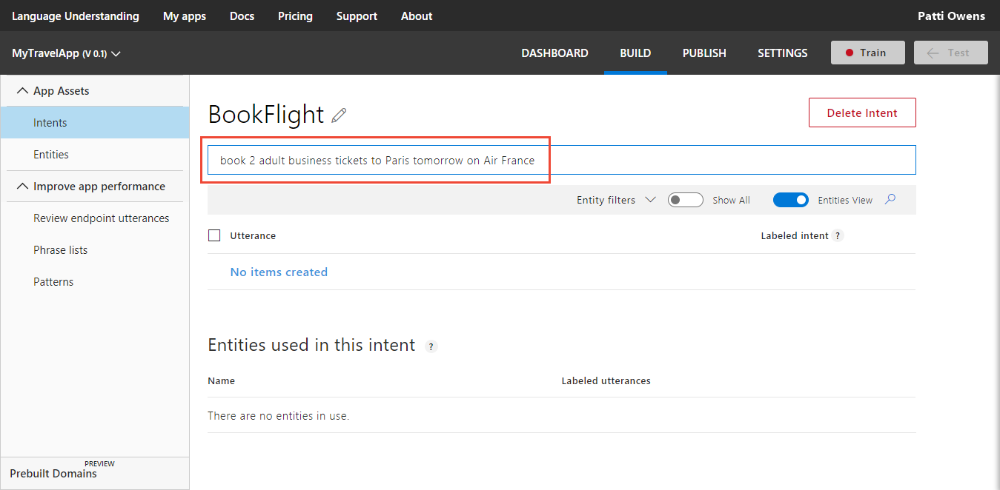 

Utterances are added to the utterances list for the current intent. 

## Ignoring words and punctuation
If you want to ignore specific words or punctuation in the example utterance, use a [pattern](luis-concept-patterns.md#pattern-syntax) with the _ignore_ syntax. 

## Add simple entity label
In the following procedure, you create and label custom entities within the following utterance on the intent page:

```
book me 2 adult business tickets to Paris tomorrow on Air France
```

1. Select "Air France" in the utterance to label it as a simple entity.

    > [!NOTE]
    > When selecting words to label them as entities:
    > * For a single word, just select it. 
    > * For a set of two or more words, select at the beginning and then at the end of the set.

2. In the entity drop-down box that appears, you can either select an existing entity or add a new entity. To add a new entity, type its name in the text box, and then select **Create new entity**. 
 
    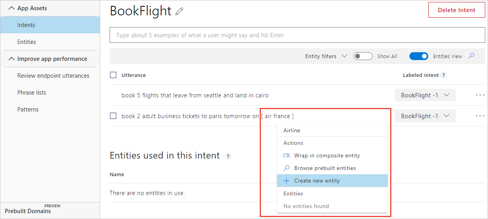

3. In the **What type of entity do you want to create?** pop-up dialog box, verify the entity name and select the simple entity type, and then select **Done**.

    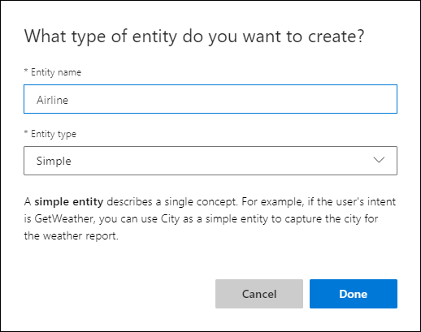

    See [Data Extraction](luis-concept-data-extraction.md#simple-entity-data) to learn more about extracting the simple entity from the endpoint JSON query response. Try the simple entity [quickstart](luis-quickstart-primary-and-secondary-data.md) to learn more about how to use a simple entity.


## Add list entity and label
List entities represent a fixed, closed set (exact text matches) of related words in your system. 

For a drinks list entity, you can have two normalized values: water and soda pop. Each normalized name has synonyms. For water, synonyms are H20, gas, flat. For soda pop, synonyms are fruit, cola, ginger. You don't have to know all the values when you create the entity. You can add more after reviewing real user utterances with synonyms.

|Normalized name|Synonyms|
|--|--|
|Water|H20, gas, flat|
|Soda pop|Fruit, cola, ginger|

When creating a new list entity from the intent page, you are doing two things that may not be obvious. First, you are creating a new list by adding the first list item. Second, the first list item is named with the word or phrase you selected from the utterance. While you can change these later from the entity page, it may be faster to select an utterance that has the word that you want for the name of the list item.

For example, if you wanted to create a list of types of drink and you selected the word `h2o` from the utterance to create the entity, the list would have one item, whose name was h20. If you wanted a more generic name, you should choose an utterance that uses the more generic name. 

1. In the utterance, select the word that is the first item in the list, and then enter the name of the list in the textbox, then select **Create new entity**.   

    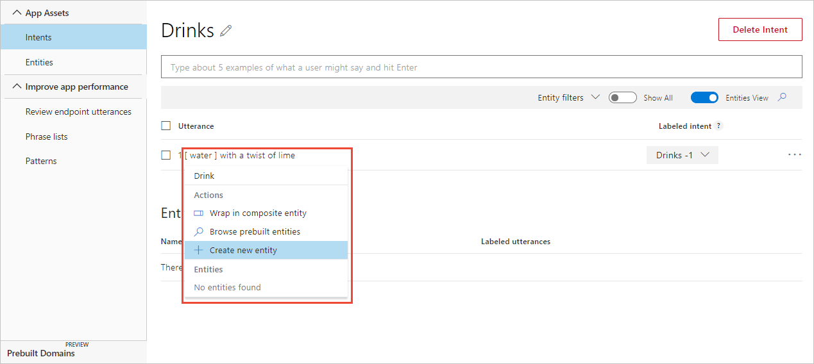

2. In the **What type of entity do you want to create?** dialog box, add synonyms of this list item. For the water item in a drink list, add `h20`, `perrier`, and `waters`, and select **Done**. Notice that "waters" is added because the list synonyms are matched at the token level. In the English culture, that level is at the word level so "waters" would not be matched to "water" unless it was in the list. 

    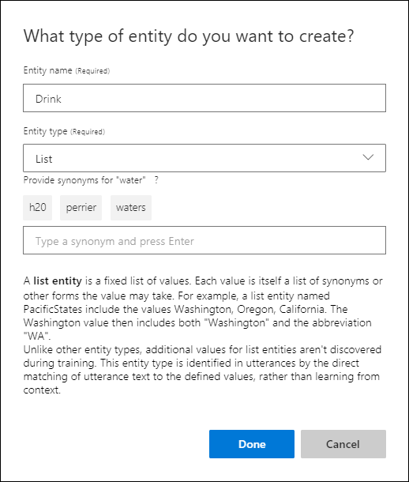

    This list of drinks has only one drink type, water. You can add more drink types by labeling other utterances, or by editing the entity from the **Entities** in the left navigation. [Editing](luis-how-to-add-entities.md#add-list-entities) the entities gives you the options of entering additional items with corresponding synonyms or [importing](luis-how-to-add-entities.md#import-list-entity-values) a list. 

    See [Data Extraction](luis-concept-data-extraction.md#list-entity-data) to learn more about extracting list entities from the endpoint JSON query response. Try the [quickstart](luis-quickstart-intent-and-list-entity.md) to learn more about how to use a list entity.

## Add synonyms to the list entity 
Add a synonym to the list entity by selecting the word or phrase in the utterance. If you have a Drink list entity, and want to add `agua` as a synonym for water, follow the steps:

In the utterance, select the synonymous word, such as `aqua` for water, then select the list entity name in the drop-down list, such as **Drink**, then select **Set as synonym**, then select the list item it is synonymous with, such as **water**.

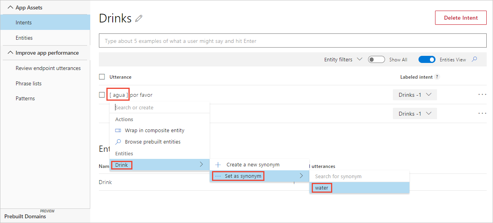

## Create new item for list entity
Create a new item for an existing list entity by selecting the word or phrase in the utterance. If you have an Employee list, and want to add `Bob Smith` as a new item, follow the steps:

In the utterance, select the word or phrase for the new list item, such as `Bob Smith`, then select the list entity name in the drop-down list, such as **Employee**, then select **Create a new normalized view**. 

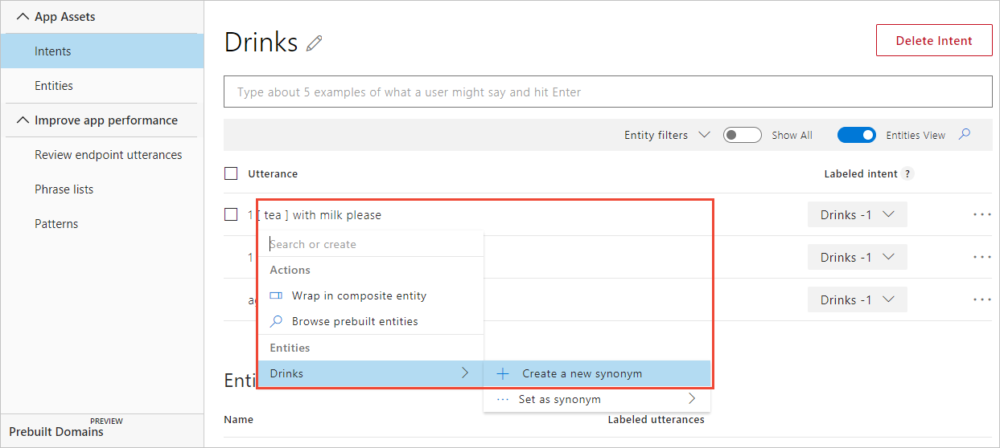

The word is now highlighted in blue. If you hover over the word, a tag displays showing the list item name, such as tea.

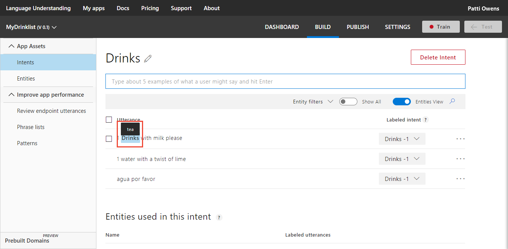

## Wrap entities in composite label
Composite entities are created from **Entities**. You can't create a composite entity from the Intent page. Once the composite entity is created, you can wrap the entities in an utterance on the Intent page. 

Assuming the utterance, `book 2 tickets from Seattle to Cairo`, a composite utterance can return entity information of the count of tickets (2), the origin (Seattle), and destination (Cairo) locations in a single parent entity. 

Follow these [steps](luis-how-to-add-entities.md#add-prebuilt-entity) to add the **number** prebuilt entity. After the entity is created, the `2` in the utterance is blue, indicating it is a labeled entity. Prebuilt entities are labeled by LUIS. You can't add or remove the prebuilt entity label from a single utterance. You can only add or remove all the prebuilt labels by adding or removing the prebuilt entity from the application.

Follow these [steps](#add-hierarchical-entity-and-label) to create a **Location** hierarchical entity. Label the origin and destination locations in the example utterance. 

Before you wrap the entities in a composite entity, make sure all the child entities are highlighted in blue, meaning they have been labeled in the utterance.

1. To wrap the individual entities into a composite, select the first labeled entity in the utterance for the composite entity. In the example utterance, `book 2 tickets from Seattle to Cairo`, the first entity is the number 2. A drop-down list appears showing the choices for this selection.

    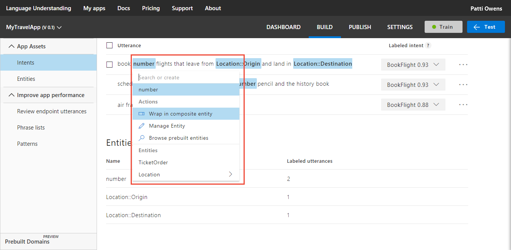

2. Select **Wrap composite entity** from the drop-down list. 

    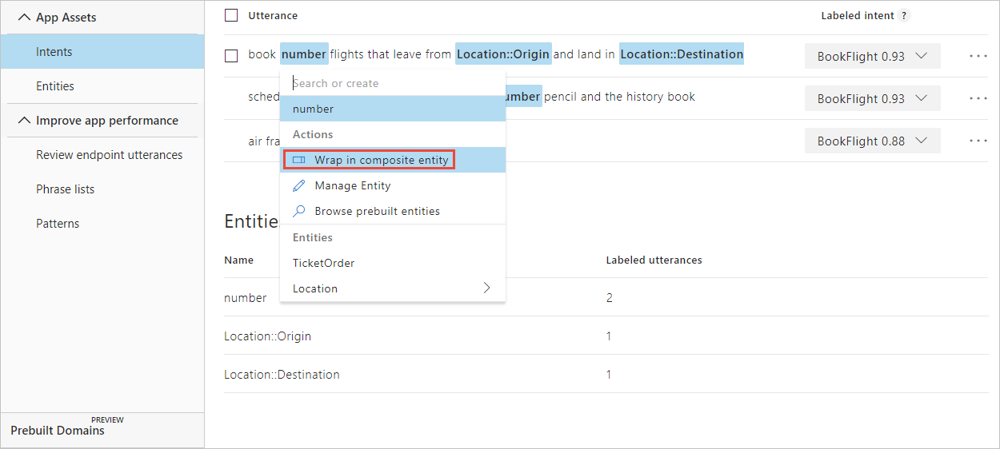

3. Select the last word of the composite entity. In the utterance of this example, select "Location::Destination" (representing Cairo). The green line is now under all the words, including non-entity words, in the utterance that are the composite.

    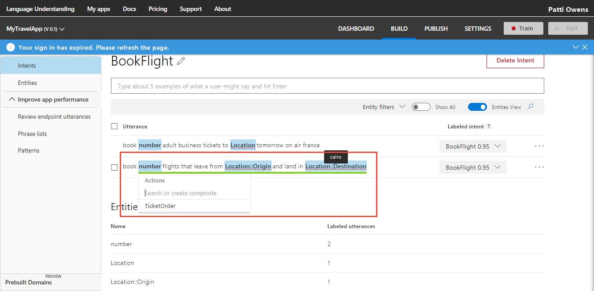

4. Select the composite entity name from the drop-down list. For this example, that is **TicketOrder**.

    

    When you wrap the entities correctly, a green line is under the entire phrase.

    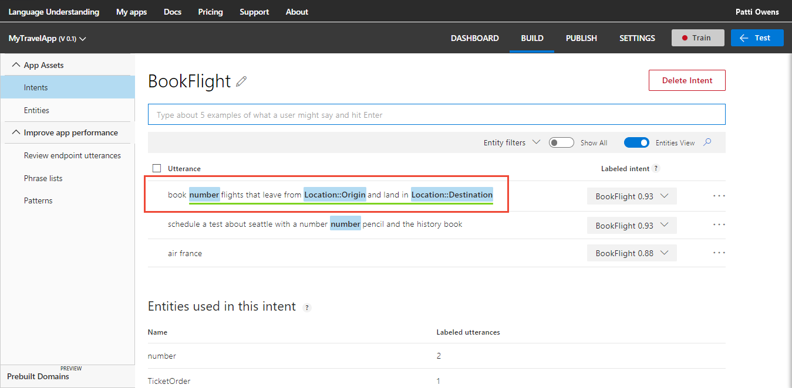

    See [Data Extraction](luis-concept-data-extraction.md#composite-entity-data) to learn more about extracting the composite entity from the endpoint JSON query response. Try the composite entity [tutorial](luis-tutorial-composite-entity.md) to learn more about how to use a composite entity.

## Add hierarchical entity and label
A hierarchical entity is a category of contextually learned and conceptually related entities. In the following example, the entity contains origin and destination locations. 

In the utterance `Book 2 tickets from Seattle to Cairo`, Seattle is the origin location and Cairo is the destination location. Each location is contextually different and learned from word order and word choice in the utterance.

1. On the Intent page, in the utterance, select "Seattle", then enter the entity name `Location, and then select **Create new entity**.

    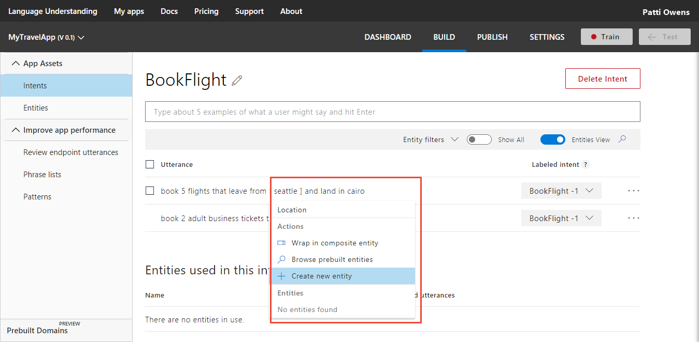

2. In the pop-up dialog box, select hierarchical for **Entity type**, then add `Origin` and `Destination` as children, and then select **Done**.

    

3. The word in the utterance was labeled with the parent hierarchical entity. You need to assign the word to a child entity. Return to the utterance on the intent page. Select the word, then from the drop-down list choose the entity name you created, and follow the menu to the right to choose the correct child entity.

    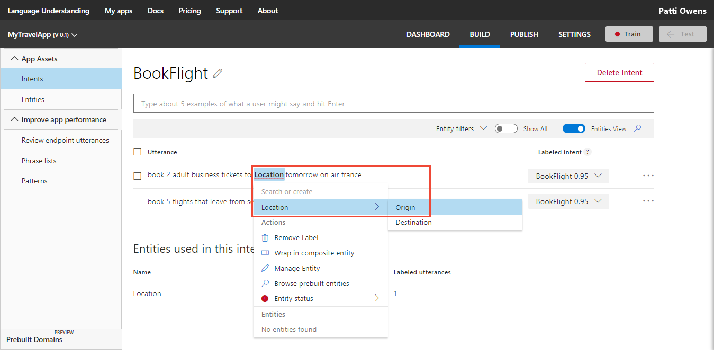

    >[!CAUTION]
    >Child entity names must be unique across all entities in a single app. Two different hierarchical entities may not contain child entities with the same name. 

    See [Data Extraction](luis-concept-data-extraction.md#hierarchical-entity-data) to learn more about extracting the hierarchical entity from the endpoint JSON query response. Try the hierarchical entity [quickstart](luis-quickstart-intent-and-hier-entity.md) to learn more about how to use a hierarchical entity.


## Remove entity labels from utterances
You can remove machine-learned entity labels from an utterance on the Intent page. If the entity is not machine-learned, it can't be removed from an utterance. If you need to remove a non-machine-learned entity from the utterance, you need to delete the entity from the entire app. 

To remove a machine-learned entity label from an utterance, select the entity in the utterance. Then select **Remove Label** in the entity drop-down box that appears.

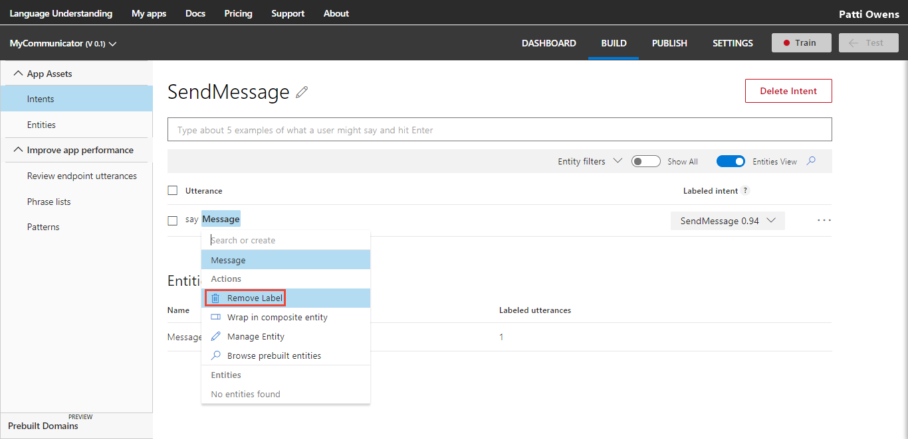 

## Add prebuilt entity label
If you add the prebuilt entities to your LUIS app, you don't need to label utterances with these entities. To learn more about prebuilt entities and how to add them, see [Add entities](luis-how-to-add-entities.md#add-prebuilt-entity).

## Add regular expression entity label
If you add the regular expression entities to your LUIS app, you don't need to label utterances with these entities. To learn more about regular expression entities and how to add them, see [Add entities](luis-how-to-add-entities.md#add-regular-expression-entities).

## Create a pattern from an utterance
See [Add pattern from existing utterance on intent or entity page](luis-how-to-model-intent-pattern.md#add-pattern-from-existing-utterance-on-intent-or-entity-page).

## Add pattern.any entity label
If you add the pattern.any entities to your LUIS app, you can't label utterances with these entities. They are only valid in patterns. To learn more about pattern.any entities and how to add them, see [Add entities](luis-how-to-add-entities.md#add-patternany-entities).

<!--
Fix this - moved to luis-how-to-add-intents.md - how ?

## Search in utterances
## Prediction discrepancy errors
## Filter by intent prediction discrepancy errors
## Filter by entity type
## Switch to token view
## Delete utterances
## Edit an utterance
## Reassign utterances

-->
## Train your app after changing model with utterances
After you add, edit, or remove utterances, [train](luis-how-to-train.md) and [publish](luis-how-to-publish-app.md) your app for your changes to affect endpoint queries. 

## Next steps

After labeling utterances in your intents, you can now create a [composite entity](luis-how-to-add-entities.md).
