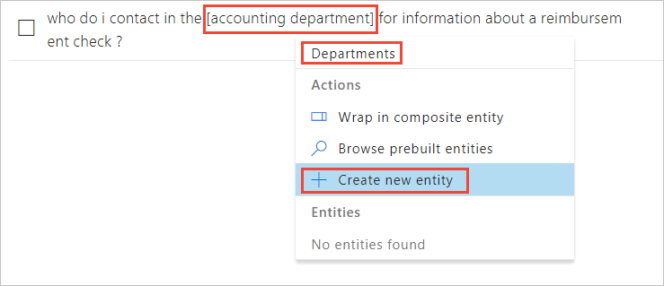
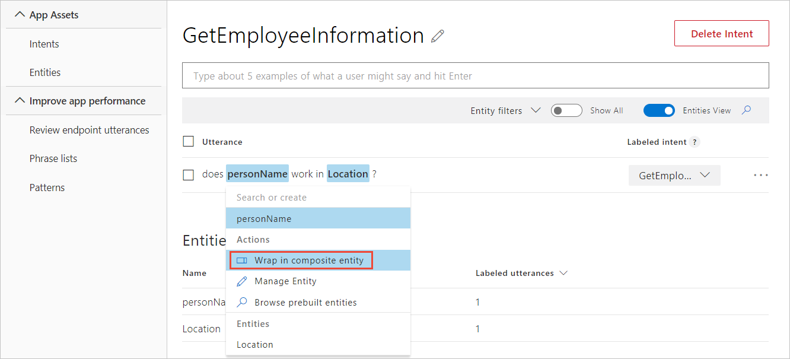
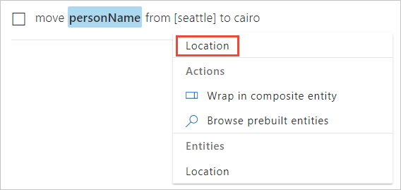
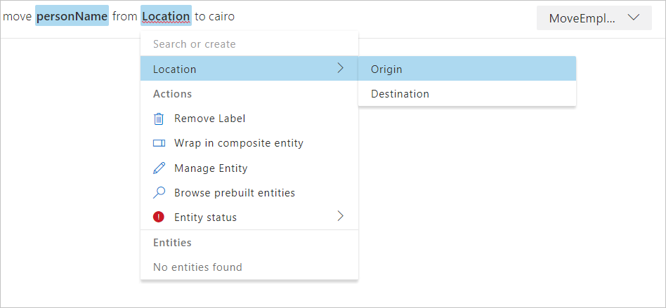
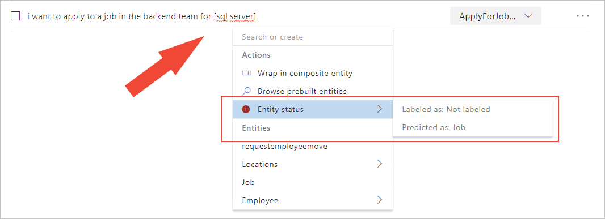

# Add an entity to example utterances 

Example utterances are text examples of user questions or commands. To teach Language Understanding (LUIS), you need to add [example utterances](luis-concept-utterance.md) to an [intent](luis-concept-intent.md).

Usually, add an example utterance to an intent first, and then create entities and label utterances on the intent page. If you would rather create entities first, see [Add entities](luis-how-to-add-entities.md).

## Marking entities in example utterances

When you select text in the example utterance to mark for an entity, an in-place pop-up menu appears. Use this menu to either create or select an entity. 

Certain entity types, such as prebuilt entities and regular expression entities, cannot be tagged in the example utterance because they are tagged automatically. 

## Add a simple entity

In the following procedure, you create and tag a custom entity within the following utterance on the intent page:

```text
Does John Smith work in Seattle?
```

1. Select `Seattle` in the utterance to label it as a simple entity.

    [](./media/luis-how-to-add-example-utterances/hr-create-simple-1.png)

    > [!NOTE]
    > When selecting words to tag as entities:
    > * For a single word, just select it. 
    > * For a set of two or more words, select at the beginning and then at the end of the set.

1. In the entity drop-down box that appears, you can either select an existing entity or add a new entity. To add a new entity, type its name in the text box, and then select **Create new entity**. 

    

1. In the **What type of entity do you want to create?** pop-up box, verify the entity name and select the **Simple** entity type, and then select **Done**.

    A [phrase list](luis-concept-feature.md) is commonly used to boost the signal of a simple entity.

## Add a list entity

List entities represent a fixed, closed set (exact text matches) of related words in your system. 

For a company's department list, you can have normalized values: `Accounting` and `Human Resources`. Each normalized name has synonyms. For a department, these synonyms can include any department acronyms, numbers, or slang. You don't have to know all the values when you create the entity. You can add more after reviewing real user utterances with synonyms.

1. In the example utterance list, for a specific utterance, select the word or phrase that you want in the new list. Then enter the name of the list in the top textbox, then select **Create new entity**.   

    


1. In the **What type of entity do you want to create?** pop-up box, name the entity and select **List** as the type. Add synonyms of this list item, then select **Done**. 

    

    You can add more list items or more item synonyms by labeling other utterances, or by editing the entity from the **Entities** in the left navigation. [Editing](luis-how-to-add-entities.md#add-list-entities) the entities gives you the options of entering additional items with corresponding synonyms or importing a list. 

## Add composite entity

Composite entities are created from existing **Entities** into a parent entity. 

Assuming the utterance, `Does John Smith work in Seattle?`, a composite utterance can return entity information of the employee name, and the location in a single parent object. 

The employee name, John Smith, is a prebuilt [personName](luis-reference-prebuilt-person.md) entity. The location, Seattle, is a custom simple entity. Once those two entities are created and tagged in an example utterance, those entities can be wrapped in a composite entity. 

1. To wrap the individual entities into a composite, select the **first** labeled entity (left-most) in the utterance for the composite entity. A drop-down list appears showing the choices for this selection.

1. Select **Wrap composite entity** from the drop-down list. 

    

1. Select the last word of the composite entity (right-most). Notice a green line follows the composite entity.

1. Enter the composite entity name in the drop-down list.

    

    When you wrap the entities correctly, a green line is under the entire phrase.

1. Validate the composite entity details on the **What type of entity do you want to create?** pop-up box then select **Done**.

    

1. The composite entity displays with both blue highlights for individual entities and a green underline for the entire composite entity. 

    

## Add hierarchical entity

A hierarchical entity is a category of contextually learned and conceptually related entities. In the following example, the entity contains origin and destination locations. 

In the utterance `Move John Smith from Seattle to Cairo`, Seattle is the origin location and Cairo is the destination location. Each location is contextually different and learned from word order and word choice in the utterance.

1. On the Intent page, in the utterance, select `Seattle`, then enter the entity name `Location`, and then select Enter on the keyboard.

    

1. In the **What type of entity do you want to create?** pop-up box, select _hierarchical_ for **Entity type**, then add `Origin` and `Destination` as children, and then select **Done**.

    

1. The word in the utterance was labeled with the parent hierarchical entity. You need to assign the word to a child entity. Return to the utterance on the intent detail page. Select the word, then from the drop-down list choose the entity name you created, and follow the menu to the right to choose the correct child entity.

    

    >[!CAUTION]
    >Child entity names must be unique across all entities in a single app. Two different hierarchical entities may not contain child entities with the same name. 

## Entity status predictions

When you enter a new utterance in the LUIS portal, the utterance may have entity prediction errors. The prediction error is a difference between how an entity is labeled compared with how LUIS has predicted the entity. 

This difference is visually represented in the LUIS portal with a red underline in the utterance. The red underline may appear in entity brackets or outside of brackets. 


Select the words that are underlined in red in the utterance. 

The entity box displays the **Entity status** with a red exclamation mark if there is a prediction discrepancy. To see the Entity status with information about the difference between labeled and predicted entities, select **Entity status** then select the item to the right.



The red-line can appear at any of the following times:

   * When an utterance is entered but before the entity is labeled
   * When the entity label is applied
   * When the entity label is removed
   * When more than one entity label is predicted for that text 

The following solutions help resolve the entity prediction discrepancy:

|Entity|Visual indicator|Prediction|Solution|
|--|--|--|--|
|Utterance entered, entity isn't labeled yet.|red underline|Prediction is correct.|Label the entity with the predicted value.|
|Unlabeled text|red underline|Incorrect prediction|The current utterances using this incorrect entity need to be reviewed across all intents. The current utterances have mistaught LUIS that this text is the predicted entity.
|Correctly labeled text|blue entity highlight, red underline|Incorrect prediction|Provide more utterances with the correctly labeled entity in a variety of places and usages. The current utterances are either not sufficient to teach LUIS that this is the entity is or similar entities appear in the same context. Similar entity should be combined into a single entity so LUIS isn't confused. Another solution is to add a phrase list to boost the significance of the words. |
|Incorrectly labeled text|blue entity highlight, red underline|Correct prediction| Provide more utterances with the correctly labeled entity in a variety of places and usages. 

## Other actions

You can perform actions on example utterances as a selected group or as an individual item. Groups of selected example utterances change the contextual menu above the list. Single items may use both the contextual menu above the list and the individual contextual ellipsis at the end of each utterance row. 

### Remove entity labels from utterances

You can remove machine-learned entity labels from an utterance on the Intent page. If the entity is not machine-learned, it can't be removed from an utterance. If you need to remove a non-machine-learned entity from the utterance, you need to delete the entity from the entire app. 

To remove a machine-learned entity label from an utterance, select the entity in the utterance. Then select **Remove Label** in the entity drop-down box that appears.

 

### Add prebuilt entity label

When you add the prebuilt entities to your LUIS app, you don't need to tag utterances with these entities. To learn more about prebuilt entities and how to add them, see [Add entities](luis-how-to-add-entities.md#add-prebuilt-entity).

### Add regular expression entity label

If you add the regular expression entities to your LUIS app, you don't need to tag utterances with these entities. To learn more about regular expression entities and how to add them, see [Add entities](luis-how-to-add-entities.md#add-regular-expression-entities).


### Create a pattern from an utterance

See [Add pattern from existing utterance on intent or entity page](luis-how-to-model-intent-pattern.md#add-pattern-from-existing-utterance-on-intent-or-entity-page).


### Add pattern.any entity

If you add the pattern.any entities to your LUIS app, you can't label utterances with these entities. They are only valid in patterns. To learn more about pattern.any entities and how to add them, see [Add entities](luis-how-to-add-entities.md#add-patternany-entities).

## Train your app after changing model with utterances

After you add, edit, or remove utterances, [train](luis-how-to-train.md) and [publish](luis-how-to-publish-app.md) your app for your changes to affect endpoint queries. 

## Next steps

After labeling utterances in your intents, you can now create a [composite entity](luis-how-to-add-entities.md).
