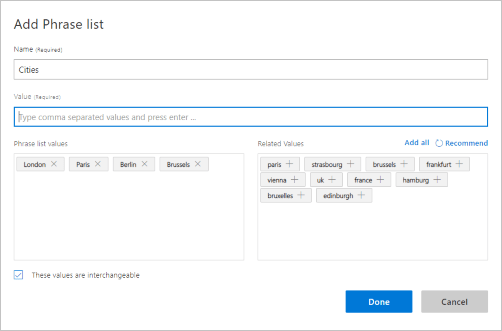
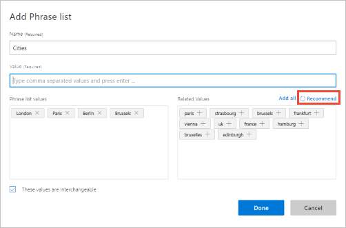
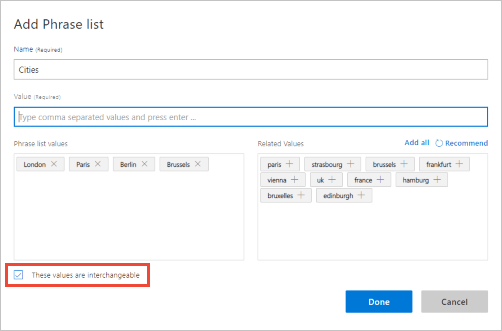

# Use phrase lists to boost signal of word list

You can add features to your LUIS app to improve its accuracy. Features help LUIS by providing hints that certain words and phrases are part of an app domain vocabulary. 

## Add phrase list

1. Open your app by clicking its name on **My Apps** page, and then click **Build**, then click **Phrase lists** in your app's left panel. 

2. On the **Phrase lists** page, click **Create new phrase list**. 
 
3. In the **Add Phrase List** dialog box, type "Cities" as the name of the phrase list. In the **Value** box, type the values of the phrase list. You can type one value at a time, or a set of values separated by commas, and then press **Enter**.

    

4. LUIS can propose related values to add to your phrase list. Click **Recommend** to get a group of proposed values that are semantically related to the added value(s). You can click any of the proposed values, or click **Add All** to add them all.

    

5. Click **These values are interchangeable** if the added phrase list values are alternatives that can be used interchangeably.

    

6. Click **Save**. The "Cities" phrase list is added to the **Phrase lists** page.

> [!Note]
> You can delete, or deactivate a phrase list from the contextual toolbar on the **Phrase lists** page.

## Pattern (regular expression) feature 
**This feature is deprecated**. New pattern features cannot be added to LUIS. Any existing pattern features are supported until May 2018. Contribute to standard LUIS regular expression matching with a PR to the [Recognizers-Text Github repository](https://github.com/Microsoft/Recognizers-Text). 

## Next steps

After adding, editing, deleting, or deactivating a phrase list, [train and test the app](luis-interactive-test.md) again to see if performance improves.
