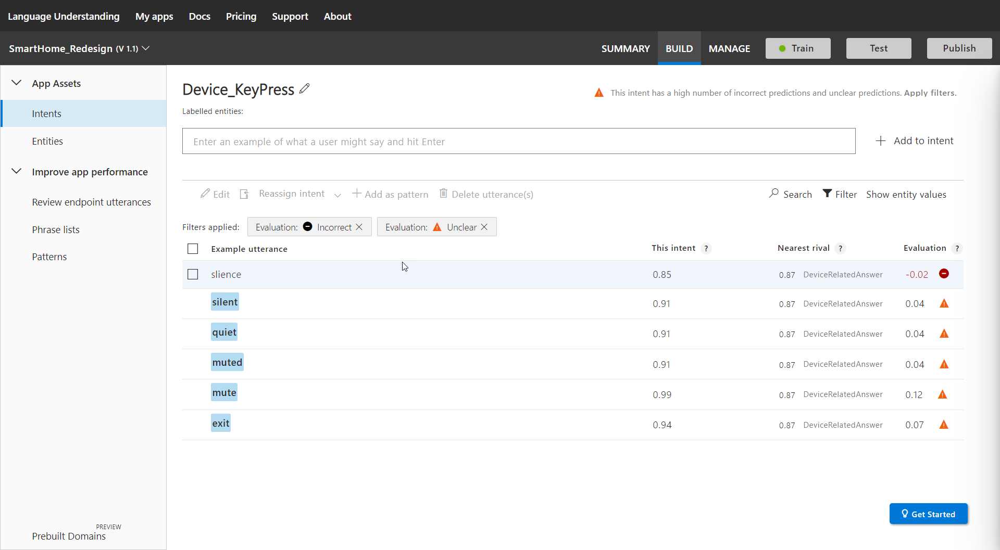
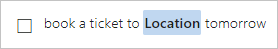

# Add intents to determine user intention of utterances

Add [intents](luis-concept-intent.md) to your LUIS app to identify groups of questions or commands that have the same intention. 

Intents are managed from top navigation bar's **Build** section, then from the left panel's **Intents**. 

## Add intent

1. On the **Intents** page, select **Create new intent**.

1. In the **Create new intent** dialog box, enter the intent name, `GetEmployeeInformation`, and click **Done**.

    

## Add an example utterance

Example utterances are text examples of user questions or commands. To teach Language Understanding (LUIS), you need to add example utterances to an intent.

1. On the **GetEmployeeInformation** intent details page, enter a relevant utterance you expect from your users, such as `Does John Smith work in Seattle?` in the text box below the intent name, and then press Enter.
 
     

    LUIS converts all utterances to lowercase and adds spaces around tokens such as hyphens.

## Intent prediction errors 

An example utterance in an intent might have an intent prediction error between the intent the example utterance is currently in and the prediction intent determined during training. 

To find utterance prediction errors and fix them, use the **Filter** option's **Evaluation** options of Incorrect and Unclear combined with the **View** option of **Detailed view**. 

When the filters and view are applied, and there are example utterances with errors, the example utterance list shows the utterances and the issues.

](./media/luis-how-to-add-intents/find-errors-in-utterances.png#lightbox)

Each row shows the current training's prediction score for the example utterance, the nearest rival's score, which is the difference in these two scores. 

### Fixing intents

To learn how to fix intent prediction errors, use the [Summary Dashboard](luis-how-to-use-dashboard.md). The summary dashboard provides analysis for the active version's last training and offers the top suggestions to fix your model.  

## Add a custom entity

Once an utterance is added to an intent, you can select text from within the utterance to create a custom entity. A custom entity is a way to tag text for extraction, along with the correct intent. 

See [Add entity to utterance](luis-how-to-add-example-utterances.md) to learn more.

## Entity prediction discrepancy errors 

The entity is underlined in red to indicate an [entity prediction discrepancy](luis-how-to-add-example-utterances.md#entity-status-predictions). Because this is the first occurrence of an entity, there are not enough examples for LUIS to have a high-confidence that this text is tagged with the correct entity. This discrepancy is removed when the app is trained. 

 

The text is highlighted in blue, indicating an entity.  

## Add a prebuilt entity

For information, see [Prebuilt entity](luis-how-to-add-entities.md#add-a-prebuilt-entity-to-your-app).

## Using the contextual toolbar

When one or more example utterances are selected in the list, by checking the box to the left of an utterance, the toolbar above the utterance list allows you to perform the following actions:

* Reassign intent: move utterance(s) to different intent
* Delete utterance(s)
* Entity filters: only show utterances containing filtered entities
* Show all/Errors only: show utterances with prediction errors or show all utterances
* Entities/Tokens view: show entities view with entity names or show raw text of utterance
* Magnifying glass: search for utterances containing specific text

## Working with an individual utterance

The following actions can be performed on an individual utterance from the ellipsis menu to the right of the utterance:

* Edit: change the text of the utterance
* Delete: remove the utterance from the intent. If you still want the utterance, a better method is to move it to the **None** intent. 
* Add a pattern: A pattern allows you to take a common utterance and mark replaceable text and ignorable text, thereby reducing the need for more utterances in the intent. 

The **Labeled intent** column allows you to change the intent of the utterance.

## Train your app after changing model with intents

After you add, edit, or remove intents, [train](luis-how-to-train.md) and [publish](luis-how-to-publish-app.md) your app so that your changes are applied to endpoint queries. 

## Next steps

Learn more about adding [example utterances](luis-how-to-add-example-utterances.md) with entities. 
