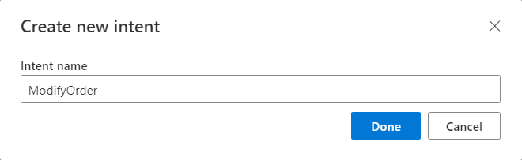
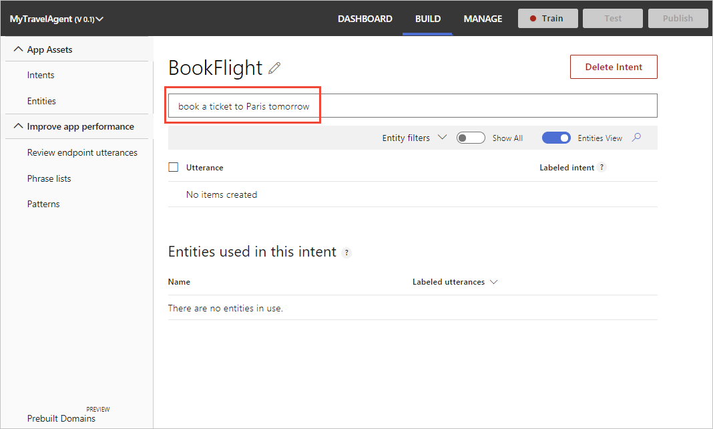
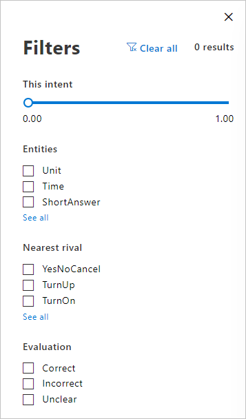

# Add intents to determine user intention of utterances

Add [intents](luis-concept-intent.md) to your LUIS app to identify groups of questions or commands that have the same intention.

In the LUIS portal, Intents are managed from top navigation bar's **Build** section, then from the left panel's **Intents**.

## Add an intent to your app

1. Sign in to the [LUIS portal](https://www.luis.ai), and select your **Subscription** and **Authoring resource** to see the apps assigned to that authoring resource.
1. Open your app by selecting its name on **My Apps** page.
1. On the **Intents** page, select **+ Create**.
1. In the **Create new intent** dialog box, enter the intent name, for example `ModifyOrder`, and select **Done**.

    > [!div class="mx-imgBorder"]
    > 

    The intent needs [example utterances](luis-concept-utterance.md) in order to predict utterances at the published prediction endpoint.

## Add an example utterance

Example utterances are text examples of user questions or commands. To teach Language Understanding (LUIS) when to predict this intent, you need to add example utterances to an intent. LUIS needs in the range of 15 to 30 example utterances to begin understanding the intent. Do not add example utterances in bulk. Each utterance should be carefully chosen for how it is different than examples already in the intent.

1. On the intent details page, enter a relevant utterance you expect from your users, such as `Deliver a large cheese pizza` in the text box below the intent name, and then press Enter.

    > [!div class="mx-imgBorder"]
    > 

    LUIS converts all utterances to lowercase and adds spaces around [tokens](luis-language-support.md#tokenization) such as hyphens.

## Intent prediction errors

An intent prediction error is determined when the utterance is not predicted with the trained app for the intent.

1. To find utterance prediction errors and fix them, use the **Filter** options of Incorrect and Unclear.

    > [!div class="mx-imgBorder"]
    > 

1. To display the score value on the Intent details page, select **Show details intent scores** from the **View** options menu.

    When the filters and view are applied, and there are example utterances with errors, the example utterance list shows the utterances and the issues.

Each row shows the current training's prediction score for the example utterance, the nearest rival's score, which is the difference in these two scores.

### Fixing intents

To learn how to fix intent prediction errors, use the [Summary Dashboard](luis-how-to-use-dashboard.md). The summary dashboard provides analysis for the active version's last training and offers the top suggestions to fix your model.

## Using the contextual toolbar

The context toolbar provides other actions:

* Edit or delete example utterance
* Reassign example utterance to a different intent
* Filters and views: only show utterances containing filtered entities or view optional details
* Search through example utterances

## Train your app after changing model with intents

After you add, edit, or remove intents, [train](luis-how-to-train.md) and [publish](luis-how-to-publish-app.md) your app so that your changes are applied to endpoint queries. Do not train after every single change. Train after a group of changes.

## Next steps

Learn more about adding [example utterances](luis-how-to-add-example-utterances.md) with entities.
