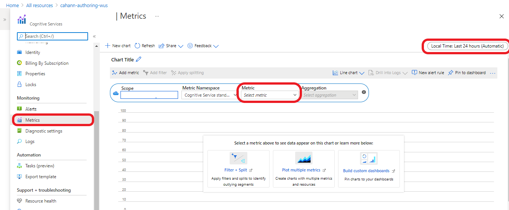
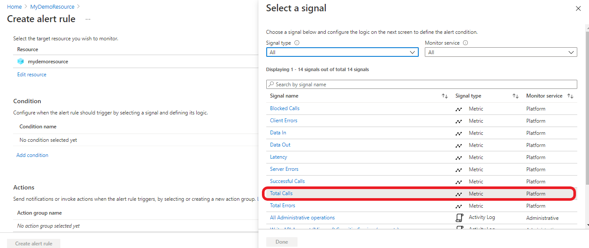
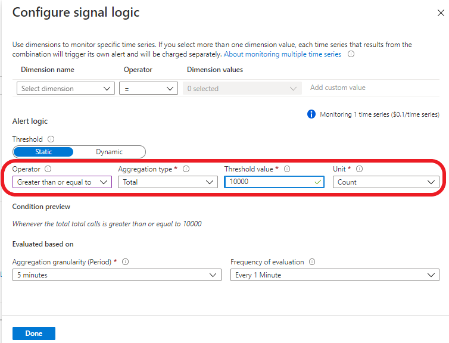
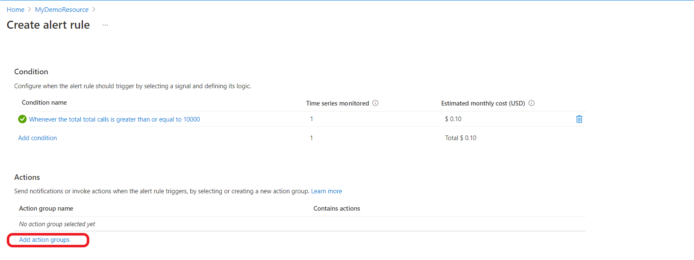

# LUIS resources

Learn more about LUIS resources [here](./luis-concept-azure-subscription.md).

## Create LUIS resources 

[!INCLUDE [Create LUIS resource in Azure portal](includes/create-luis-resource.md)]

## Create LUIS resources in LUIS Portal

### Create LUIS Authoring resource

1. Sign in to the [LUIS portal](https://www.luis.ai), select your country/region and agree to the terms of use. If you see **My Apps** instead, a LUIS resource already exists and you can skip the next step.

2. In the **Choose an authoring** window that appears, find your Azure subscription, and LUIS authoring resource. If you don't have a resource, you can create a new one.

    :::image type="content" source="./media/luis-how-to-azure-subscription/choose-authoring-resource.png" alt-text="Choose a type of Language Understanding authoring resource.":::
    
    When you create a new authoring resource, provide the following information:
    * **Tenant name** - the tenant your Azure subscription is associated with.
    * **Azure subscription name** - the subscription that will be billed for the resource.
    * **Azure resource group name** - a custom resource group name you choose or create. Resource groups allow you to group Azure resources for access and management.
    * **Azure resource name** - a custom name you choose, used as part of the URL for your authoring and prediction endpoint queries.
    * **Pricing tier** - the pricing tier determines the maximum transaction per second and month.

### Create LUIS Prediction resource

[!INCLUDE [Create LUIS Prediction resource in LUIS portal](./includes/add-pred-resource-portal.md)


## Create LUIS resources in the Azure CLI

Use the [Azure CLI](/cli/azure/install-azure-cli) to create each resource individually.

Resource `kind`:

* Authoring: `LUIS.Authoring`
* Prediction: `LUIS`

1. Sign in to the Azure CLI:

    ```azurecli
    az login
    ```

    This command opens a browser so you can select the correct account and provide authentication.

1. Create a LUIS authoring resource of kind `LUIS.Authoring`, named `my-luis-authoring-resource`. Create it in the _existing_ resource group named `my-resource-group` for the `westus` region.

    ```azurecli
    az cognitiveservices account create -n my-luis-authoring-resource -g my-resource-group --kind LUIS.Authoring --sku F0 -l westus --yes
    ```

1. Create a LUIS prediction endpoint resource of kind `LUIS`, named `my-luis-prediction-resource`. Create it in the _existing_ resource group named `my-resource-group` for the `westus` region. If you want higher throughput than the free tier provides, change `F0` to `S0`. [Learn more about pricing tiers and throughput.](luis-limits.md#key-limits)

    ```azurecli
    az cognitiveservices account create -n my-luis-prediction-resource -g my-resource-group --kind LUIS --sku F0 -l westus --yes
    ```

    > [!Note]
    > These keys aren't used by the LUIS portal until they're assigned on the **Manage** > **Azure Resources** page in the LUIS portal.

## Assign LUIS resources
Creating a resource doesn't necessarily mean that it is put to use, you need to assign it to your apps.

## Assign resources using LUIS portal
**Assign an authoring resource to all your apps** 

You can assign an authoring resource for a single app or for all apps in LUIS. The following procedure assigns the authoring resource to all apps.

1. Sign in to the [LUIS portal](https://www.luis.ai).
1. In the upper-right corner, select your user account, and then select **Settings**.
1. On the **User Settings** page, select **Add authoring resource**, and then select an existing authoring resource. Select **Save**.

**Assign a resource to a specific app**

The following procedure assigns a resource to a specific app.

1. Sign in to the [LUIS portal](https://www.luis.ai). Select an app from the **My apps** list.
1. Go to **Manage** > **Azure Resources**:

    

1. On the **Prediction resource** or **Authoring resource** tab, select the **Add prediction resource** or **Add authoring resource** button.
1. Use the fields in the form to find the correct resource, and then select **Save**.

## Assign prediction resource programatically 

For automated processes like CI/CD pipelines, you might want to automate the assignment of a LUIS resource to a LUIS app. To do so, complete these steps:

1. Get an Azure Resource Manager token from [this website](https://resources.azure.com/api/token?plaintext=true). This token does expire, so use it right away. The request returns an Azure Resource Manager token.

    ```azurecli
    az account get-access-token --resource=https://management.core.windows.net/ --query accessToken --output tsv
    ```
    
    

1. Use the token to request the LUIS runtime resources across subscriptions. Use the [Get LUIS Azure accounts API](https://westus.dev.cognitive.microsoft.com/docs/services/5890b47c39e2bb17b84a55ff/operations/5be313cec181ae720aa2b26c), which your user account has access to.

    This POST API requires the following values:

    |Header|Value|
    |--|--|
    |`Authorization`|The value of `Authorization` is `Bearer {token}`. The token value must be preceded by the word `Bearer` and a space.|
    |`Ocp-Apim-Subscription-Key`|Your authoring key.|

    The API returns an array of JSON objects that represent your LUIS subscriptions. Returned values include the subscription ID, resource group, and resource name, returned as `AccountName`. Find the item in the array that's the LUIS resource that you want to assign to the LUIS app.

1. Assign the token to the LUIS resource by using the [Assign a LUIS Azure accounts to an application](https://westus.dev.cognitive.microsoft.com/docs/services/5890b47c39e2bb17b84a55ff/operations/5be32228e8473de116325515) API.

    This POST API requires the following values:

    |Type|Setting|Value|
    |--|--|--|
    |Header|`Authorization`|The value of `Authorization` is `Bearer {token}`. The token value must be preceded by the word `Bearer` and a space.|
    |Header|`Ocp-Apim-Subscription-Key`|Your authoring key.|
    |Header|`Content-type`|`application/json`|
    |Querystring|`appid`|The LUIS app ID.
    |Body||{`AzureSubscriptionId`: Your Subscription ID,<br>`ResourceGroup`: Resource Group name that has your prediction resource,<br>`AccountName`: Name of your prediction resource}|

    When this API is successful, it returns `201 - created status`.

## Unassign a resource

When you unassign a resource, it's not deleted from Azure. It's only unlinked from LUIS.

## Unassign resources using LUIS portal

1. Sign in to the [LUIS portal](https://www.luis.ai), and then select an app from the **My apps** list.
1. Go to **Manage** > **Azure Resources**.
1. Select the **Unassign resource** button for the resource.


## Unassign prediction resource programatically

1. Get an Azure Resource Manager token from [this website](https://resources.azure.com/api/token?plaintext=true). This token does expire, so use it right away. The request returns an Azure Resource Manager token.

    ```azurecli
    az account get-access-token --resource=https://management.core.windows.net/ --query accessToken --output tsv
    ```
    
    

1. Use the token to request the LUIS runtime resources across subscriptions. Use the [Get LUIS Azure accounts API](https://westus.dev.cognitive.microsoft.com/docs/services/5890b47c39e2bb17b84a55ff/operations/5be313cec181ae720aa2b26c), which your user account has access to.

    This POST API requires the following values:

    |Header|Value|
    |--|--|
    |`Authorization`|The value of `Authorization` is `Bearer {token}`. The token value must be preceded by the word `Bearer` and a space.|
    |`Ocp-Apim-Subscription-Key`|Your authoring key.|

    The API returns an array of JSON objects that represent your LUIS subscriptions. Returned values include the subscription ID, resource group, and resource name, returned as `AccountName`. Find the item in the array that's the LUIS resource that you want to assign to the LUIS app.

1. Assign the token to the LUIS resource by using the [Unassign a LUIS Azure account from an application](https://westus.dev.cognitive.microsoft.com/docs/services/5890b47c39e2bb17b84a55ff/operations/5be32554f8591db3a86232e1/console) API.

    This DELETE API requires the following values:

    |Type|Setting|Value|
    |--|--|--|
    |Header|`Authorization`|The value of `Authorization` is `Bearer {token}`. The token value must be preceded by the word `Bearer` and a space.|
    |Header|`Ocp-Apim-Subscription-Key`|Your authoring key.|
    |Header|`Content-type`|`application/json`|
    |Querystring|`appid`|The LUIS app ID.
    |Body||{`AzureSubscriptionId`: Your Subscription ID,<br>`ResourceGroup`: Resource Group name that has your prediction resource,<br>`AccountName`: Name of your prediction resource}|

    When this API is successful, it returns `200 - OK status`.

## Resource ownership

An Azure resource, like a LUIS resource, is owned by the subscription that contains the resource.

To change the ownership of a resource, you can take one of these actions:
* Transfer the [ownership](../../cost-management-billing/manage/billing-subscription-transfer.md) of your subscription.
* Export the LUIS app as a file, and then import the app on a different subscription. Export is available on the **My apps** page in the LUIS portal.

## Change the pricing tier

1.  In [the Azure portal](https://portal.azure.com), Go to **All resources** and select your resource

    
1.  From the left side menu select **Pricing tier** to see the available pricing tiers
1.  Select the pricing tier you want, and click **Select** to save your change<br>
    When the pricing change is complete, a notification appears in the top right verifying  the pricing tier update.

## View Azure resource metrics

## View a summary of Azure resource usage
You can view LUIS usage information in the Azure portal. The **Overview** page shows a summary, including recent calls and errors. If you make a LUIS endpoint request, allow up to five minutes for the change to appear.


## Customizing Azure resource usage charts
The **Metrics** page provides a more detailed view of the data. 
You can configure your metrics charts for a specific **time period** and **metric type**.



## Total transactions threshold alert
If you want to know when you reach a certain transaction threshold, for example 10,000 transactions, you can create an alert:

1. From the left side menu select **Alerts**
2. From the top menu select **New alert Rule**


3. Click on **Add Condition**


4.Select **Total Calls**



5. Scroll down to the **Alert logic** section and set the attributes as you want and click **Done**



6. To send notifications or invoke actions when the alert rule triggers go to the **Actions** section and add your action group.



### Reset an authoring key

For [migrated authoring resource](luis-migration-authoring.md) apps: If your authoring key is compromised, reset the key in the Azure portal, on the **Keys** page for the authoring resource.

For apps that haven't been migrated: The key is reset on all your apps in the LUIS portal. If you author your apps via the authoring APIs, you need to change the value of `Ocp-Apim-Subscription-Key` to the new key.

### Regenerate an Azure key

You can regenerate an Azure key from the **Keys** page in the Azure portal.

<a name="securing-the-endpoint"></a>

## App ownership, access, and security

An app is defined by its Azure resources, which are determined by the owner's subscription.

You can move your LUIS app. Use the following resources to help you do so by using the Azure portal or Azure CLI:

* [Move an app between LUIS authoring resources](https://westus.dev.cognitive.microsoft.com/docs/services/5890b47c39e2bb17b84a55ff/operations/apps-move-app-to-another-luis-authoring-azure-resource)
* [Move a resource to a new resource group or subscription](../../azure-resource-manager/management/move-resource-group-and-subscription.md)
* [Move a resource within the same subscription or across subscriptions](../../azure-resource-manager/management/move-limitations/app-service-move-limitations.md)


## Next steps

* Learn [how to use versions](luis-how-to-manage-versions.md) to control your app life cycle.


